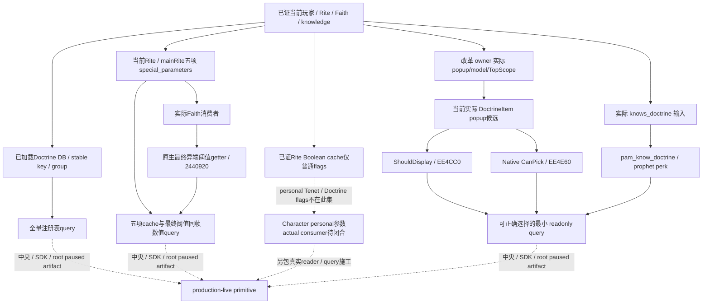

# 1.20.0.2 Doctrine 最终选择门与数值参数后续施工

计划记录：2026-10-01 17:21（Asia/Shanghai）。本页是在已冻结 73 个 Doctrine / Tenet 原生域文件之后的后续包，不改写其 source pins 或原验证结果。当时项目所有者允许继续宗教研究，战争、圣战与 holy order 暂停；这些授权限制已由 2026-10-02 全面宗教授权和 2026-10-03 全面战争授权撤销，后续施工按真实能力与 exact-build 证据推进。

已交 baseline 为 [四个实际私有只读 query](religion_doctrine12002_private_queries.md)：当前双 Rite Doctrine / 布尔参数、普通有向 hostility、Doctrine 知识、Core / personal Tenet rows。这些独立 primitive 已 `static-ready`，不代表 Doctrine 完整候选列表和最终选择门已完成，也不代表数值参数已求值。

## 必要的新增观测

| 新包 | 必要性 | 最小可用目标 |
| --- | --- | --- |
| `religion_doctrine12002_selection*` | `knows_doctrine` 只是 GUI 最终选择 gate 的一项输入；原生 DoctrineItem 的 `ShouldDisplay/CanPick` 及实际 model/context 尚未由本域发布 | 在真实构造/现存 model 的上下文中，返回实际候选、可见、native pick 与知识 gate，足以区分真实可选项和被拒原因 |
| `religion_doctrine12002_numeric*` | 当前完整布尔 token 集不能替代数值参数；创建/改制等条件可能依赖实际值 | 实际原生数值参数 getter/cache/map 与 stable key，保留已观测零、合法不存在、读取失败，区分 actor Rite 与 Faith main Rite 实际语义 |
| `religion_doctrine12002_catalogue*` | 当前 popup 只包含已打开的候选 model，不能作为全量注册表 | 读取已加载 Doctrine DB 的所有 stable key / group，包括 mod 定义；候选是否可选仍由真实 model 的最终 gate 判定 |
| `religion_doctrine12002_personal_parameters*` | 已证 Rite Boolean cache 只合并 Core Tenet / effective Doctrine 普通 flags，未发布 Character 的 personal flags | 在真实 Character consumer 中闭合 personal 参数来源与最终结果；先交当前数值 query，再独立新增实际 reader / query，不猜 definition union 等于当前角色有效结果 |

施工前置冻结为 CK3 **1.20.0.2 Crozier / Steam build 25588574**，EXE SHA-256 `AE1BA6FF060BA603842F6F4A2DED0AF4B7D3666B3DD271F75FB01B0DA8E81B2D`。复用改革专题 owner 已研究的真实 popup/model/TopScope 与先前原生知识 reader；不重新扫描、重证或重跑同一已闭合分支。

`DoctrineItem.CanPick` 与 `TenetItem.CanPick` 必须按真实类型区分。此前错误归类的 `0xEE47A0 → 0xEE0AD0` 已确认是 Tenet；Doctrine 使用实际 `0xEE4E60` wrapper 与 definition 的 `+0x1B8 / +0xE8` triggers。现有 knowledge getter 的 extension `+0xE0` 来源也不冒充 Tenet item 使用的其他列表。

截至 **2026-10-01 18:06（Asia/Shanghai）**，三域新增 provider、独立最终异端阈值 getter、注册表 query / mailbox 和数值组合 query / mailbox 均为 **static-ready**。实际 source tree、ABI 与 Mermaid 已由各专题落盘。选择 observer 复用当前改革 popup，补入真实 `ShouldDisplay`，输出最终 `selectable` 与当前可选 stable keys；未打开的其他组没有被冒充已观测候选。关闭 popup 是 `current_draft_not_visible`，当前实际空列表是合法观测。

数值参数分属 `special_parameters`，普通 `parameters` / `personal_tenet_parameters` 是布尔集合。五项实际聚合 cache 为 `minimum_fervor`（整数，`-1` 是原生 unset）、`fervor_per_holy_site` / `bonus_fervor_gain`（Q100000）、`bonus_heresy_protection`（整数）与 `heresy_threshold`（Q100000 加法修正）。后者不能当作最终异端阈值；独立最终 getter `0x2440920` 的 ABI、out 参数和定义基值读取已闭合，直接调用原生函数输出 final raw/value，同时保留 main Rite 修正与 native define 来源。其他字段已观测为零时不反推原始定义是否写过参数。真实数值 query / full `command_result` 已组合两项同帧 observer，分别发布 `player_religion_numeric_special_parameters` 与 `faith_numeric_final`。后者独立读取失败时保留真实可用 cache，outer `status` 根据主 cache 的 `available` 判定；调用者必须读取 final observer 自己的 `available` / typed reason。

Boolean source 的实际范围也已明确：`Rite+0x7B8`（container `+0x68`）由 rebuild `0x2591180` 合并 Core Tenet definition `+0x728` 与 effective Doctrine definition `+0x288`；它不读取 personal Tenet definition `+0x740` 或 Doctrine definition `+0x2A0`。现有 Boolean query 的完整性只指该 Rite cache。个人 Tenet 身份已由 Character extension `+0x88` array 发布，但 personal flags 的 definition union `0x31D9C42 / 0x31D9C4C → 0x30747E0` 尚未被证明等于角色有效参数；必须继续闭合真实 Character consumer，另包输出实际值。这是已证输入缺口，不由 stock 95 个 personal authoring blocks 或长期 null 替代。

新增独立交付证据位于 `artifacts/g2-offline-2026-10-01/religion-doctrines/`：

| 已冻结包 | 文件 | 新增验证 | 交付 manifest |
| --- | ---: | --- | --- |
| 当前 popup 最终 Doctrine selection | 8 | exact 4 functions / 14 anchors；实际 O2 15 checks / 6 C++ JSON | `selection/delivery-result.json` |
| 五项数值 special parameters | 8 | exact 10 spans / 5 keys / 6 offsets；实际 O2 15 checks / 6 DTO JSON | `numeric/delivery-result.json` |
| 全量已加载 Doctrine registry provider | 5 | 实际 O2 11 checks / 3 DTO JSON | `catalogue/provider-delivery-result.json` |
| Catalogue actual domain / mailbox | 9 | 实际 O2 23 real queue checks / 3 protocol1 full packets | `catalogue/mailbox-delivery-result.json` |
| 原生最终 Faith heresy threshold | 7 | 复用已证 native span；新增实际 O2 10 checks / 6 DTO JSON | `numeric/final-delivery-result.json` |
| 数值 cache + final actual domain / mailbox | 6 | 变化后的实际 O2 31 combined checks / 6 protocol1 full packets | `numeric/numeric-mailbox-delivery-result.json` |

这些数目只描述新增证据，不是新的 G2 live credit；各完整 manifest 保留路径、SHA、失败 attempt 和日报/周报合并字段。旧 73 文件和其 proof 不变。

本轮验证采用一次必要 exact ABI 加实际 production-provider `/O2 /W4 /WX` fixture，不重复旧 library 的 `/Od`、`/O2` 矩阵。新域 query/mailbox 源独立交付，共享注册由中央 owner 完成。原四 query 的 named permit 验证由中央以新增薄 wrapper 复用原 fixture，不修改冻结 73 文件或生产域逻辑，也不重计旧 domain proof。

原估计为记录后 20–40 分钟交首批接口、40–90 分钟交最小 provider / query；实际新增 selection、numeric provider 与 catalogue query 已在前 25 分钟内冻结，最终阈值独立包在前 30 分钟内冻结，数值组合 query 在前 43 分钟内冻结。共有 43 个新增域文件，加本协调专题为 44 个显式 source pins；不混未来 personal consumer 包或中央 named permit 测试增量。初次 cache-only 成功的 39-check attempt 原样保留，最终组合只执行变化后的 31 checks，没有重跑旧 numeric 15 / final 10 / cache 39 矩阵。

共享注册、SDK 与 root paused artifact 由相应 owner 串接，不阻塞已冻结源先提交。下一原生施工是实际 Character personal 参数 reader / query：stock study 条件同时消费 Rite 参数与 `has_personal_tenet_flag`，收养与招募访客也明确使用后者；这是普通非军事条件所需的真实缺失观测。中央新 catalogue named permit 的必要一次薄 wrapper 已独立冻结 3 文件：新 O2 8 checks / 1 real queue full packet，primary permit 为 null，专属 named executor 接受；旧 23-case matrix main 没有执行，provider/runtime 保持冻结。该测试增量有自己的 `catalogue/named-permit-delivery-result.json`，不混入上述 44-file domain source package。真实实机由 root 独占，各域代理不访问 CK3、进程、pipe、Steam 或桌面；没有宗教动作或 counter-policy。
