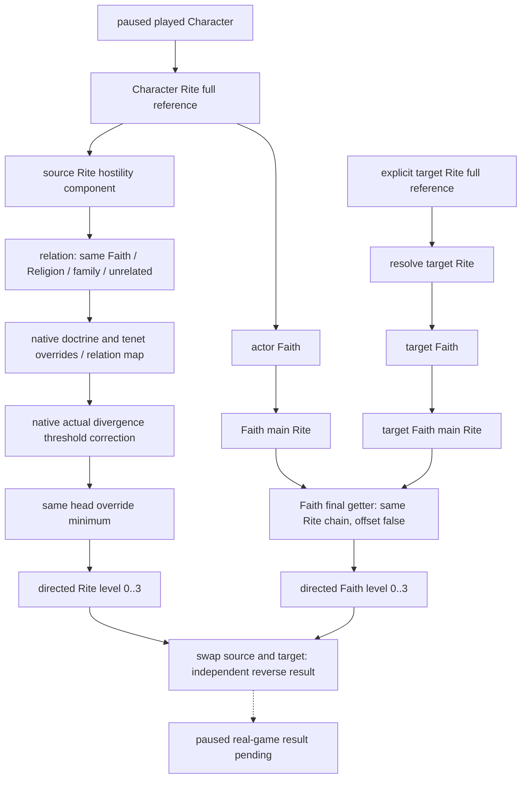

# 1.20.0.2：方向性 Faith／Rite 敌对等级

2026-10-01，CK3 `1.20.0.2 Crozier / Steam25588574`，EXE SHA-256
`AE1BA6FF060BA603842F6F4A2DED0AF4B7D3666B3DD271F75FB01B0DA8E81B2D`。
当前原生调用链为 exact-build `static-confirmed`，独立只读 provider 为 `static-ready`。没有操作 CK3、进程、pipe 或界面。
本专题只覆盖一般宗教关系和婚姻输入，不研究战争消费者，也不实现改宗、动作或策略。

## 原生输入与结果

Character `+B4` 是完整 Rite reference；通过 [当前宗教上下文](ck3-1.20.0.2-religion-context.md)
的实际 getter 获得 actor Rite、Rite 的 Faith、Faith 的 Religion 和 main Rite，不能把 Rite 误标成 Faith。

| 原生入口 | 实际 ABI / 语义 |
| --- | --- |
| `0x2591CE0` | `uint8_t(source_rite + 0x750, source_rite, target_rite)`，Rite 最终敌对等级 |
| `0x243E950` | `uint8_t(source_faith, target_faith, bool offset)`，解析双方 `Faith+0x98` main Rite，再调用 Rite 最终函数 |
| `0x2443580` | `Faith.GetHostilityLevelTowards` reflection wrapper，注册 callback 在 `0x4D3592` |
| `0x2591F80` | source hostility component 的有效 doctrine／tenet override 与 relation map；从入口到 `0x259218B` 的完整 chained 函数 |
| `0x2BDF930` | 实际 Rite divergence getter；最终敌对函数直接调用它 |
| `0x2AEAA50` | `CRiteHostilityLevelTrigger` 的实际 value virtual：`0x4784678+0x100`，传 scoped Rite → target Rite |
| `0x2B28090` | `CFaithHostilityLevelTrigger` 的实际 value virtual：`0x47BE370+0x100`，调用 Faith core，`offset=false` |

返回 ABI 是 **byte**。冻结 `_doctrine_types.info:260–268` 明确列出
`righteous=0`、`astray=1`、`hostile=2`、`evil=3`；`00_defines.txt:870–875`
以同样顺序给出四个 localization key。`4` 是 native invalid/sentinel，不是第五个合法敌对等级。
Faith 的 `offset=true` 会把非 evil 的合法等级加一；本 provider 固定 `false`，保留 script trigger 的基础语义。

Rite 最终函数先解析双方完整 Faith reference：相同 Faith 的 relation 为 0，相同 Religion 为 1，
不同 Religion 但同 family 为 2，不同 family 为 3。这是 **relation 输入**，不是未经 override 的最终敌对等级。
随后调用 source component 的 doctrine／tenet override／relation map，实际 divergence 小于或等于
当前 `RITE_DIVERGENCE_HOSTILITY_THRESHOLD` 时把非零等级减一，最后与有效 same-head override 取更低等级。
Stock 对阈值写“below”；该 exact binary 的 `jg` 分支证明等于阈值也进入减一级路径。
override 的 authoring 语义见 `_doctrine_types.info:170–194`；provider 调用完整最终函数，不在我方重算这些规则。

## 婚姻消费者的方向

冻结 `00_marriage_scripted_modifiers.txt:1127–1207` 的异信仰惩罚使用
**recipient.rite → puppet_or_actor.rite**，不是 actor → recipient，也不是两个值的最大值。
异 Faith 且等级 >0 时先 -10；未获相应 struggle 例外时，等级 >1 再 -15、达到
`faith_hostility_prevents_marriage_level` 再 -975。相同 Faith 跳过该段，但
`:1209–1265` 另按不同 Rite 的 divergence 处理，因此 same Faith / righteous 不等于完整婚姻无宗教惩罚。
这只是婚姻一个原生输入，不能替代既有 native 最终 CanSend／接受度。

## provider 与验收边界

接口读取当前 paused 玩家及一个显式 **完整 target Rite ID**，输出双方 Rite／Faith／Religion／main Rite
身份和四个方向性等级：actor Rite→target Rite、target Rite→actor Rite、actor Faith→target Faith、
target Faith→actor Faith。Actor Rite 与 Faith main Rite 可不同，结果分别保留。
Rite storage `0x5D1E2F8` 使用 `+20` slots / `+2C` count、16-byte slot 内 `+8` object、object `+8` full reference；
只 index mask `0xFFFFFF` 用于寻址，比较保留 generation。无 getter、无对象或 native sentinel 返回 unavailable，不能编造等级 0。

记录入口：`research/religion_doctrine12002_hostility_native.py`、同名前缀 ABI JSON、
`religion_doctrine12002_hostility.hpp/.cpp`；外部 artifact 在
`Z:/ck3_mod_rewrite/artifacts/g2-offline-2026-10-01/religion-doctrines/hostility/`。
尚未接中央 mailbox／MCP，也未获得 paused 实机资格；独立 fixture 通过范围将按真实结果追加。

## 离线实际结果（2026-10-01）

`native/result.json` GREEN：7 个 complete/chained function、2 个明确标记 slice、29 条语义指令、
2 套 exact trigger RTTI／COL／vtable value virtual、5 个 stock 窗口与 5 个实际 source constants。
ABI JSON SHA-256 `1fd331cbbe06add87d65e3112ebb9b5d15af199f0a78fd739f7a38fed4374794`。
已复用当前 religion context getter 的版本证据，未重跑其旧矩阵。

MSVC `/Od` 和 `/O2`、`/W4 /WX` 均 `PASS checks=20`。这是各 20 条检查，不能称 20 场实机测试。
夹具编译并调用真实 `ReadPlayedHostilityTowardsRite12002`／实际 serializer；底层 native getter 是
夹具持有的 ABI callbacks，没有启动游戏。每次查询取两帧，实际验证双向不对称、personal/main Rite
差异、同 Religion／同 Faith、不同 Religion 的 native override、完整 generation、合法 target ID 0、
合法等级 0、native sentinel unavailable、第二帧实际不同、暂停要求与 exact binder。
每个构建生成七份实际 JSON，源码冻结副本见 `research/religion_doctrine12002_hostility_wire_fixtures.json`。

初次 attempt 保留在 `attempt-001-harness/`：RTTI 字符串 verifier 多取一字节，以及 fixture 的
`optional<uint32_t> == int 0` 被 `/WX` 判为 signedness warning。已分别改为准确长度与 `0U`；
production provider 未因这两个 harness RED 改动，也没有 capability live RED。

中央增量只需把该 library 接至同一宗教 query 的显式 target Rite 请求及 Python/MCP typed output。
下一资格必须由 root 在真实 paused 帧读取双方当前身份和四个等级；本包没有 conversion action、
婚姻最终合法性、完整 religion OODA 或 G2 credit。
