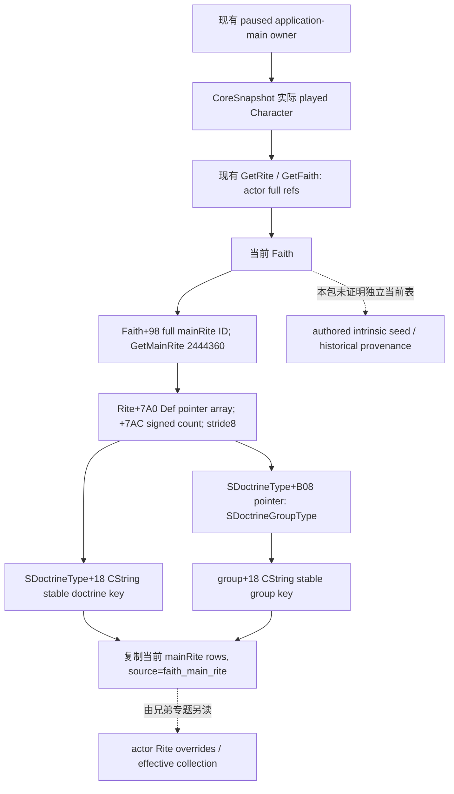

# CK3 1.20.0.2 Faith 教义：当前 main Rite 与 authored intrinsic 的区别

项目所有者于 2026-10-01 恢复宗教研究并停止战争研究。本包只读取当前玩家 Faith 的 main Rite 教义，不做转换、改革或战争操作。冻结 EXE 为 CK3 1.20.0.2 Crozier / Steam25588574，SHA-256 `AE1BA6FF060BA603842F6F4A2DED0AF4B7D3666B3DD271F75FB01B0DA8E81B2D`。

原版 `common/religion/faith_types/_faith_types.info:35-43,60-64` 中的 Faith intrinsic doctrines 是 authored seed：同组的 Rite 与 Religion 选择优先。该 stock 规则已由 [宗教 stock 专题](ck3-1.20.0.2-religion-stock.md) 冻结，不能把它称为当前持久 Faith 的独立教义列表。本轮找到的实际 Faith getter 都转向 **当前 main Rite**；未证明存在独立的 current intrinsic runtime 表。因此生产接口明确名为 `ReadPlayedFaithMainRiteDoctrines12002`，每行来源为 `faith_main_rite`。

## 已闭合原生读取树



这里没有自行合并 Faith 与 actor Rite。原生 initializer 的同组筛选、可用性与可兼容性由兄弟 Rite 专题解释；已有生效集合直接读取游戏维护的实际结果。

## Exact-build 证据

| 入口 / 字段 | 精确来源与语义 |
| --- | --- |
| Faith `HasDoctrine` reflection | registration slice `0x4D4620–0x4D4717`，callback LEA `0x4D4707 → 0x2443A40`；wrapper `0x2443AB4` 调 core `0x2439C20` |
| Faith `HasDoctrine` core | 完整 leaf `0x2439C20–0x2439CAF`；`+0x98` 解析 full main Rite，目标 `+8` 校验 generation；`0x2439C67/+C73` 读取 main Rite `+0x7A0/+0x7AC`，`*8` pointer membership |
| UI `GetDoctrines` | registration `0x71279–0x71314` 明确 `GetDoctrines`，callback `0x71303 → 0xC59360`；完整 wrapper `0xC59360–0xC593F1` 同样解析 Faith main Rite 并返回其 `+0x7A0` collection |
| Faith inherited doctrine source | `0x24F8176` 调 leaf `0x243EA30–0x243EA85`，返回当前 main Rite 的 `+0x750` TenetDoctrineContainer；caller `0x24F8181` 从容器 `+0x50` 取 doctrine array，传 `0x24FA130` |
| Definition stable key | initializer `0x24FA541` 取 SDoctrineType `+0x18`，用于原生 `'Visible' Doctrine '{}'` 日志；不是显示名或 full entity ID |
| Definition group | initializer `0x24FA2AA/0x24FA2FD/0x24FA371` 取 SDoctrineType `+0xB08` 的 group pointer，按 group 去重复；同组 compare 在 group postload `0x31E1183` 再次直接证明 |
| Group stable key | 完整 group postload `0x31E0FA0–0x31E12BB`，`0x31E0FD2` 取 group `+0x18`；`0x31E1003/+0x31E100A` 实际 CString 长度/capacity；`0x31E11E8` 将该 key 传入 `DoctrineGroup '{}' has no associated DoctrineTypes` 日志 |
| Definition registry | getter `0x8FC740–0x8FC797` 读取 `0x5C67198` CDoctrineTypeDatabase*；group postload `0x31E1161` 取该 DB，`0x31E1166/+0x31E116A` 读取 DB `+0x50` Def* array / `+0x5C` count，再按 `Def+B08 == group` 枚举。生产 reader 无需调用缺失时会日志/初始化的 DB getter |

教义与教义组定义是原版静态数据库对象；这两类定义没有被本包证明为 full-generation runtime entity。对外公开真实 stable key，不输出地址、造出的 full ID 或 intern token 数值。仅 actor/Rite/Faith/mainRite refs 保留原生完整 32 位 generation。

ABI 提取与冻结 manifest 位于 [研究脚本](../../research/religion_doctrine12002_intrinsic.py) / [ABI JSON](../../research/religion_doctrine12002_intrinsic_abi.json)。已通过一次 exact-build 提取验证：7 个完整函数、3 个明确 registration/caller slice、25 条语义指令、3 个 exact RTTI、9 个实际 producer 常量。ABI manifest SHA-256 为 `fe2e219c19e63bd92222bc4f8c0ee2f5ccf38b1ad80be4411aa9911c192a1ccd`；原始 span 字节、每个 span SHA、registration callback 与 RIP target 全部保留。

## 实际 provider 与验证

接口在 [header](../../ck3_autonomous_player/native_bridge/include/xar_bridge/religion_doctrine12002_intrinsic.hpp)，实现为 [生产读取与 serializer](../../ck3_autonomous_player/native_bridge/src/religion_doctrine12002_intrinsic.cpp)：

```cpp
bool ReadPlayedFaithMainRiteDoctrines12002(const religion::Bindings&,
    uint64_t capture_epoch, FaithMainRiteDoctrines&) noexcept;
bool CopyDoctrineDefinition12002(const void* definition, DoctrineRow&);
std::string SerializeFaithMainRiteDoctrines12002(const FaithMainRiteDoctrines&);
```

它只接受已有 exact-build religion/CoreBindings，由现有 paused application-main owner 读取实际 played Character；没有任意 actor 参数、进程发现或命令。输出含实际 date、capture_epoch、played Character ID、actor Rite/Faith/mainRite 的 full IDs，以及两次相同原生读取取得的实际 `doctrine_key` / `group_key` rows。合法无 Rite/Faith/mainRite 与已观测空列表可成功，读取失败保留 `available=false` 与原因；未知不伪装为空结果。定义 copier 供 actor Rite、知识列表兄弟 reader 复用，避免各自重造定义 identity。

生产 reader 不调用可能初始化或日志的 DoctrineType DB getter；registry 的实际 pointer array、对象类型与 group linkage 已冻结作 ABI 证据。它直接复制原生当前 mainRite collection 中已有 Def* 的稳定定义键。不自行根据 stock 表合并，不声称某条教义的历史持有来源。

[实际组件 fixture](../../ck3_autonomous_player/native_bridge/src/religion_doctrine12002_intrinsic_test.cpp) 与 [runner](../../research/religion_doctrine12002_intrinsic_tests.py) 链接实际 `ck3_12002.cpp`、生产 reader/copier/serializer。MSVC `/W4 /WX /Od`、`/O2` 各通过 **13 项检查**；每种模式生成 **4 份实际 C++ JSON**，由 Python 按原字符解析：`current-main-rite`、`known-empty`、`legal-absent`、`main-rite-unavailable`。它验证 actor Rite≠mainRite、full generation、合法零 ref、SSO 与 heap CString、中文与引号 stable key、明确来源、读取失败、实际两次读取不一致和 paused 入口。没有将 fervor/fulfillment getter 设为额外前置依赖。

artifact 根为 `Z:/ck3_mod_rewrite/artifacts/g2-offline-2026-10-01/religion-doctrines/intrinsic/`：`native/native-verification.json`、`native/native-disassembly.txt`、`provider-final/result.json` 与两模式完整 build/test/wire 文件。首次 fixture 在 `optional<uint32_t> == 0` 的测试表达式触发 `/WX` signed/unsigned warning；这是 **harness RED**，日志保留在 `provider/Od/build.log`。只把 fixture 零常量改为 `0U` 后重跑必要两编译配置；没有修改生产 reader，也未把失败改写成 capability RED。

复跑入口：

```text
python research/religion_doctrine12002_intrinsic.py --exe <frozen-exe> --output-dir <Z-artifact-dir>
python research/religion_doctrine12002_intrinsic_tests.py --output-dir <Z-artifact-dir>
```

本包为 **`static-ready`**，没有启动、附加或操作 CK3，不是 fixture-live 或 production-live。root 后续在统一宗教 query 的真实 paused frame 取得本 DTO，并与 actor Rite 输出对照，才能提升 primitive 的 live 资格。authored intrinsic 历史来源、宗教动作/费用和完整宗教决策仍有独立施工入口，不由这份当前集合替代。
