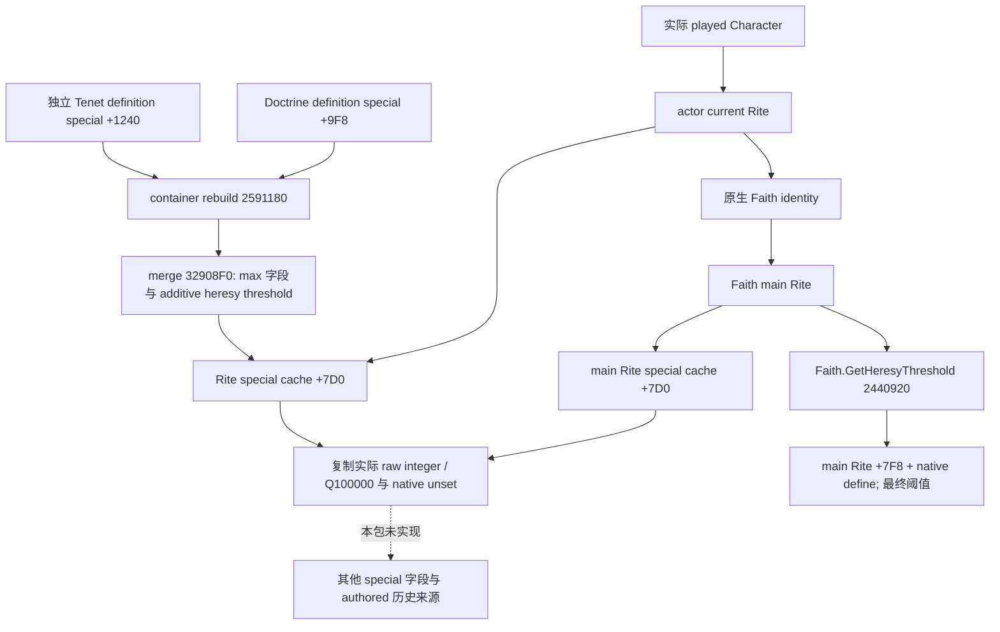

# CK3 1.20.0.2 当前宗教 special_parameters 数值缓存

状态：原生字段与读取树 static-confirmed；R6 私有 SDK 的五项缓存及原生最终阈值查询已取得真实暂停帧，升为 `production-live primitive`。覆盖仅为下文记录的本帧读取，没有宗教动作或 OODA。

**1.20.0.2 的普通 `parameters` 与 `personal_tenet_parameters` 是布尔 token 集合，不是通用数值 map。** 冻结 stock 的 199 个普通参数块、95 个个人参数块没有数值赋值。旧 `STokenParameter` 数字反射 getter `0x22C81A0` 不能冒充本版本当前 effective 数值查询。`Faith.HasParameterByKey` 同样只转到 main Rite `+0x7B8` 布尔 membership。数值 authoring 位于独立 `special_parameters`。

冻结游戏 CK3 1.20.0.2 Crozier / Steam 25588574，EXE SHA-256 `AE1BA6FF060BA603842F6F4A2DED0AF4B7D3666B3DD271F75FB01B0DA8E81B2D`，大小 101039736 bytes。本包不涉及战争、holy order、宗教动作或我方策略；只读取同一 paused owner frame 的实际 played Character。

原生 constructor `0x14F27B0` 初始化特殊参数结构；container `+0x80` 为该结构，即 Rite `+0x7D0`。rebuild `0x2591180` 将 Core Tenet definition `+0x1240` 与 effective Doctrine definition `+0x9F8` 合并到该结构。`0x32908F0` 对多个字段取 max，对 `+0x28` 加法合并。当前最小输入目标为 `minimum_fervor`、`fervor_per_holy_site`、`bonus_fervor_gain`、`bonus_heresy_protection`、`heresy_threshold`。

`heresy_threshold` 特殊参数是 additive adjustment，不能等同于 Faith 的最终阈值；后者已由 `0x2440920..0x2440974` 证明只读取 Faith main Rite `+0x7F8` 加原生 define。actor current Rite 与 Faith main Rite 必须保留独立来源。

constructor 默认零的合并字段不保留“显式 authored 零”与“未 authored”的历史区别。输出必须称为实际 effective cache 值，不能从零反推 definition 缺失。`minimum_fervor` 的原生 `-1` sentinel 则可明确表示 unset，不能当成零；读取失败与合法无 Rite 另外区分。

| 原生 key | special / Rite offset | payload 与 scale | 默认 / 合并 | 实际 Faith consumer |
| --- | --- | --- | --- | --- |
| `minimum_fervor` | `+C` / `+7DC` | signed int32，scale 1，热忱点数 | -1 unset / max | setter `243EBC0..243EC59` 将主 Rite 整数乘 100000 作为热忱下限 |
| `fervor_per_holy_site` | `+10` / `+7E0` | signed int64，Q100000，每个受控圣地的年度热忱增量 | 0 / max | Faith calc `243EF4B..243EFA2` 从主 Rite 读取，在圣地遍历中使用 |
| `bonus_fervor_gain` | `+18` / `+7E8` | signed int64，Q100000，年度热忱增量 | 0 / max | Faith calc `243EE24..243EE7D` 从主 Rite 读取并加原生基础增量 |
| `bonus_heresy_protection` | `+20` / `+7F0` | signed int32，scale 1，保护名额增量 | 0 / max | Faith calc `243F626..243F685` 读取主 Rite 整数并加原生基础保护数 |
| `heresy_threshold` | `+28` / `+7F8` | signed int64，Q100000，热忱阈值 adjustment | 0 / addition | final getter `2440920..2440974` 读取主 Rite adjustment 并加原生 define |

`32901B0..3290557` 为特殊参数 field parser；五个 key 的 builtin table/CString 字节及实际 token 分派冻结在 [ABI JSON](../../research/religion_doctrine12002_numeric_abi.json)。`minimum_fervor` 分支 `329021A` 传 `+C` 给 int parser；holy-site gain 分支 `32902AD` 传 `+10` 给 fixedpoint parser；bonus gain `3290530` 传 `+18` 给同一 fixedpoint parser；protection `3290525` 传 `+20` 给 int parser；threshold `3290519` 传 `+28` 给 fixedpoint parser。原生 fixedpoint parser `3F840C0..3F841A1` 写 signed 64-bit；Faith consumer 的乘 100000 与同一 Q 原生基础值闭合单位。

Stock 证据为 `Z:/ck3_mod_rewrite/artifacts/g2-offline-2026-10-01/religion-doctrines/tenet/numeric-stock-dependencies/result.json`，SHA `b51ff93b66ed96128c3047c2d455490c82f0c92e09dfbc7e1bf959214339e683`。`_doctrine_types.info` 134–168 行明写这五项默认和合并规则；`20_doctrines.txt` 的无领袖教义提供最低热忱 45、bonus gain 0.5、保护 1、threshold +5；fundamentalist adjustment -5；Pentarchy Tenet 的 holy-site gain 为 0.05。

离线 ABI 已冻结 10 个完整函数 / 明确 scalar merge 与 actual consumer slices，跨 `.pdata` fragment 的 merge 只称 scalar slice，不冒称完整函数。父包既有 bool/rows 验证不重跑；新 provider 只运行一次 `/O2 /W4 /WX` 实际组件验证。

实际接口为 [religion_doctrine12002_numeric.hpp](../../ck3_autonomous_player/native_bridge/include/xar_bridge/religion_doctrine12002_numeric.hpp) 的 `BindNumericSpecialParameters12002`、`ReadPlayedNumericSpecialParameters12002`、`LookupNumericSpecialParameter12002` 和 `SerializeNumericSpecialParameters12002`。它复用已有 exact-build `religion::Bindings/CoreBindings`；只从实际 played Character 取得当前 Rite、Faith/main Rite 的完整 generation ID，分别复制五项原生缓存。DTO 的 `supported_key_count=5` 和行级 raw/scale/unit 描述当前支持范围，不声称已覆盖所有特殊参数或未来热忱预测。

typed lookup 分开 `Value`、`Unset`、`UnsupportedKey`、`UnavailableSource`。真实观测零返回 Value；最低热忱 -1 返回 Unset、保留 raw=-1 而 value=null；合法无 Rite 可 available=true/source=null；失败 available=false，没有伪造零缓存。default-zero 字段始终是有效合并值，不输出 invented authored presence。

本轮验收 GREEN：`religion_doctrine12002_numeric_native.py` 校验 **10 spans、5 个实际 key、6 个 provider offsets**；`religion_doctrine12002_numeric_tests.py` 只编译并运行一次 `/O2 /W4 /WX`，链接实际 core 与实际 production reader/serializer，**15 项检查、6 份实际 C++ DTO JSON**：current-versus-main、known-zero-current、minimum-unset、legal-absent、faith-unavailable、state-changed。JSON parser 互证 0.05、0.5、signed threshold ±5、integer protection、原生 unset 与失败。没有 Od / 旧 Boolean 19 / Rows 15 / mailbox 29 重跑，也未启动 CK3。

最初离线证据根：`Z:/ck3_mod_rewrite/artifacts/g2-offline-2026-10-01/religion-doctrines/numeric/`。`native/native-verification.json`、`native/native-disassembly.txt`、`provider/result.json`、`provider/O2/build.log`、`test.log` 与实际 JSON 保留。新增六份实际 DTO 的可移植冻结文件为 [numeric_wire_fixtures.json](../../research/religion_doctrine12002_numeric_wire_fixtures.json)。这个文件仍是 provider DTO，不能单独作为中央 mailbox 或 paused 游戏证据；后续实际查询另见 [numeric mailbox](religion_doctrine12002_numeric_mailbox.md) 与本页下段。最终 Faith heresy threshold 的 native define 与 callback 通过独立 getter 提供原生最终比较值。

**R6 实际暂停 SDK 读样，2026-10-01。** 已保存批次 `Z:/ck3_mod_rewrite/artifacts/g2-offline-2026-10-01/targeted-sdk-r6/r6-new-five-law-recovery-20261001T115250Z/` 的 [003 数值响应](Z:/ck3_mod_rewrite/artifacts/g2-offline-2026-10-01/targeted-sdk-r6/r6-new-five-law-recovery-20261001T115250Z/003-ck3_query_player_religion_numeric_special_parameters_v1.json) 来自 `ck3_query_player_religion_numeric_special_parameters_v1`，`isError=false`、`resultType=complete`、`available=true`、`status=observed`、`read_only=true`。响应 SHA-256 为 `d87877f677e4ece4b6b94e7a033e8f125335aeca26e2f080df49eeb65ed75baf`。相邻已保存 snapshot 002 确认 `paused=true`、cold bridge PID **77216**、角色 **29829**、日期 **53169336**、exact-build match=true；游戏版本与 EXE SHA 与本专题冻结值一致。本次文档代理只核验保存包，没有新增游戏调用、测试或 state action。

SDK `queried_revision=2`，原生 `queried_native_revision / snapshot_revision=3`，实际 owner `capture_epoch=13386`；这三个数各有含义，不能互换。Faith full ID 为 **23**；当前 Rite 与 Faith main Rite 本帧均为 **152**，两者各自 `observed_special_parameters_complete=true`、各有五项真实缓存：

| key | 当前 Rite raw / value / state | main Rite raw / value / state |
| --- | --- | --- |
| `minimum_fervor` | `-1 / null / unset` | `-1 / null / unset` |
| `fervor_per_holy_site` | `0 / 0.0 / value` | `0 / 0.0 / value` |
| `bonus_fervor_gain` | `0 / 0.0 / value` | `0 / 0.0 / value` |
| `bonus_heresy_protection` | `0 / 0 / value` | `0 / 0 / value` |
| `heresy_threshold` adjustment | `0 / 0.0 / value` | `0 / 0.0 / value` |

同一次响应的 `faith_numeric_final.available=true`，epoch、角色、日期及 Faith / Rite 身份与主缓存一致。原生 getter `0x2440920` 给出 `native_define_raw=6500000`、`main_rite_adjustment_raw=0`、`final_heresy_threshold_raw=6500000`、scale **100000**、最终阈值 **65.0**。这实际区分了零修正与最终比较值，也保留最低热忱的 unset；没有将 null 当作读取失败或把缓存零反推成 authored 参数不存在。

该已保存帧支撑五项缓存和最终阈值的 `production-live primitive`。当前 / main Rite 相同，非零 bonus、负修正及不同 Rite 来源仍只有离线夹具覆盖，不能写成已实机覆盖。此读取不证明改宗、改革、费用支付、未来热忱预测或完整 OODA；实际动作、结果闭环和总体宗教 readiness 另属后续工作。保存包核验与原文件 SHA 索引在 [saved-package-verification.json](Z:/ck3_mod_rewrite/artifacts/g2-offline-2026-10-01/religion-doctrines/live-r6-docs/saved-package-verification.json)。
