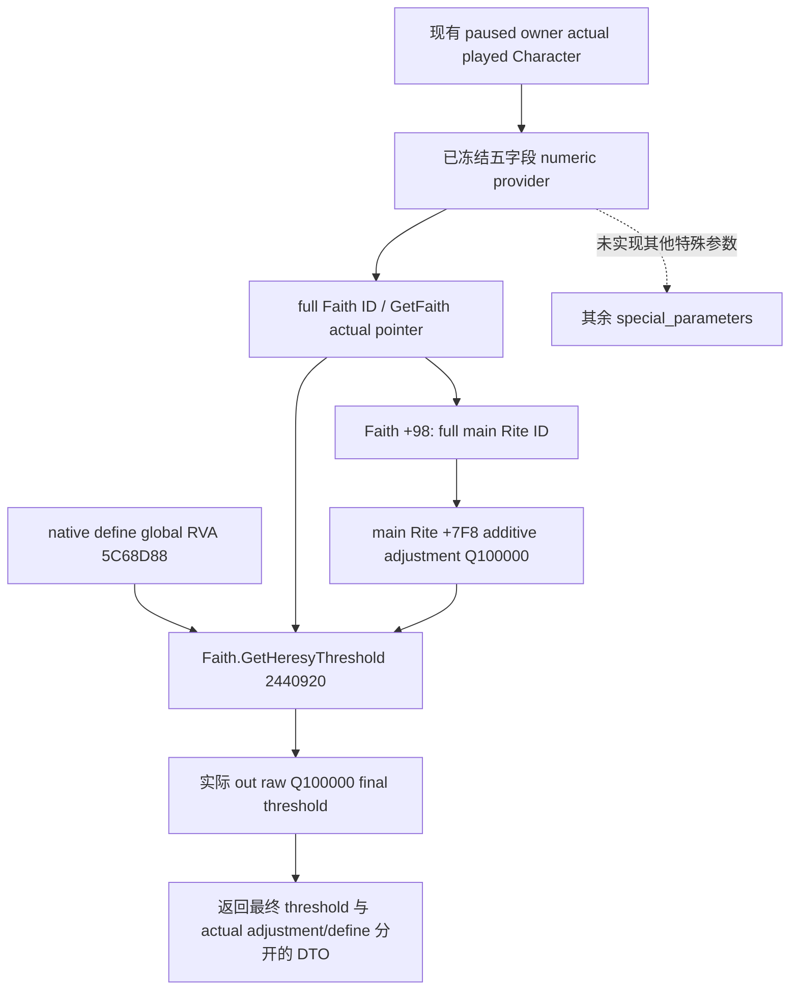

# CK3 1.20.0.2 Faith 原生最终异端热忱阈值

状态：native ABI static-confirmed；独立 actual provider / native callback / serializer static-ready，不改已冻结五字段包。

冻结 CK3 1.20.0.2 Crozier / Steam 25588574，EXE SHA `AE1BA6FF060BA603842F6F4A2DED0AF4B7D3666B3DD271F75FB01B0DA8E81B2D`。本包只读取原生最终比较值，不触碰 CK3 进程、游戏动作、战争、holy order 或我方策略。

UI registration `4D3620` 绑定 callback `24435C0`，最终 native getter 是完整 leaf `2440920..2440974`，ABI `int64_t* (const Faith*, int64_t* out)`。它解析 Faith `+98` 的主 Rite full reference，校验 generation，然后把该主 Rite `+7F8` 的 signed Q100000 adjustment 加原生 signed Q100000 define（global `5C68D88`）写到 out，并返回 out 指针。该完整 span 已由 [五字段 ABI](../../research/religion_doctrine12002_numeric_abi.json) 的单次 exact-file verification 通过，复用 receipt，不重复原生验证。

这是最终 `Faith.heresy_threshold`，与 [五字段 cache](religion_doctrine12002_numeric.md) 中的特殊参数 adjustment 不同；Faith consumer 不读取 actor current Rite 的同名 adjustment。合法没有 Faith / main Rite 时没有原生最终值，不能使用 native fallback object 伪造玩家 Faith。当前 provider 依旧由 actual played scope 解析，没有任意 actor 或目标参数。

接口在 [numeric_final.hpp](../../ck3_autonomous_player/native_bridge/include/xar_bridge/religion_doctrine12002_numeric_final.hpp)：`BindFaithNumericFinal12002(base, exact_sha)` 绑定 getter 与 define address；`ReadPlayedFaithNumericFinal12002(religion::Bindings, NumericSpecialBindings, FaithNumericFinalBindings, capture_epoch, output)` 复用冻结的实际五字段 provider，取得玩家 Faith/main Rite 后调用两次真实 getter ABI，并在前后实际状态采样一致时复制结果；`SerializeFaithNumericFinal12002` 输出独立 DTO。数值来自 native callback 的 out 参数，不由我方对缓存自行计算后冒充原生最终结果。

DTO 保留实际 played/date/epoch、current Rite / Faith / main Rite full ID、main adjustment raw、native define raw、native final raw/value，scale 100000，unit `fervor_points`，source `faith_main_rite`。`value_state=value` 下合法 0 仍为数值；`legal_absent_faith` / `legal_absent_main_rite` 为合法源缺失且不调用 fallback；失败 available=false。该阈值是原生当前比较值，不是未来热忱预测、改革 divergence 创建阈值或动作合法性总结果。

验证 GREEN：[final_tests.py](../../research/religion_doctrine12002_numeric_final_tests.py) 一次 `/O2 /W4 /WX` 链接实际 core、冻结五字段 producer、新 final producer 与 native callback fixture，**10 项新增检查、6 份实际 C++ DTO JSON**。主 Rite adjustment +5、原生 base 25 的实际 callback 得 final 30；玩家当前 Rite -5 没有被错用。已覆盖 actual out ABI、合法最终零、Faith/main Rite 合法缺失、实际 callback 不可读、实际两次 callback 值改变和 image binding。复用冻结 memory fixture 的旧 main 不执行，原 15 检查及所有早先包不重跑。

独立证据：`Z:/ck3_mod_rewrite/artifacts/g2-offline-2026-10-01/religion-doctrines/numeric/final-provider/result.json`、`O2/build.log` / `test.log` / 六份 DTO；[final ABI](../../research/religion_doctrine12002_numeric_final_abi.json) 回链已验证 span/receipt；[可移植 final DTO](../../research/religion_doctrine12002_numeric_final_wire_fixtures.json) 供后续 query/SDK 复用。没有新 RED，没有 CK3/process/pipe/UI 访问；中央 query 和 paused live artifact 仍待协调者验收。
