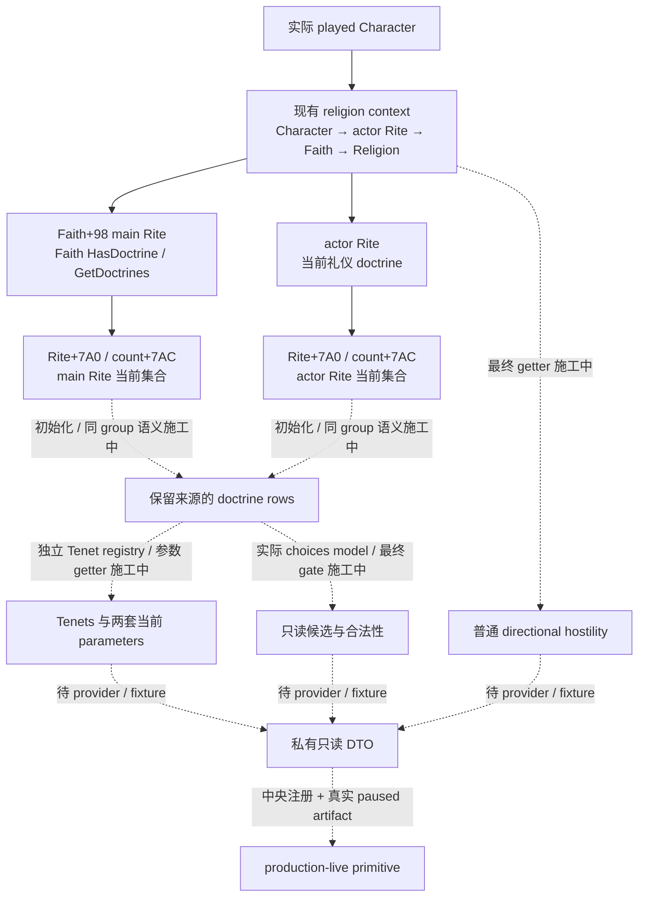
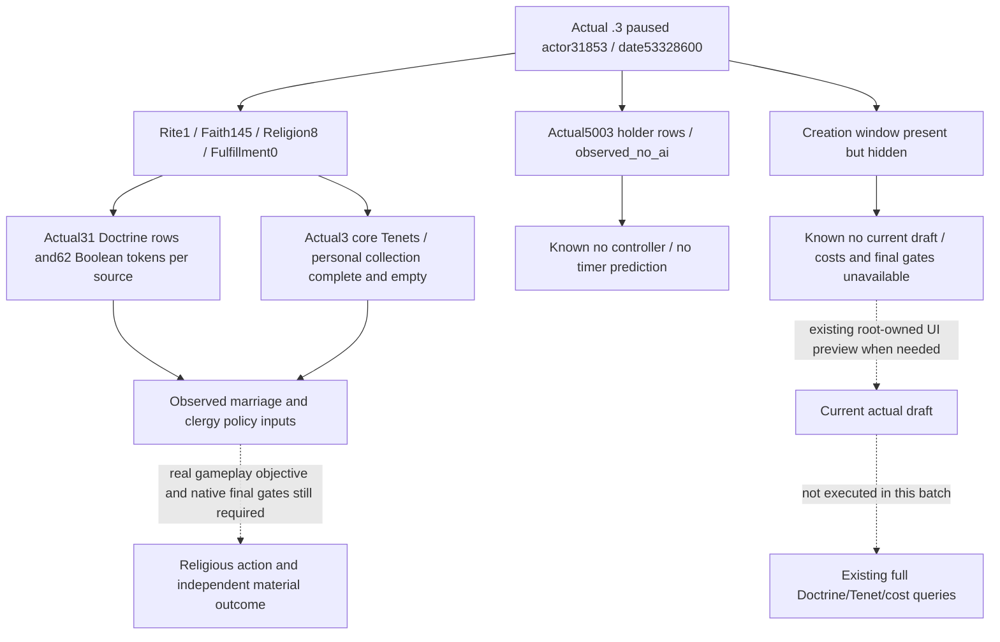

# 1.20.0.2 当前玩家 Doctrine / Tenet 只读原生施工

施工开始记录：2026-10-01 16:17（Asia/Shanghai）。项目所有者已明确恢复宗教研究，同时停止战争相关研究。本专题只覆盖一般宗教与必要婚姻语义，不开展战争、圣战或 holy order。它是独立后续增量，不阻塞已冻结 nonwar candidate 的首轮实机。

冻结游戏为 CK3 **1.20.0.2 Crozier / Steam build 25588574**；`ck3.exe` 大小 `101039736` bytes，SHA-256 `AE1BA6FF060BA603842F6F4A2DED0AF4B7D3666B3DD271F75FB01B0DA8E81B2D`。施工输入是冻结安装文件，研究与夹具不访问运行中的 CK3。当前 baseline 为 [religion-stock](ck3-1.20.0.2-religion-stock.md) 与 [实际宗教 context](ck3-1.20.0.2-religion-context.md)，复用其已验证 getter，不重复旧验证。

`Character+0xB4` 是 full **RiteID**；Faith 由原生 `Character.GetFaith` 解析当前 Rite 后获得。角色采用的 Rite 与 Faith 的 main Rite 可以不同。因此“Faith intrinsic doctrine”“Rite 覆盖 doctrine”“有效 doctrine”必须分别保留来源与含义，不能将同一字段改标签当作完成。

## 五个并行工作包

| 工作包 | 当前交付目标 | 施工边界 |
| --- | --- | --- |
| Faith doctrine source | 原生 Faith 查询实际来源、authored definition 与 runtime 状态、stable key / group | 不将 main Rite 的当前集合误标为独立 intrinsic 列表 |
| Rite override | 实际 Rite doctrine collection、同 group 覆盖与 effective lookup | 不把 main Rite 当作玩家 Rite |
| Tenet / parameter | 原生 Tenet 分类与实际参数 getter、参数类型 / 来源 | 不以 stock 文本猜当前 runtime 状态 |
| 普通 hostility | 原生最终敌对分类 getter、方向与 enum 语义 | 仅一般宗教 / 婚姻，不研究军事使用 |
| Choices / legality | 实际 Doctrine / Tenet choices model、最终可见 / 合法输入 | 只读；不执行改宗、改革或创建信仰 |

每个工作包先记录 exact-build 原生树、ABI 与 Mermaid，再实现已闭合、能独立提供实际状态价值的最小只读 provider。复杂 choices model 未闭合时，记录具体构造器 / 最终 gate 的下一入口；不得用长期空字段或 schema 声称 choices 完成。共享 CMake、bridge 注册与 Python / MCP 接线由对应中央 owner 负责。本页及各域源不修改首轮冻结运行树。

以上虚线保留尚未闭合的完整 choices 分支。施工开始时五包均为 **research**；当时预计第一批原生树 / ABI 在 20–40 分钟交付，已闭合 getter 的最小 provider / MSVC fixture 在 40–75 分钟交付，完整 choices model 在 60–120 分钟研究。以下以实际回执更新，估计不是验收承诺。

## 第一批静态发现

原生 `Faith.HasDoctrine` core `0x2439C20` 与 UI `GetDoctrines` `0xC59360` 解析 `Faith+0x98` 的 **main Rite**，继而访问 `Rite+0x7A0` doctrine pointer array、`+0x7AC` count。它们不是独立 Faith intrinsic 列表 getter；authored definition 的初始化来源与当前 runtime 集合需分别追查。当前角色的 Rite 及 Faith main Rite 要分别观测。

Faith 的 `has_doctrine_parameter` trigger `0x2B29170` 同样先解析 main Rite，再查 `Rite+0x7B8` 布尔 token 集；直接 Rite trigger `0x2AE9F70` 使用接收者 Rite 的该集合。两者均复用 membership `0xB9DE80`。布尔 token 与数值参数类型、key 来源正在闭合。新版 Tenet 有独立 `CTenetTypeDatabase`，不能按旧版 Doctrine group key 直接重命名为 Tenet。

一般 Faith hostility core `0x243E950` 通过双方 Faith main Rite 调用最终 `0x2591CE0`；其分类具有方向，offset 参数为 UI 变换。只读 provider 将固定 offset=false，并区分 actor Rite 及 Faith main Rite 的结果，分类标签与完整 ABI 由域专题冻结。

`window_rite_creation.gui` 的 choices 最终可选条件是 `DoctrineItem.CanPick(TopScope)` **并且** `pam_know_doctrine`，后者为真实玩家的 `knows_doctrine` 或 `prophet_perk`；还受 `ShouldDisplay(TopScope)` 控制。raw `CanPick` 不是完整最终合法性。choices model 的构造器、记录布局与 top-scope 输入仍有未闭合分支，不能将这个条件的名字或 schema 当作可执行候选 query。

后续 actual popup 研究已纠正同名 reflection 的类型归属：`0xEE47A0 → 0xEE0AD0` 是 **TenetItem.CanPick**，不是 DoctrineItem；DoctrineItem 单参数 wrapper 是 `0xEE4E60`，其 definition triggers 位于 `+0x1B8 / +0xE8`。知识 getter `0x28B0C00(Character*, DoctrineDefinition*)` 的生产读取与已完成 fixture 不受这个标签更正影响。choices ABI / 树已按新类型证据更新，旧标签不得用于最终合法性结论。

## 当前交付截点

2026-10-01 16:44（Asia/Shanghai）已完成 [当前 Doctrine query](religion_doctrine12002_query.md) 的真实 mailbox/完整 command-result：MSVC `/Od`、`/O2` 各 26 项新路径检查、各 4 份实际 full packet，并完成 3-reader 组合各 3 个 case。Python consumer 随后复用这四份 packet，3 个测试／7 个子场景通过；SDK 私有路由和中央 shared 登记由各 owner 接线。该包为 **static-ready**，没有 root paused artifact 时不称 live。

五个 library 首包及真实 Tenet rows 已各自通过必要 fixture，可复用下列原生专题：

- [Faith/main Rite Doctrine](religion_doctrine12002_intrinsic.md)：13 检查与 4 实际 JSON／模式。
- [actor Rite 有效 Doctrine](religion_doctrine12002_rite.md)：23 检查与 4 实际 JSON／模式。
- [布尔参数](religion_doctrine12002_tenet.md)：19 检查与 5 实际 JSON／模式；真实 core/personal Tenet rows 另有独立包。
- [一般 directional hostility](religion_doctrine12002_hostility.md)：20 检查与 7 实际 JSON／模式；其单独 target-Rite query/mailbox 正在交付。
- [Doctrine knowledge / choices 真实输入](religion_doctrine12002_choices.md)：19 检查与 8 实际 JSON／模式；完整可选列表/最终合法性未闭合，不以知识 getter 冒充它。

这些数字是各包原始验证范围，不汇总成新的验收矩阵或 live 计数。仅对新 selector/mailbox 路径增加相称的验证，不重跑已冻结 library 证明。第一批 ABI 和已闭合最小只读 primitive 在施工开始后约 27 分钟进入 static-ready；共享接线、真实 paused artifact 与实际游戏价值仍由下一增量记录。

交付记录应包含精确 tracked paths、SHA-256、原生 proof、一次与变更相称的实际 production-path fixture、失败 attempt、真实 readiness，以及日报 / 周报汇总字段。fixture 使用夹具进程的对象和原生回调替身，不等于运行游戏、fixture-live 或 production-live。后续真实 paused 验收由 root 串行执行。

## 2026-10-02：1.20.0.3 Murchad 当前宗教五查询实测

2026-10-02 08:47–08:48（Asia/Shanghai），root 在 CK3 **1.20.0.3 Crozier / Steam25652598** 的普通 `xar_off/no-pact` Murchad 局，以现有 production MCP 串行执行 context、effective Doctrine、current Tenet、AI reform inputs、already-open reform context 五项只读查询，全部 `status=observed / available=true`。本次取得的是 **production-live primitive**；没有宗教动作、时间推进、冷恢复或完整宗教 OODA，不增加 G2 完成数。

冻结 EXE SHA-256 为 `94b55397abb687a3dcd436805a5d885e6be90fa6c693feb44a9e3bbeeade02a6`；Python source 为 `0ccc3f00b741598bc7ef72798a831ed2f7157abf`，v10 DLL SHA-256 为 `af88527cd99d18cdd0b3f493ccc84f25fbe70e58bc1dfacac38647071909c876`。实际 PID **54636**、actor **31853**、episode `native-31853-af642d76cb41`、paused date raw **53328600**。每项查询前取 fresh public snapshot revision，各查询自己的 owning callback epoch 不同；这里证明固定 paused 日期和玩家的连续采样，不声称五查询组成同一个 atomic capture epoch。既有[16 宗教 ABI 迁移 PASS](Z:/ck3_mod_rewrite/artifacts/migrations/2026-10-02/abi-comparison/religion-supplement/summary.json)直接复用，未重跑 ABI 或旧 fixture 矩阵。

原始包保留在 [religion-murchad-v10-01](Z:/ck3_mod_rewrite/artifacts/g2-maintainer-2026-10-02/resume-12003/religion-murchad-v10-01/)；完整字段、packet SHA、运行输入与收口字段见 [ACTUAL-MURCHAD-V10-REPORT-FIELDS.json](Z:/ck3_mod_rewrite/artifacts/g2-maintainer-2026-10-02/resume-12003/religion-murchad-observation/ACTUAL-MURCHAD-V10-REPORT-FIELDS.json)。只消费 `structuredContent`，不把同一个 payload 的 `content.text` 副本重复计数。

| 实际查询 | 当前观测 | 原始包 SHA-256 |
| --- | --- | --- |
| `004 context` | actor Rite **1** → Faith **145**（`christian_faith`）→ Religion **8**（`christianity_religion`）；main Rite **1**；fervor raw **5000000**，Fulfillment raw **0**，scale **100000** | `040404fe33c7c1a17700e876835bf404ce4145db3462d46c7d63498d2560b121` |
| `006 doctrines` | actor Rite 与 Faith-main-Rite 各 **31** effective Doctrine rows；两个独立参数来源均完整，各 **62** 布尔 token | `67e61ec6ebd3526d3883573b78eceda57e6e8d41ff7c7dbc1e1da34ad1deb8c0` |
| `008 current tenets` | 两来源各 **3** core Tenets：`tenet_confession`、`tenet_communal_identity`、`tenet_vows_of_poverty`，状态均 **core=4**；`personal_tenets_complete=true`，个人 Tenet `[]` | `45402f7f160894a677bda6ca3d4f5c3c74a90d355fdf4d2ee5123ad4a648488a` |
| `010 AI inputs` | actual holder **5003** 项完整观测；`observed_no_ai / controller_count=0 / gate_inputs_observation_complete=true`；当前 globals `reformation_enabled=true`，rare period **180 prepare ticks** | `00c599842011405b72d6ebe6ac6972bbb1edc0138e0b39e680eed3b169a8616c` |
| `012 reform context` | 当前 Rite model、main-Rite status、window observation 可用；head **34676**，`current_is_main=true`，divergence raw **0**，heresy threshold raw **7000000**；窗口 `present=true / visible=false / draft_observed=false` | `39fc2062635df69613c1bc8dca72216ec7fe31c08aa72364e8e3a4b0027d9e73` |

这些是当前普通局的数据，不把历史 Rogue 的 Rite152/Faith23、draft 29 slots/94 sources/49 selectable 或空 Tenet slot 外推到本局。当前 Tenet query 读取现行 core/personal rows，**不是草案 slot 选择**；当前个人列表合法空，与历史草案的 nullable selected key 是不同语义。

AI 的零 controller 来自本帧完整 holder 遍历；不构造 controller，也不将 `schedule_base.ai_status=not_supplied` 下 null cache/timer 当作读失败。当前原生最高 tier **3**、independent-ruler predicate **false** 与 globals 单独保留；180 的单位是 prepare 调用次数，不能写成游戏天数、下次改革日期或意愿。此查询不能替代其它 AI 的改革行为观测。

Reform 窗口已经实例化但隐藏，是合法“当前没有可观测 draft”分支。实际 `current_draft_costs.available=false / draft_unavailable`，`current_draft_eligibility.available=false / current_window_unavailable`；`can_create_rite/can_edit_rite` 与报价均保留 null，draft/popup/final-choice readiness 均 false。该分支不说明创建非法、费用为零或没有合法候选，也不需要为此修改 bridge。只有后续玩法确实需要改革比较时，root 在解决自然 modal 后，通过[既有 stock UI 入口](religion_reform12002_group_gui.md)打开当前 Rite 的真实预览，再调用现成 choices/cost/final-gate 查询；本次没有打开窗口或执行 select/create/edit/convert。

当前完整布尔集合确实含 `doctrine_monogamy`、`divorce_approval`、近亲婚姻许可，以及 `clerical_appointment_fixed`、`clerical_appointment_head_of_faith`、`clergy_must_be_male`、`clergy_can_marry` 和 `tenet_confession_confess_sins_decision`。它们提供婚姻、祭司与后续 stress 管理的实际输入；婚姻仍消费原生 final legality/acceptance，祭司更换仍须现有[clergy final predicates](ck3-1.20.0.2-religion-clergy-appointment.md)与真实候选，不能自行用 token 合取出动作许可。`tenet_confession` 解锁了可进一步评价的玩家价值，但本帧 stress **80**，没有达到 stock AI 的 stress-level1条件，且 cooldown、chaplain、DLC 与最终 CanExecute 没有在本批读取，未提交忏悔或声称减压收益。

最后正常保存为 **h2033/full2033**；`xar_checkpoint.ck3` **111634244 bytes**，SHA-256 `b78f9e9e4ca929b263172fa7549b6411d04071686987a6e7ef7a91f3d9d642f1`，日期仍 **53328600**。checkpoint 原包 `014` SHA-256 为 `3ff44b19b7106c574e97dbd7a8d8c9706ee4b3f849030631d1b9ebb6824b0764`。查询前后 actor、日期、gold/prestige/piety/stress 和自然 event13 均保持；root 已关闭本次 stdio client/driver，没有选择该婚姻 modal。

日报／周报汇总：完成新版当前普通局五宗教观测，readiness 从本包 file-only/static 准备提升为本帧 **production-live primitive**；无宗教动作/G2 delta/游戏日增量。四份共享报告和 Git commit/push 由 root 合并；本 worker 只写本专题与外置 fields，不修改游戏、pipe、共享源或旧证据。当前没有由本批实际故障证明的新 bridge blocker；下一施工按真实婚姻、Council 或 stress 玩法需求消费这些已观测输入，不为合法空 controller/隐藏 draft 添加新机制。
