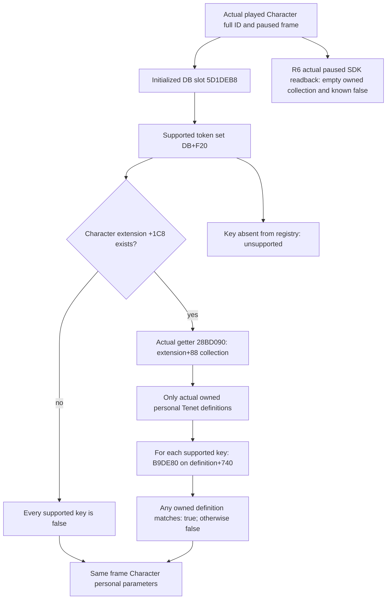

# CK3 1.20.0.2 Character personal Tenet parameters

Exact build: Crozier 1.20.0.2 / Steam 25588574, EXE SHA-256 `AE1BA6FF060BA603842F6F4A2DED0AF4B7D3666B3DD271F75FB01B0DA8E81B2D`. Source tree and ABI were frozen before the new producer. This capability reads the actual played Character and does not require a Rite/Faith. The R6 private SDK now has an actual paused readback and qualifies as a `production-live primitive` for the saved frame below. The initial producer proof was `static-ready`; this documentation update made no game or UI call.

The current/main Rite Boolean producer reads the cache at Rite+7B8. Its rebuild uses core Tenet+728 and effective Doctrine+288. Character personal parameters are a separate native trigger, `has_personal_tenet_flag`, whose Evaluate at 2B2BD10 checks Character+1C8, obtains the actual owned personal Tenet collection through 28BD090, and calls B9DE80 on each owned Tenet definition+740. The union is thus the exact observed trigger algorithm, rather than an inference from authored definitions. An unowned definition contributes nothing. No observed branch includes Doctrine+2A0 or Fulfillment flags.

The trigger's Validate at 2B2BC30 checks DB+F20 through B9DE80. A154B0 reads initialized database slot 5D1DEB8; our read-only producer reads that slot directly, without invoking its absent-database logging branch. This native registry defines which keys are supported. Every supported key receives an actual final Boolean from the Character algorithm; known missing means false, unknown key means `unsupported_key`, and a failed frame/registry/collection means `unavailable_source`. No per-key authored presence bits are invented. Character extension absence is a legal all-false result, matching Evaluate's early false branch; it does not call the collection getter's empty-array initializer.

Eight concrete nonmilitary stock inputs are independently frozen in `artifacts/g2-offline-2026-10-01/religion-doctrines/personal-parameters/stock/result.json`, SHA-256 `377f0fecebcaeb54d397ac1c55db00db9ed40d0cc04e8bbaedb467b5cf010d23`: adoption qualification, free guest recruitment, meditation visibility, confession reward/priest-hook factor, conversion tax concession, Adaptive faith study, and knowledge pursuit/scholastic scripture study. The scripted helper `pam_study_rite_tenet_bonus_trigger` explicitly ORs a Rite parameter with a Character personal flag. Adaptive's prediction expression uses +5 whereas its base-success expression uses +15; these are separate stock consumers, not a value computed by this reader.

Fulfillment `has_fulfillment_parameter` is separate: Evaluate 2B29320 calls current fulfillment-level getter 3181D60 and checks level definition+1C0. It does not identify a personal Tenet flag. This producer neither merges those flags nor claims final interaction availability, affordability or outcome. It supplies the missing actual Boolean inputs so the existing native/stock final evaluators can make their own decisions.

The ABI manifest records four new complete native spans and ten semantic instructions. The one actual MSVC `/O2 /W4 /WX` producer validation passed 17 checks and six actual serialized DTOs: current true/known-missing false, extension absent, actual empty collection, absent registry, native key failure, and state change. The provider also verifies that an unowned authored definition contributes nothing, unsupported keys differ from supported false, and no Rite/Faith callbacks are required. Frozen existing token/string and Tenet stable-key proofs were reused; their old matrices were not rerun. Evidence is under `artifacts/g2-offline-2026-10-01/religion-doctrines/personal-parameters/native` and `provider`; the tracked ABI and portable DTO file are in `research/`. DTO fixtures are not full `command_result` packets.

Integration uses selector `query-player-religion-personal-parameters-v1`, flag `XAR_CK3_ENABLE_G2_PLAYER_RELIGION_PERSONAL_PARAMETERS_PRIVATE_QUERY_V1` (default OFF), named permit `permitted_executor_religion_personal_parameters12002`, and result field `player_religion_personal_parameters`. A separate mailbox package supplies the actual queue and full packets. Central host and Python wiring have separate receipts; the actual R6 SDK readback is recorded below. Doctrine personal authored fields at definition+2A0 have no observed source branch in this trigger and remain outside this capability's complete flag.

**Actual R6 paused SDK readback, 2026-10-01.** Saved batch `Z:/ck3_mod_rewrite/artifacts/g2-offline-2026-10-01/targeted-sdk-r6/r6-new-five-law-recovery-20261001T115250Z/` contains [009 personal parameters response](Z:/ck3_mod_rewrite/artifacts/g2-offline-2026-10-01/targeted-sdk-r6/r6-new-five-law-recovery-20261001T115250Z/009-ck3_query_player_religion_personal_parameters_v1.json), SHA-256 `d62d386ed7253f47f84f7d3d0c29e43e9c0698aafd67aadd5d218d5e3ffdfdd0`. The actual official SDK tool `ck3_query_player_religion_personal_parameters_v1` returned `isError=false`, `resultType=complete`, `available=true`, `status=observed` and `read_only=true`. Saved snapshot 008 confirms a paused exact-build frame, cold bridge PID **77216**, played Character full ID **29829**, date **53169336** and CK3 build match=true. Only these saved artifacts were inspected; no new game call, test run or state action was performed for this update.

The response preserves SDK `queried_revision=2`, native `queried_native_revision / snapshot_revision=3`, and owner `capture_epoch=13418`. Its source is `character_personal_tenets`; `has_character_extension=true`, `personal_tenet_keys=[]`, `supported_keys_complete=true` and `personal_parameters_complete=true`. The actual native supported registry contains **190** serialized parameter rows, all **190** carrying the known Boolean **false**. Thus this frame has a legal empty owned personal Tenet collection with a complete nonempty supported registry; it is not a missing registry, unavailable collection or unobserved placeholder. The two complete flags are true, but no individual personal parameter value was observed true.

This saved production SDK path qualifies as a `production-live primitive` for complete supported-key / known-false observation on this actual paused save. Positive personal flags, absent extensions and registry failure branches retain their offline proofs and are not claimed as live coverage. No guest recruitment, meditation, adoption, conversion, reform, interaction affordability or outcome was executed or verified here; no `production-live loop`, OODA or general religion completion follows from the readback. The artifact field comparison and source SHA index are in [saved-package-verification.json](Z:/ck3_mod_rewrite/artifacts/g2-offline-2026-10-01/religion-doctrines/live-r6-docs/saved-package-verification.json).
