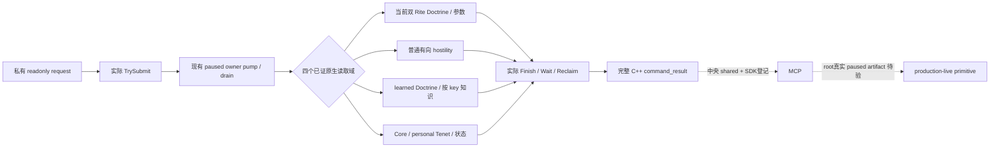

# 1.20.0.2 Doctrine / Tenet 四个私有只读查询接线

2026-10-01 后续增量，冻结 EXE SHA-256 `AE1BA6FF060BA603842F6F4A2DED0AF4B7D3666B3DD271F75FB01B0DA8E81B2D`。所有实现都只读取当前 played Character 的状态；战争、圣战、holy order、宗教动作与 counter-policy 不在范围。首轮 nonwar 实机冻结树没有被本批修改。当前为 **static-ready**，中央第三次 native freeze、Python/MCP 登记与 root paused 读回仍需分别记录。

| selector | 输入 | 实际结果字段 | header / handler |
| --- | --- | --- | --- |
| `query-player-religion-doctrines-v1` | 无 actor/target；可 expected revision | `player_religion_doctrines`：actor Rite / Faith main Rite 两套 Doctrine 与完整布尔参数 | `religion_doctrine12002_mailbox.hpp` / `HandlePlayerReligionDoctrinesPrivate12002` |
| `query-player-religion-hostility-v1` | `target_rite_id` full uint32，零合法；可 expected revision | `player_religion_hostility`：实际 actor Rite 与 Faith main Rite 两套双方有向等级、身份与失败原因 | `religion_doctrine12002_hostility_mailbox.hpp` / `HandlePlayerReligionHostilityPrivate12002` |
| `query-player-religion-doctrine-knowledge-v1` | 可 `doctrine_key`；不传读当前已知列表；可 expected revision | `player_religion_doctrine_knowledge`：原生 learned rows 或按实际定义 key 的真实知识 bool | `religion_doctrine12002_choices_mailbox.hpp` / `HandlePlayerReligionDoctrineKnowledgePrivate12002` |
| `query-player-religion-tenets-v1` | 无 actor/target；可 expected revision | `player_religion_tenets`：真实 Core / personal rows 与原生当前状态 | `religion_doctrine12002_tenet_rows_mailbox.hpp` / `HandlePlayerReligionTenetsPrivate12002` |

expected revision 支持 canonical `expected_snapshot_revision` 与 `expected_revision` 别名；两者同时存在时必须一致。native owner `capture_epoch` 与 published `snapshot_revision` 是不同标识。完整响应均为真实 `command_result`、`protocol_version=1`，含 `accepted/private_build/read_only/advertised/status/domain_key/backend_id`；`ok=true` 只是查询传输完成，实际观测资格由内层 `available` 与 `status=observed|unavailable` 表示。SDK fixture 应复用下面的 actual packet，而不是自行补缺失 metadata。

对应默认 **OFF** 编译 flag 与中央 named permit 为：

| flag | permit / executor |
| --- | --- |
| `XAR_CK3_ENABLE_G2_PLAYER_RELIGION_DOCTRINES_PRIVATE_QUERY_V1` | `permitted_executor_religion_doctrines12002` / `ExecutePlayerReligionDoctrinesMailbox12002` |
| `XAR_CK3_ENABLE_G2_PLAYER_RELIGION_HOSTILITY_PRIVATE_QUERY_V1` | `permitted_executor_religion_hostility12002` / `ExecutePlayerReligionHostilityMailbox12002` |
| `XAR_CK3_ENABLE_G2_PLAYER_RELIGION_DOCTRINE_KNOWLEDGE_PRIVATE_QUERY_V1` | `permitted_executor_religion_doctrine_knowledge12002` / `ExecutePlayerReligionDoctrineKnowledgeMailbox12002` |
| `XAR_CK3_ENABLE_G2_PLAYER_RELIGION_TENETS_PRIVATE_QUERY_V1` | `permitted_executor_religion_tenets12002` / `ExecutePlayerReligionTenetsMailbox12002` |

共享 CMake、worker selectors、permit 注册与 private build metadata 由中央 owner 修改；Python shared registry 由 Python owner 修改。四个 domain 自身没有增加 public advertised action，不能把这些只读字段当作已实现改宗或改革。

四条 mailbox 新路径均只增加必要的实际 domain runtime 验证，未重跑已经冻结的 library 证明。MSVC `/W4 /WX /Od` 与 `/O2` 各自结果如下；这些不是新的 live matrix 或 G2 credit：

- Current Doctrine：26 checks、4 actual complete packet／模式，另有三 reader 组合 3 case／模式。
- Hostility：50 checks、5 actual complete packet／模式。
- Doctrine knowledge：43 checks、6 actual complete packet／模式。
- Tenet rows：29 checks、4 actual complete packet／模式。

夹具使用自己的 native-layout 对象和 canonical getter callbacks，真实提交、执行 owner drain、等待与回收 mailbox，链接未替换的生产 reader / serializer。domain fixture 使用现成 primary permit；不能把它说成中央新 named permit 已联编或真实运行。root 完成中央联编与 paused artifact 后再记录相应资格。

Actual wire 的 portable 来源均在 `research/`：

- `religion_doctrine12002_query_wire_fixtures.json`
- `religion_doctrine12002_hostility_mailbox_wire_fixtures.json`
- `religion_doctrine12002_choices_mailbox_wire_fixtures.json`
- `religion_doctrine12002_tenet_rows_mailbox_wire_fixtures.json`

失败记录保留在 `Z:/ck3_mod_rewrite/artifacts/g2-offline-2026-10-01/religion-doctrines/` 各域 manifest。知识首包的同名 Tenet / Doctrine reflection 类型误标已根据真实 popup 链纠正，原生产知识 reader 的 proof 不变；新知识 mailbox 缺 `JsonStringField` 绑定的首次 compile RED 保留。Tenet 新 mailbox 的三次装配 RED（fixture helper、binding source 链接、fixture 未初始化 bindings）保留，最终原生产 reader 与实际 query 路径通过，不能改写这些 attempt 为 capability 或 live RED。

知识 primitive 不代表完整 choices：`ShouldDisplay/CanPick` 的 native model 与 GUI `pam_know_doctrine` gate 仍须在实际创建上下文中闭合，当前只公开其中已实证的知识输入。布尔参数不代表数值参数求值；Tenet 当前状态不代表未来转换结果。完整 faith/reform AI selection、最终合法性与成本另有研究入口，不以本四 query 宣称宗教 OODA 完成。
