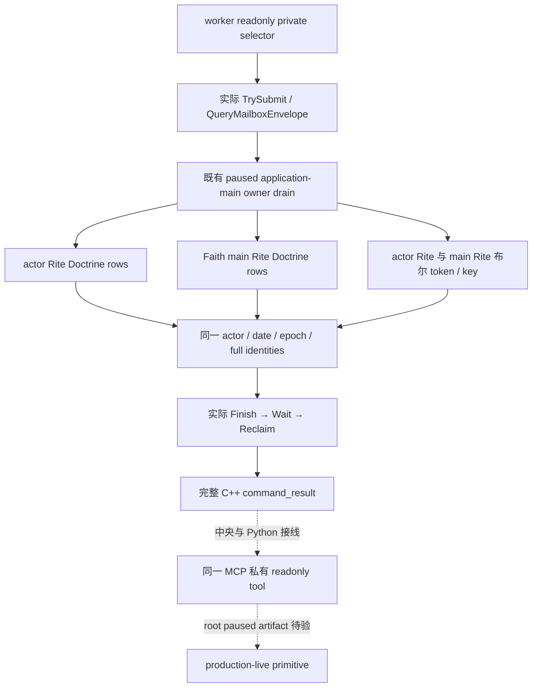

# 1.20.0.2 当前玩家 Doctrine 与布尔参数实际只读 query

本包按 2026-10-01 当时恢复宗教研究、停止战争研究的指令施工；战争停研授权限制已于 2026-10-03 撤销。它只观测实际 played Character 的宗教状态，不执行宗教动作，也不修改自动玩家策略。冻结 CK3 为 **1.20.0.2 Crozier / Steam build 25588574**；EXE SHA-256 `AE1BA6FF060BA603842F6F4A2DED0AF4B7D3666B3DD271F75FB01B0DA8E81B2D`，大小 `101039736` bytes。

实际原生树先由 [Faith/main Rite 来源](religion_doctrine12002_intrinsic.md)、[actor Rite 有效集合](religion_doctrine12002_rite.md) 与 [两套布尔参数](religion_doctrine12002_tenet.md) 冻结。本包组合这些真实生产 reader，不手写 Doctrine 同组 merge。当前 Faith 的 Doctrine 查询走它的 **main Rite**；当前角色采用的 Rite 可以不同，两个集合与两个参数集合都保留。

## 实现与 wire

入口位于 `include/xar_bridge/religion_doctrine12002_query.hpp`，namespace `xar::ck3_12002::religion::doctrine12002`：

```cpp
CurrentDoctrineBindings BindCurrentDoctrineImage12002(uintptr_t base, string_view exe_sha);
bool ReadPlayedCurrentDoctrines12002(const CurrentDoctrineBindings&, uint64_t epoch,
                                   CurrentDoctrineContext&);
string SerializePlayedCurrentDoctrines12002(const CurrentDoctrineContext&);
```

DTO schema 为 `ck3_12002_current_doctrines_v1`。它包含真实当前 `capture_epoch/date_raw/played_character_id`、`available/unavailable_reason`，及三个已实际实现的子观测：

| 子观测 | 实际来源与字段 |
| --- | --- |
| `current_rite` | actual actor Rite full ID、Faith full ID、`rows`（stable `doctrine_key/group_key`，`source=rite_effective`） |
| `faith_main_rite` | actor Rite / Faith / main Rite full IDs、`rows`（同样 stable keys，`source=faith_main_rite`） |
| `boolean_parameters` | Faith ID、actor Rite 与 main Rite 各自 full ID、完整当前布尔 token 集及实际 stable key；每个已存在参数为 `value=true` |

参数子对象使用 `boolean_parameters_complete=true` 表明这是对应 Rite 的完整布尔集合；合法空集合是已观测的空数组。布尔参数不代表数值参数，后者没有进入本 schema。Tenet rows、Doctrine knowledge、hostility 和完整 choices 属于独立 provider；本 DTO 不用空占位声称完成它们。

定义对象只公开真实 stable key/group key，不伪造 full entity ID，也不输出内部地址。合法 full Rite ID `0` 保留为 `0`；合法没有 Rite/Faith 使用域 reader 的 nullable identity；实际读取失败使用 `available=false` 和明确失败原因，不能当作合法零或空集合。组合读失败时不发布部分结果为成功观测，owner mailbox 仍记录本次真实 queried date/actor。三个完整读取的 actor、date、epoch、Rite/Faith/main Rite identities 必须相符。

## 实际 domain mailbox

`religion_doctrine12002_mailbox.hpp/.cpp` 实现私有 selector **`query-player-religion-doctrines-v1`**；`domain_key=player_religion_doctrines_v1`，backend `ck3-1.20.0.2-native-player-religion-doctrines-v1`。默认关闭 flag 为 `XAR_CK3_ENABLE_G2_PLAYER_RELIGION_DOCTRINES_PRIVATE_QUERY_V1`。共享中央下一增量登记 `permitted_executor_religion_doctrines12002`，不修改已冻结首轮 nonwar 运行树。



请求没有 actor/target 参数。可传 `expected_snapshot_revision` 或别名 `expected_revision`，显式值绑定当前 published revision；不传时查询当前发布帧。响应保留 `protocol_version=1`，`result` 包含 `accepted=true`、`private_build=true`、`read_only=true`、`advertised=false`、`status=observed|unavailable`、exact build、published `snapshot_revision/date_raw` 与 **`player_religion_doctrines`** DTO。原生 `capture_epoch` 是 owner pump epoch，不冒充 published revision。

## 验证与资格

跨 reader 组合 fixture 链接实际 core、context bindings、三个未替换 reader 与 serializer，以 MSVC `/W4 /WX /Od`、`/O2` 各通过 **3 个新跨 provider case**：不同 actor/main Rite 同组教义及参数、合法空集合、参数 key getter 失败。实际 C++ JSON 经 Python 解析验证。它复用域内已通过的 ABI / fixtures，没有重跑或重计旧域证明。

实际 mailbox fixture 链接未替换的组合 reader、`QueryMailboxEnvelope`、真实 mailbox Submit/Drain/Wait/Reclaim 与完整 serializer；`/Od`、`/O2` 各通过 **26 项检查**，各产生 **4 份完整实际 command-result**：`current-scopes`、`legal-zero-rite`、`known-empty`、`parameter-unavailable`。额外执行真实 owner snapshot 改变并确认没有成功 packet。该夹具使用已有 primary executor permit；中央生产 named permit 尚由 root 下一增量注册，未将两者混称。native callback/object 内存属于夹具进程；adapter identity shim 只覆盖 bare GameAdapter，不替换生产 WorkerAdapter。

实际 receipt 位于 `Z:/ck3_mod_rewrite/artifacts/g2-offline-2026-10-01/religion-doctrines/query-provider/result.json` 与 `.../mailbox/result.json`。四份 packet 原样冻结在 [query wire fixtures](../../research/religion_doctrine12002_query_wire_fixtures.json)，SHA-256 `914d8f79f338270a3ff62b4e9e2ea23c6eec319d85831bc8d200fe20735041bd`。该冻结文件保留原 packet SHA 与完整 compiler receipt SHA，供实际 Python/SDK consumer 读取；只有 endpoint echo 的 request ID 可在 consumer fixture 中动态匹配。

当前资格为 **static-ready**。本包没有启动、附加或操作 CK3，没有战争研究或游戏动作，没有新的 fixture-live、production-live、完整宗教 OODA 或 G2 credit。剩余工作是中央 flags/named permit/selector 接线、实际 Python/MCP consumer，再由 root 在真实 paused game 对照 actor/main Rite 的独立观测。真实 artifact 出现后才能提升该 query 的 live 资格。

可复跑的新检查：

```text
python research/religion_doctrine12002_query_tests.py --output-dir <Z-artifacts>
python research/religion_doctrine12002_mailbox_tests.py --output-dir <Z-artifacts>
```
