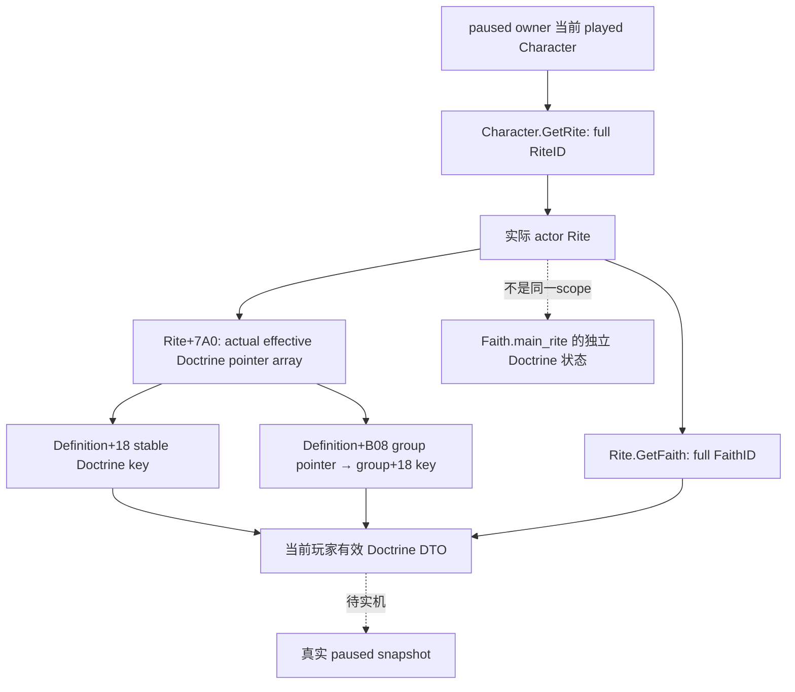
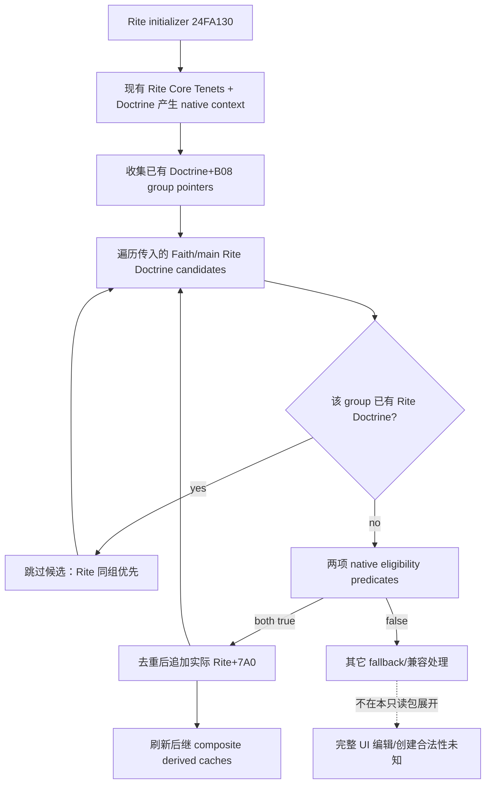

# CK3 1.20.0.2：玩家当前 Rite 的有效 Doctrine

状态：原生字段与同组优先级 `static-confirmed`；实际 reader/serializer 已 `static-ready`，没有实机证据。游戏冻结为 `1.20.0.2 Crozier / Steam25588574`，EXE SHA-256 `AE1BA6FF060BA603842F6F4A2DED0AF4B7D3666B3DD271F75FB01B0DA8E81B2D`。本包在 2026-10-01 当时遵守开放宗教、停止战争研究的旧指令，实际只交付玩家非战争宗教观测。2026-10-03 项目所有者已撤销战争暂停与非战争限定，当前执行者获战争研究、实现、策略及实机运行全面授权；旧证据范围与 static-ready 状态不因此提升。

## 当前有效状态与来源

角色 `+0xB4` 是 full RiteID，Rite `+0x4B8` 是 full FaithID；身份解析复用 [religion context](ck3-1.20.0.2-religion-context.md)。**角色当前 Rite 与 Faith main Rite 是两种不同 scope**，不得用 Faith 的 getter 替代玩家当前 Rite。

`CRite.HasDoctrine` reflection callback `0x24FC3B0` 直接在 `Rite+0x7A0` 数据指针、`Rite+0x7AC` signed count 的 **stride 8 `DoctrineDefinition*`** 数组中查 pointer membership。其完整 PE `.pdata` 范围为 `[0x24FC3B0,0x24FC498)`；collection 的 count 不是 `+0x7A8` capacity。数组定义没有 full-generation entity ref，公开 Doctrine 与 group 的 stable key，不能把指针、数组位置或 token 编造成 full ID。

`Rite+0x750` 是 composite belief container。兼容原生 `HasDoctrineByKey` 核心 `0x2590F10` 先扫描其 `+8` core Tenet 数组，再扫描 `+0x50` Doctrine 数组。因此此方法的 true 不必意味着严格 Doctrine 命中；本专题从实际 `+0x7A0` Doctrine 数组复制严格 Doctrine 行，不将 core Tenet 混进输出。

Definition stable key 是 `DoctrineDefinition+0x18` 的 native CString；同组由 `DoctrineDefinition+0xB08` 指向 GroupType，group stable key 是 `GroupType+0x18` CString。该布局由 initializer `0x24FA130` 的 group load 与不兼容日志 key copy 互证，定义复制器由 [Faith/main Rite 专题](religion_doctrine12002_intrinsic.md)提供。这里只复制实际行，不按 stock key 猜当前对象。



## 同组覆盖的原生构造树

原生 initializer `0x24FA130`，完整 PE 范围 `[0x24FA130,0x24FA716)`，先以 Rite 已有有效数组产生 context，然后从已有 Doctrine 的 `+0xB08` 收集 group pointers。对传入的 Faith/main Rite Doctrine 候选，先检查其 group 是否已被 Rite 占用：已存在即跳过；只有未占的组才继续两项原生 eligibility predicate 并尝试添加。因此 Rite 同组优先由原生构造结果保证，**不是我方无条件拼接两套列表**。



已闭合语义指令：`0x24FA1A6` 定位 Rite Doctrine array；`0x24FA233/237/23C` 确認 pointer/count/stride；`0x24FA2AA` 与 `0x24FA371` 加载 group；`0x24FA449/44C` 命中 group 后跳过；`0x24FA48A/49E` 调用两项 eligibility；`0x24FA4EE` 追加候选。Predicate 的完整内容不由这个当前状态观测口替代，没有转换/编辑动作与策略。

当前数组中的每行来源标记为 `rite_effective`，只陈述读取 scope。原生合并后不能仅凭与 Faith 行相等断定某行最初来自 Faith 或 Rite authored 定义；该 provenance 未查明，不编造。当前状态为 head/clergy 等 Doctrine 判定提供可复用输入；下一步是 aggregate query 接线与 root 独占的 paused 实机读回。

## 实际观测接口与验证

[header](../../ck3_autonomous_player/native_bridge/include/xar_bridge/religion_doctrine12002_rite.hpp) 和 [production reader/serializer](../../ck3_autonomous_player/native_bridge/src/religion_doctrine12002_rite.cpp) 的 namespace 为 `xar::ck3_12002::religion::doctrine12002`：

```cpp
bool ReadPlayedRiteDoctrines12002(const religion::Bindings&, uint64_t epoch,
                                RiteDoctrineSnapshot&) noexcept;
bool HasRiteDoctrineByStableKey12002(const RiteDoctrineSnapshot&, string_view) noexcept;
string SerializeRiteDoctrines12002(const RiteDoctrineSnapshot&);
```

reader 复用现有 exact-build religion/core bindings，subject 是实际 played Character，不接受任意 actor/target，不操作游戏命令。两次真实 provider 读取得到同样 frame、full refs 和当前行才交付可用状态。单行复制复用 sibling 的 `CopyDoctrineDefinition12002`，未重新实现 stock 合并或 key registry。membership helper 对已观测数组中的稳定 Doctrine key 做精确比较；**调用者必须先检查 snapshot.available**，不可将 unavailable 时的 false 当作已观测 Doctrine 不存在。

schema `ck3_12002_player_rite_doctrines_v1` 包含 `available/unavailable_reason/capture_epoch/date_raw/played_character_id/rite_id/faith_id/rows`。每行只有 `doctrine_key/group_key/source`；没有原生地址、token/full ID 冒充或对原始来源的推测。合法没有 Rite、实际空数组与 native 读取失败分别输出 observed absence、known empty、unavailable。

[exact verifier](../../research/religion_doctrine12002_rite_native.py) 和 [ABI manifest](../../research/religion_doctrine12002_rite_abi.json) 记录 3 个完整函数、2 个 bounded slice、21 条语义指令及 3 个实际 reader 常量。manifest SHA-256 `e0128017533f6184755b38aaac2437a169411290467018fc421c27be3d48e033`；反汇编 SHA-256 `d7ce4bec3f390e44a25626b0a42a5aa7267e9b3608d163f5385f534a93161442`。receipt 位于 `Z:/ck3_mod_rewrite/artifacts/g2-offline-2026-10-01/religion-doctrines/rite/native/receipt.json`。context 身份与 definition/group key ABI 复用前述已有专题证据，不重跑它们的独立矩阵。

[fixture](../../ck3_autonomous_player/native_bridge/src/religion_doctrine12002_rite_test.cpp) 链接实际 core、religion context、sibling definition copier、当前 Rite reader 与 serializer。[runner](../../research/religion_doctrine12002_rite_tests.py) 的 MSVC `/W4 /WX /Od`、`/O2` **各 23 项检查 GREEN**；每种模式生成 4 份实际 C++ JSON 并通过 Python JSON consumer。覆盖当前 Rite 与同组 main Rite 的不同 Doctrine、严格 Doctrine/Tenet 分开、完整 generation refs、heap/SSO native CString、中文/引号/换行、known empty、合法不存在、实际 callback 读失败与两次实际样本变化。fixture 内存和 getter 属于夹具进程，没有执行冻结 EXE 中的函数，也没有使用 CK3；不称 `fixture-live` 或完整宗教 OODA。

provider receipt 位于 `Z:/ck3_mod_rewrite/artifacts/g2-offline-2026-10-01/religion-doctrines/rite/provider/result.json`，其中保留实际源文件、可执行文件和每份 wire SHA。复现使用：

```text
python research/religion_doctrine12002_rite_native.py --exe <frozen-exe> --output-dir <Z-artifact-dir>
python research/religion_doctrine12002_rite_tests.py --output-dir <Z-artifact-dir>
```

剩余是 aggregate current Doctrine query 的实际 mailbox/MCP 注册，以及 root 独占的真实 paused 查询。head/clergy 可复用这个已经完成的当前 Rite 有效 Doctrine 观测；创建/编辑候选与最终门仍由独立后续专题继续研究，不阻断本查询的独立当前状态价值。
