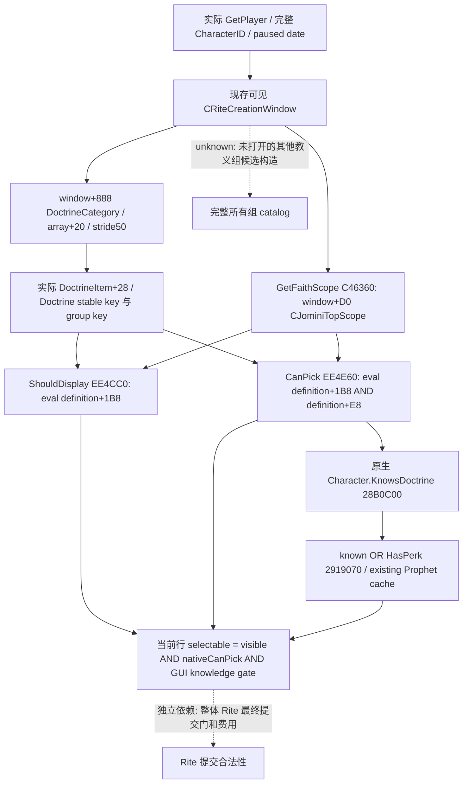

# CK3 1.20.0.2 当前教义 popup 的最终选择门

本包观察原生创建/编辑 Rite 窗口已经生成的当前教义 popup，输出每一行的 `ShouldDisplay`、`CanPick`、GUI 知识门和最终 `selectable`。范围是当前 materialized popup，不是所有教义组的完整 catalog。只读，不创建窗口、构造 TopScope、选择教义或提交 Rite。

冻结版本为 CK3 1.20.0.2 / Steam build 25588574；EXE SHA-256 为 `ae1ba6ff060ba603842f6f4a2ded0af4b7d3666b3dd271f75fb01b0da8e81b2d`。输入复用 [真实创建窗口](religion-reform12002-window.md)、[当前 popup 模型](religion-reform12002-choices.md) 和 [实际教义知识 getter](religion_doctrine12002_choices.md)。既有文件保持冻结。

## 原生树及证据边界

`DoctrineItem.ShouldDisplay` reflection callback 是 **EE4CC0**；它从实际 item+28 读取 DoctrineType，再将 definition+1B8 和实际 CJominiTopScope 交给 **372DF30**。`DoctrineItem.CanPick` callback 是 **EE4E60**，它追加 definition+E8 判定。相同名字的 **TenetItem.CanPick EE47A0 → EE0AD0** 不是教义判定。

原版 `gui/window_rite_creation.gui:1246` 使用 `ShouldDisplay(TopScope.Self)` 作为行的 visible；`:1251` 将 `CanPick` 与 `pam_know_doctrine` 相与作为 enabled。`common/scripted_guis/pam_scripted_guis.txt:82–92` 的知识门是 `knows_doctrine OR has_perk = prophet_perk`。TopScope 来自同一窗口的 `GetFaithScope`，不是我方构造的角色 scope。上述原生谓词保留窗口当前创建/编辑上下文，不依据 IsUnreformed 猜测模式。

## 只读 provider 合同

新增 `religion_doctrine12002_selection.hpp/cpp`。provider 消费既有 `DraftChoiceBindings` 和同一 epoch 的实际 `DraftChoices`；以 popup_index 对照当前原生数组和稳定 key，补读 `ShouldDisplay`，联合既有原生 CanPick / known / Prophet 输出。便利入口可自行调用既有 popup producer。这样候选来源只有一个；联合宗教查询可直接复用已经读到的 rows。

DTO 区分 `native_should_display`、`native_can_pick`、`button_enabled`、`selectable`，并给出 blocked reason。知识/Prophet 的 null 只表示原生短路没有需要该输入；不会让最终 selectable 为 null。可见草案但当前 popup 零行是已观测的空集合；窗口关闭则返回 typed unavailable `current_draft_not_visible`，不能推断所有教义都不可选。

`selectable` 表示当前行的原版 visible/enabled 判定结果，不包含鼠标坐标、容器展开状态、未来草案或最终提交行为。全组候选仍须让原生窗口实际生成其他组的 popup，不能把当前列表冒充其全集。

## 验证与下一步

已完成一次实际 provider/serializer 的 MSVC `/O2 /W4 /WX` fixture：**15 checks GREEN，6 个实际 C++ JSON packet**。fixture 编译并调用既有当前窗口/popup producer 和新增 selection observer，而不是手写响应。覆盖原生 hidden、原生 CanPick 阻断、未知教义无 Prophet、Prophet 放行、当前零行、闭窗、变化帧，以及组合查询复用同一 epoch 的 actual rows。6 packet 冻结到 `research/religion_doctrine12002_selection_wire_fixtures.json`。

exact PE ABI 冻结 **4 个完整函数、14 个指令锚点、3 处原版 GUI/script 窗口 GREEN**。新增证据使用完整 `.pdata` 函数 `F05190–F051EB`，其返回 metadata 的 LEA 是 `F051B0 → 54D7E08`；真实 `GetFaithScope` leaf 是 `C46360–C46368`，RET 位于 C46367。首次提取器沿用了旧证据的前缀/含 INT3 范围，触发 harness RED；保留 `native-attempt-001.json`，修正提取边界后 GREEN。旧冻结源和 provider 不受影响，未重跑旧矩阵。

可核验 artifact 根目录是 `Z:\ck3_mod_rewrite\artifacts\g2-offline-2026-10-01\religion-doctrines\selection\`。`native/result.json` SHA-256 为 `e91e1f55a5214420924b8b07d2962c04562a0f81c9b773d1d64c0f017e85e545`；`provider/result.json` SHA-256 为 `f52b38708007871abee1ec12ee013e083dc0d05800782be4a6bd31b7289de0a0`。源清单/依赖 pin/日报周报字段见同目录 `delivery-result.json`。

当前 readiness 为 **static-ready**，不是 live；本代理未接触 CK3。新组件不修改既有冻结 73 源宗教包或 reform 的 44 源包。

实机依赖：由统一实机执行者暂停游戏、打开现存 Rite 创建/编辑预览和教义组 popup，读取该接口，将显示/禁用的行与原版窗口对照；关闭窗口验证 typed unavailable。本代理不操作 CK3。只有该 paused artifact GREEN 后才升级为 production-live primitive；完整跨组策略和 Rite 提交循环不属于本包。
