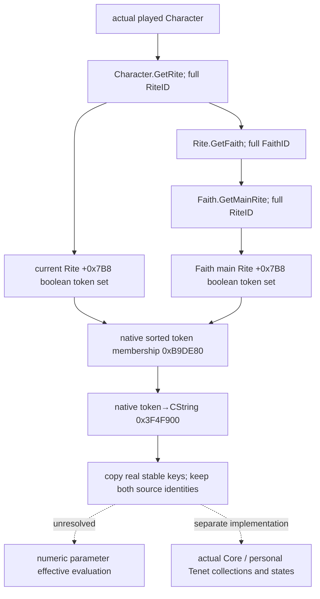

# CK3 1.20.0.2 当前 Rite / Faith 主 Rite 的实际教义参数

状态：**原生链 static-confirmed；实际只读 production reader 与 serializer static-ready**。用户于 2026-10-01 已开放宗教研究，并停止战争研究。本专题不研究或执行战争、圣战、holy order、宗教动作或我方策略。

冻结游戏为 CK3 1.20.0.2 Crozier / Steam 25588574，EXE SHA-256 `AE1BA6FF060BA603842F6F4A2DED0AF4B7D3666B3DD271F75FB01B0DA8E81B2D`，大小 101039736 bytes。这里只读取冻结 EXE 与 stock 数据，不访问 CK3 进程。上下文与新版结构见 [宗教 context](ck3-1.20.0.2-religion-context.md) 与 [stock](ck3-1.20.0.2-religion-stock.md)。

## 原生来源必须区分

`CHasDoctrineParameterTrigger` 的实际 Evaluate `0x2B29170` 先解析 **Faith**（scope type 13），再解析 `Faith+0x98` 的 **main Rite**，最后在该 Rite 的 `+0x7B8` 集合执行实际布尔 token membership `0xB9DE80`。`CRiteHasParameterTrigger` 的 Evaluate `0x2AE9F70` 解析 **Rite**（scope type 42），直接读取同一 Rite `+0x7B8` 集合。玩家当前 Rite 与所属 Faith 的 main Rite 可以不同；Faith scope 的参数查询不等于玩家当前 Rite 的参数。

`CTenetDoctrineContainer` 位于 Rite `+0x750`。实际 rebuild `0x2591180` 将 Core Tenet 的布尔参数集（definition `+0x728`）与 effective Doctrine 的布尔参数集（definition `+0x288`）合并到 container `+0x68`，即 Rite `+0x7B8`；它没有用旧版 `has_doctrine=tenet_*` 来模拟新版 Tenet。

## 已闭合 ABI

| 项目 | 实证 |
| --- | --- |
| Rite 布尔参数集合 | Rite `+0x7B8`，data pointer `+0`、signed count `+0xC`、signed token row stride 4 |
| 原生 membership | `0xB9DE80`，`bool(const void* collection, const int32_t* token)`；完整函数包含 `.pdata` chained fragments，不能只记录首段 `0xB9DE80..0xB9DE91` |
| token → actual stable key | `0x3F4F900`，`const CString*(int32_t token)`；原生 pool 查询返回 actual CString，不能拿 token 整数当 stable definition key |
| Faith 参数来源 | trigger Evaluate `0x2B29170..0x2B2921E`，Faith→main Rite→bool set |
| Rite 参数来源 | trigger Evaluate `0x2AE9F70..0x2AE9FDE`，Rite→bool set |
| Bool / number 原生类型 | TokenParameter bool getter `0x22C80F0` 只接受 `+4==0`；number getter `0x22C81A0` 只接受 `+4==1`，payload `+8` 是 signed Q100000 |

本轮最小 reader 只发布**完整已生效布尔参数集合**。集合内 key 为 true；在同一完整已观测集合中不存在的布尔 key 为 false。不会把这个 false 等同于数值零，也不会输出数值参数全为 null 的假完成结构。数值 effective merge 尚未闭合，单独记录为后续入口。

新版 Tenet 是独立 `CTenetTypeDatabase`，与 `CDoctrineTypeDatabase` 分开；旧版 Doctrine group 的 Tenet 分类不再适用。Core/personal Tenet 集合和五档 status 不属于本轮布尔参数集合的身份，也不能从“某个布尔参数出现”反推具体 Tenet 或完整宗教决策已可执行。

## 最小 producer 接口与验收边界

接口在 [religion_doctrine12002_tenet.hpp](../../ck3_autonomous_player/native_bridge/include/xar_bridge/religion_doctrine12002_tenet.hpp)，namespace `xar::ck3_12002::religion::doctrine12002`。`ReadPlayedTenetParameters12002(religion::Bindings, TenetParameterBindings, capture_epoch, output)` 复用现有 core 与宗教 native getters，从实际 paused played actor 解析身份，复制当前 Rite / Faith main Rite 的真实 key 集合。没有任意 actor 参数、游戏动作或进程发现。

当前阶段没有本包 paused artifact，不称 live。后续由中央 composition query 组合 intrinsic Doctrine、effective Rite Doctrine 与本包两个参数来源；实机必须同一 paused 帧读到真实 key 与两个来源身份，才能提升为 production-live primitive。

## 已完成验证

[exact-file verifier](../../research/religion_doctrine12002_tenet_native.py) 与 [冻结 ABI](../../research/religion_doctrine12002_tenet_abi.json) 通过：**7 个完整 native spans、24 条语义指令、5 个 exact class RTTI、2 个真实 trigger vtable Evaluate 指向**。`native/native-verification.json` 的 manifest SHA 为 `fbcdb331f82cadfaa738551c14cdcf7cffec0100e49f47c1451fa9302e7a0dca`。布尔 membership 已记录完整 chained body，未把首个 `.pdata` fragment 当作完整函数。

[fixture](../../ck3_autonomous_player/native_bridge/src/religion_doctrine12002_tenet_test.cpp) 链接实际 core、[production reader / serializer](../../ck3_autonomous_player/native_bridge/src/religion_doctrine12002_tenet.cpp)。[runner](../../research/religion_doctrine12002_tenet_tests.py) 以 MSVC `/W4 /WX /Od` 和 `/O2` 各通过 **19 项检查**；每种模式生成 **5 份实际 C++ JSON**，由 Python JSON parser 验证来源身份、当前 / 主 Rite 分离、完整 generation、合法零 ID、真实 inline/heap key、引号与中文、已观测空集合、合法无 Rite、缺失 key 与两次真实读样不一致。native getter 与 CString pool 在 fixture 进程中提供，不会调用 CK3 EXE 或把 fixture 内存称为游戏 live。

证据根为 `Z:/ck3_mod_rewrite/artifacts/g2-offline-2026-10-01/religion-doctrines/tenet/`：`native/native-disassembly.txt`、`native/native-verification.json`、`provider/result.json`、两种模式的 `build.log` / `test.log` 与实际 wire。中央 CMake / composition mailbox / Python MCP 接线和实机 paused read 尚未由本包验收；数值 effective evaluation 与 Tenet 状态 / 个人列表仍是具体后续施工入口。
