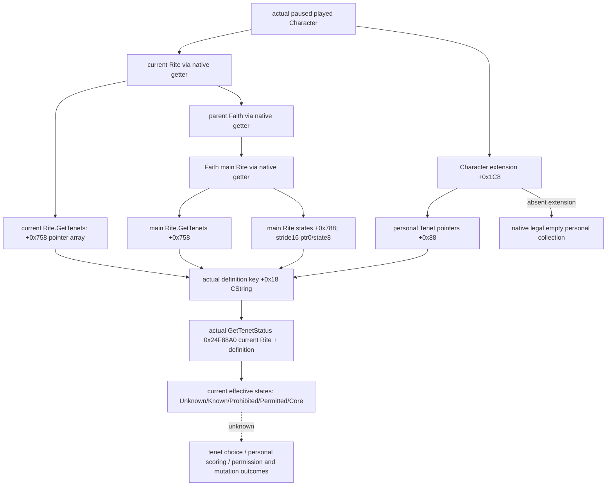

# CK3 1.20.0.2 Core / personal Tenet 条目与原生状态

状态：**完整原生链 static-confirmed；实际只读 provider / serializer static-ready**。用户已于 2026-10-01 开放宗教研究并停止战争研究；本专题无宗教动作、策略、战争或 holy order 内容。冻结 EXE SHA-256 `AE1BA6FF060BA603842F6F4A2DED0AF4B7D3666B3DD271F75FB01B0DA8E81B2D`，CK3 1.20.0.2 Crozier / Steam 25588574，101039736 bytes。

此包独立追加在[已冻结的布尔参数 reader](religion_doctrine12002_tenet.md)之后。新版 `CTenetTypeDatabase` 与 `CDoctrineTypeDatabase` 独立；Tenet 条目使用实际 definition CString stable key（`+0x18`），不编造 full-generation TenetID。Rite 与 Character 仍保留真实 full-generation refs。

## 实际布局与合并语义

| 读取 | 完整来源 |
| --- | --- |
| 当前 / main Rite 的 Core Tenet collection | `Rite.GetTenets` core `0x1CF98A0..0x1CF98A8` 返回 `Rite+0x758`；`CTenetDoctrineContainer.rebuild 0x2591180` 读 data `+0`、signed count `+0xC`、row stride 8、row 是 Tenet definition 指针 |
| main Rite 的非 Core 状态 collection | `0x24F88A0..0x24F89ED` 读 `Rite+0x788`、count `+0x794`；stride16、definition 指针 `+0`、uint8 status `+8` |
| Character personal Tenet collection | `CHasPersonalTenetTrigger` Evaluate `0x2B2BA60..0x2B2BAF3` 从 Character `+0x1C8` 读 extension，非 null 才访问 extension `+0x88` pointer array；membership `0xA11CC0`，data `+0`、count `+0xC`、row stride8；无 extension 原生返回 false，不是读失败 |
| definition stable key | container 实际 save serializer `0x2590C80..0x2590EF3` 检查 definition `+0x38` 为 `GDbo`，读取 definition `+0x18` CString；不是 pointer 地址或反射整数 |
| 当前有效 status | 直接调用 actual `uint8_t GetTenetStatus(Rite*, const TenetDefinition*)`，RVA `0x24F88A0`；实际0是 Unknown，1 Known，2 Prohibited，3 Permitted，4 Core |

`0x24F7E40..0x24F7EA2` 判断 Rite 是否其 Faith 的 main Rite。实际 GetTenetStatus 在 non-main Rite 先检查自己 Core collection：存在时返回 Core=4；否则解析 Faith main Rite，再依原生循环检查 main Rite 的 Core collection 和 status rows。主 Rite 的 absent status 返回 Unknown=0。本包不自己推导、重写或简化这个最终规则。

当前 / main 的 `core_tenets` 是各自真实 `GetTenets` collection，字段明确区分来源；`effective_tenet_states` 为两处 Core / main 状态 / 个人条目定义的去重并集，逐项由当前 Rite 的 actual GetTenetStatus 求值。所有其它不出现在已观测集合中的 Tenet 不被冒充已知或可选；个人 Tenet 仍是个人拥有列表，不等于当前 Rite 的 Core。

同一条目允许实际 native state 为 Unknown=0，例如玩家拥有个人 Tenet 而当前 Rite 不认识它。没有当前 Rite 时 personal 条目的 `current_rite_status` 为合法 absent，而非读取失败；没有 Character extension 的 personal 列表是已观测空列表。

## Provider / live 边界

新独立接口为 `religion_doctrine12002_tenet_rows.hpp` 的 `ReadPlayedTenetRows12002(religion::Bindings, TenetRowsBindings, capture_epoch, TenetRowsContext&)`。它从现有 CoreBindings 的实际 played actor 与 paused frame 进入，复用已冻结身份 getters，不接任意 actor，不发现或触碰进程。

先验收 actual core/provider/serializer 的 MSVC fixture 和冻结 exact ABI，再交中央 composition；本专题当前没有 paused game artifact。Core/personal 集合、真实 status 能解锁独立当前宗教观测，不代表 Tenet candidate selection、desired score、许可/修改动作或完整宗教 OODA 已完成。

## 已完成验证

[native verifier](../../research/religion_doctrine12002_tenet_rows_native.py) 与 [ABI manifest](../../research/religion_doctrine12002_tenet_rows_abi.json) 验证 **7 个完整原生 span、26 条语义指令、4 个 exact RTTI、1 个实际 PersonalTenet trigger Evaluate vtable**。ABI manifest SHA `2da08d26e972de73a5289ff4f364b5f94ccf7b5348b53fd8cc57eb54cb9ee790`。

[实际 reader / serializer](../../ck3_autonomous_player/native_bridge/src/religion_doctrine12002_tenet_rows.cpp) 与 [fixture](../../ck3_autonomous_player/native_bridge/src/religion_doctrine12002_tenet_rows_test.cpp) 由 [runner](../../research/religion_doctrine12002_tenet_rows_tests.py) 以 MSVC `/W4 /WX /Od`、`/O2` 各通过 **15 项检查**，每种模式 **5 份实际 C++ JSON** 由 Python parser 消费。覆盖当前 / main Core 来源不同、独立 personal 条目、合法 Unknown=0、五档 native getter值、pointer definition 去重、完整 generation/零 RiteID、无 extension 的已观测空列表、无 Rite 保留 personal keys、actual native state 无效和两次实际读样不同。`current-main-personal.json` SHA 两种模式相同，为 `d1669e704bcb891c856dd211735f7faf8ca79e11ebb2d37c85e55c899d22b5bc`。

public `CopyTenetDefinitionKey12002(const void*, std::string&)` 复用同一实际 definition key copier，供独立草案候选 reader 使用；它不把 UI currently selected Tenet 当成已拥有条目。

证据在 `Z:/ck3_mod_rewrite/artifacts/g2-offline-2026-10-01/religion-doctrines/tenet/rows-native/` 和 `rows-provider-final/`，后者 `result.json` 绑定实际 source 与所有 wire SHA。`rows-provider/` 保留首轮同样 GREEN 的结果；追加修正只让 unavailable 包明确 `personal_tenets_complete=false`，最终证据以 `rows-provider-final/` 为准，没有重复已冻结布尔参数夹具。fixture callbacks / 对象内存属于夹具进程，不代表 CK3 live；中央接线 / SDK / root paused 当前与独立后继读回仍待验证。
