# CK3 1.20.0.2 当前玩家 Tenet 独立只读查询

状态：**static-ready**。此包在 [Core/personal Tenet reader](religion_doctrine12002_tenet_rows.md) 上增加实际 domain mailbox / handler / 完整 command-result response；没有触碰本地 CK3，也没有本包 live artifact。用户于 2026-10-01 已允许宗教研究并停止战争研究；没有动作、战争分支或我方策略改动。

冻结版本为 CK3 1.20.0.2 Crozier / Steam 25588574，EXE SHA-256 `AE1BA6FF060BA603842F6F4A2DED0AF4B7D3666B3DD271F75FB01B0DA8E81B2D`。Core/个人列表与原生五档 status 的 exact ABI / fixture 保留在原 reader 专题，接线追加包不重新运行或改变该冻结 reader。

| 接线项 | 实际约定 |
| --- | --- |
| selector | `query-player-religion-tenets-v1` |
| domain key | `player_religion_tenets_v1` |
| backend | `ck3-1.20.0.2-native-player-religion-tenets-v1` |
| 默认 OFF 编译开关 | `XAR_CK3_ENABLE_G2_PLAYER_RELIGION_TENETS_PRIVATE_QUERY_V1` |
| 中央 named permit | `permitted_executor_religion_tenets12002`（由中央 owner 登记） |
| private SDK/MCP 建议名称 | `ck3_query_player_religion_tenets_v1` |
| source header/runtime | `religion_doctrine12002_tenet_rows_mailbox.hpp/.cpp` |

namespace 为 `xar::ck3_12002`；接入点是 `IsPlayerReligionTenetsPrivateStep12002`、`ExecutePlayerReligionTenetsMailbox12002` 与 `HandlePlayerReligionTenetsPrivate12002`。调用者使用既有 `QueryMailboxEnvelope`，没有 `actor` 或 `target` selector，reader 始终从实际 core 当前玩家进入。`expected_snapshot_revision` / `expected_revision` 为可选 alias；给出时必须非零且匹配 published revision，两者同时存在必须相同。

```mermaid
flowchart LR
    W[private worker request] --> T[actual TrySubmit]
    T --> P[actual paused owning-thread pump/drain]
    P --> E[QueryMailboxEnvelope Enter / frame]
    E --> R[actual played Tenet rows provider]
    R --> F[Finish same full snapshot]
    F --> A[actual Wait / Reclaim]
    A --> J[protocol_version1 complete command_result]
    J -. central/Python registration .-> M[MCP readonly tool]
    M -. actual paused artifact required .-> L[production-live primitive]
```

成功 response 的顶层为 `type=command_result`、`protocol_version=1`、原 request_id、`ok=true`。`result` 包含 `step`、`accepted=true`、`status=observed|unavailable`、`private_build=true`、`read_only=true`、`advertised=false`、`game_version`、EXE SHA、domain/backend、实际 `snapshot_revision` / `date_raw`，以及 **`player_religion_tenets`** 原生 DTO。实际 owner pump epoch 保存在 inner `capture_epoch`，不会拿它冒充 published revision。

reader 失败但 query owner frame 仍一致时输出 typed unavailable 和真实 reason，保留当次 owner 的 played actor / date；`personal_tenets_complete=false`。owner snapshot 漂移不返回成功 JSON。Rite=0 是合法 full ref；个人 Unknown=0 是实际 native状态；无 Character extension 则 personal 列表是已观测空；没有 Rite 时合法保留个人条目，但其 `current_rite_status=null`。

## 实际验证与保留的失败

[mailbox fixture](../../ck3_autonomous_player/native_bridge/src/religion_doctrine12002_tenet_rows_mailbox_test.cpp) 复用已冻结 fixture 的对象布局，新增真实 worker submit → owner `ObserveMainThreadPumpAndDrainV1` → wait/reclaim；不会执行旧 fixture 的 main 或重跑其 15 项验证。[runner](../../research/religion_doctrine12002_tenet_rows_mailbox_tests.py) 以 MSVC `/W4 /WX /Od`、`/O2` 各通过 **29 项新通路检查**，每种模式 **4 份实际 C++ complete command-result JSON** 被 Python parser 验证：current/main/personal、无 extension、personal with absent Rite、native state unavailable。另检验实际 owner frame drift 不成功、独立 selector 与 revision aliases。

真实 wire 与最终 source pins 在 `Z:/ck3_mod_rewrite/artifacts/g2-offline-2026-10-01/religion-doctrines/tenet/rows-mailbox-final-v3/result.json`。fixture 使用现有 primary fixture permit 与夹具自有 TLS / state / getters，不替换生产 `WorkerAdapter` 或给 mock 添传输字段；部署 named permit 由中央 owner 接线。

三次 **harness RED** 均保留，没有标成 capability 或 CK3 live 失败：`rows-mailbox/` 首轮测试装配缺 Get 读字段辅助；`rows-mailbox-final/` 缺真实宗教 binder 源链接导致 LNK2019；`rows-mailbox-final-v2/` 的夹具漏初始化 TenetRowsBindings，实际序列化了 `bindings_unavailable` packet 后期望检查失败。修正均限于新 fixture / runner 装配，已冻结 Boolean / Tenet rows source 不变；最终以 `rows-mailbox-final-v3/` 为准。

剩余工作是中央 CMake / selector / named permit / Worker 分派与实际 Python MCP registry，随后由 root 独占 paused CK3 验收实际 key、独立 Core / personal 来源及 native status。当前通路只解锁观测，不宣称宗教动作、Tenet candidate AI 选择或完整 OODA 完成。
