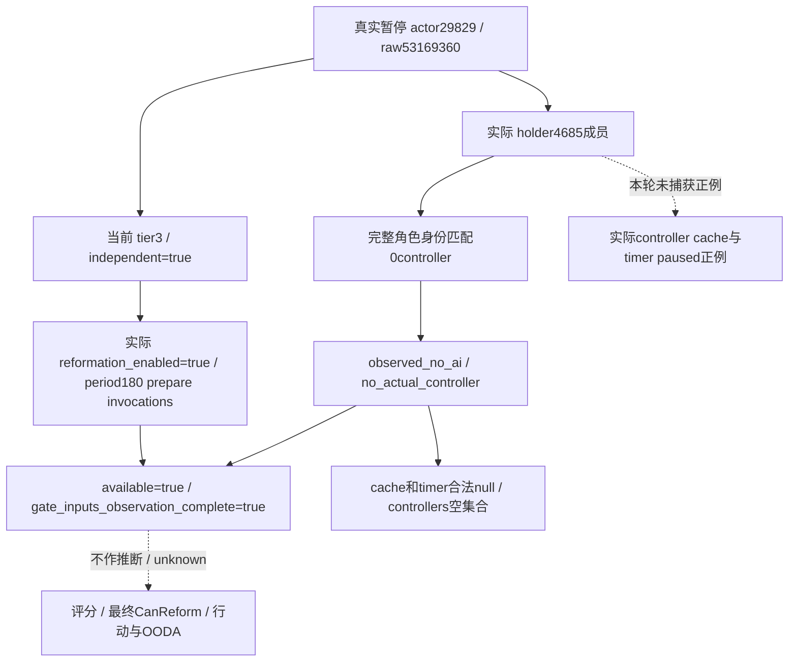

# CK3 1.20.0.2：R9 宗教 AI context 与 schedule 实机只读输入

2026-10-01，Asia/Shanghai。R9 在真实 h98 campaign 的暂停帧确认了 **production-live readonly primitive**：当前玩家的实际 AI holder 查询得到合法 `observed_no_ai`，同时读取当前角色和原生宗教调度配置。本次没有捕获匹配该角色的正例 controller，没有改革评分、预测、改革动作或完整 OODA 资格。

原生树、ABI 和接口来源分别见 [AI holder context](religion-reform12002-ai-context.md)、[schedule 输入](religion-reform12002-schedule.md)、[联合查询](religion_reform12002_ai_inputs_query_python.md) 与 [专用队列夹具](religion_reform12002_ai_inputs_named_fixture.md)。这些历史静态包保持冻结；本页记录其后新增的真实暂停观测。

## 构建与实际证据

游戏为 `1.20.0.2`，EXE SHA-256 为 `AE1BA6FF060BA603842F6F4A2DED0AF4B7D3666B3DD271F75FB01B0DA8E81B2D`。Root 执行交接记录为 PID `101408`、L9 commit prefix `f54ad34`、candidate prefix `e467db`、官方 CI 对应 commit prefix `e60a` GREEN；这些 prefix 按 root 交接记录保留，不扩写为未经提供的完整哈希。

唯一实际 AI 查询包为：

`Z:\ck3_mod_rewrite\artifacts\g2-offline-2026-10-01\targeted-sdk-r9\r9-tenet-ai-faction-readonly-20261001T142357Z\006-ck3_query_player_religion_ai_reform_inputs_v1.json`

SHA-256：`1d4bf5826f64916cf05c467c96b751f3efa71106786c4ee36eaf9e8cf507a5d3`。原包是官方 MCP `ck3_query_player_religion_ai_reform_inputs_v1` 的 `complete` 结果，`isError=false`，请求 `expected_revision=2`。本页只读取其 `structuredContent`，不把同包的 `content.text` 副本再计为第二个结果。

Root 实际执行摘要为 `Z:\ck3_mod_rewrite\artifacts\g2-offline-2026-10-01\live-run-09\actual-r9-summary.json`，SHA-256 `e77d99afbeb866822056d424d90c70415b88a28fd88b5c75c39c3e76a4d5bd30`。Root 确认 h98 暂停、actor `29829`、date raw `53169360`，正式 action `0`、time advance `0`；仅打开预览后关闭，没有选择教义或 Tenet、创建、编辑或改革。

## 本帧实际值

| 字段 | 实际结果 |
| --- | --- |
| `schema` | `ck3_12002_player_religion_ai_reform_inputs_v1` |
| `available` / `status` | `true` / `observed` |
| `capture_epoch` / `date_raw` / `played_character_id` | `16576` / `53169360` / `29829` |
| snapshot / queried revision / native revision | `native:2` / `2` / `2` |
| `context_status` / `context.status` | `observed_no_ai` / `observed_no_ai` |
| `context.actual_holder_count` | `4685` |
| `controller_count` / `controllers` | `0` / `[]` |
| `controller_absence` | `no_actual_controller` |
| `gate_inputs_observation_complete` | `true` |
| 当前 `highest_tier` / `current_independent_ruler` | `3` / `true` |
| 当前原生 `reformation_enabled` | `true` |
| 原生 `rare_period_prepare_ticks` | `180` |
| `schedule_base.status` / `ai_status` | `observed` / `not_supplied` |
| `actual_ai_cache.available` / `actual_ai_timer.available` | `false` / `false` |
| cache flags、cache gates、countdown、selected raw | 全部 `null` |
| timer `units` | `prepare_invocations` |
| `read_only` / `advertised` | `true` / `false` |

实际 holder 中的 4685 个成员没有匹配当前完整角色身份的 controller，所以零 controller 与空集合是成功观测的已知缺席。`schedule_base` 使用当前角色与原生 globals，未传实际 controller，因此其 `ai_status=not_supplied` 与空 cache/timer 保持原 API 语义；这不是读取器未实现或容器读取失败，也不应填入虚构的缓存或倒计时。联合查询以 `controller_absence=no_actual_controller` 和 `gate_inputs_observation_complete=true` 明确区分这一状态。

`180` 是原生 rare period 的 prepare invocation 参数，不是下一次改革的日期、当前 controller 的剩余倒计时或改革意愿。当前独立统治者判定为 true、宗教改革 toggle 为 true，也不等同于缓存 handler gates、最终 CanReform 或即将改革。

## Readiness 与后续边界

本次将联合查询的实际 known-absence 分支及 current actor/globals 输入从 static-ready 提升为 **production-live readonly primitive**。正例多 controller、inactive 成员、当前值与 cache 不同、signed timer 等，仍仅有冻结的生产代码路径夹具和官方 SDK 消费证据；不能把本帧的零 controller 观测冒充这些分支已经真实 paused 验收。

本次没有重跑旧 schedule/context ABI、provider、generic/named 或 SDK 矩阵，也没有新增生产代码、测试、AI 创建/退休研究或策略。本页不对原生 cache/timer 的合法缺席启动修补，不从输入完整标志外推改革动作资格。后续只有实际需要正例 controller 输入时，再由 root 捕获对应真实暂停样本；评分、最终改革判定、操作和结果验证仍为独立能力。

日报与周报归属 `2026-10-01` / `2026-W40`：完成联合 AI context/schedule 的真实 known-absence 和当前调度输入观测；原因是将原先静态可用的输入口与真实 campaign 对齐；本域新增实机 capability RED 为零。本次未执行改革或推进时间，R8 Tenet 失败及 R9 最小修复证据由其独占专题保留。Root 负责将本页及精确 source-only manifest 提交、推送并汇总进日/周报告；本页作者未访问 CK3、进程、pipe、UI、Steam 或 Git。
