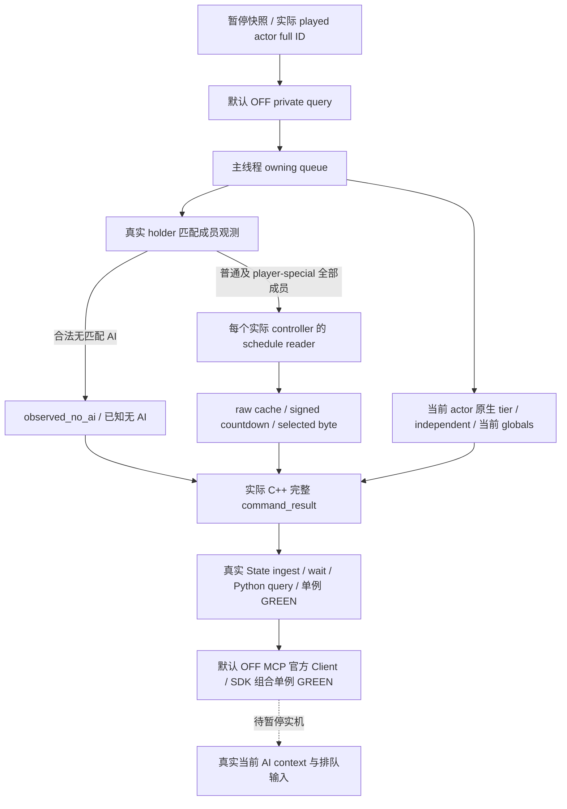

# CK3 1.20.0.2 宗教 AI context / schedule 输入查询

2026-10-01。本包独立接入 [真实 AI holder context](religion-reform12002-ai-context.md) 与 [原生 schedule 输入](religion-reform12002-schedule.md)。EXE SHA-256 为 `AE1BA6FF060BA603842F6F4A2DED0AF4B7D3666B3DD271F75FB01B0DA8E81B2D`。R8 / R7 查询、旧 provider 与现有验收包保持冻结。

接口只读当前 played actor 的真实 AI holder 匹配成员，再将每个实际 controller 交给既有 schedule reader。普通与 player-special 成员全部保留，包括 inactive 成员；查询不猜优先级，不创建 controller，不更新缓存，不调 scheduler 或改革动作。公开 DTO 不含内部 pointer。

| 接口 | 固定值 |
| --- | --- |
| Native step | `query-player-religion-ai-reform-inputs-v1` |
| Domain / result payload | `player_religion_ai_reform_inputs_v1` / `player_religion_ai_reform_inputs` |
| Backend | `ck3-1.20.0.2-native-player-religion-ai-reform-inputs-v1` |
| Schema | `ck3_12002_player_religion_ai_reform_inputs_v1` |
| Driver | `query_player_religion_ai_reform_inputs_private_v1` |
| MCP | `ck3_query_player_religion_ai_reform_inputs_v1` |
| Permission / CLI | `allow_private_player_religion_ai_reform_inputs_query` / `--private-player-religion-ai-reform-inputs-query` |

公开输入只有 `expected_revision`，默认 permission / CLI 关闭。共享 transport 同时传原生 `expected_revision` 与 `expected_snapshot_revision`；没有 actor、target、action 参数。

`observed_no_ai` 是实际完整容器遍历确认的合法无 AI，不是读取失败或长期缺失字段。原 schedule API 未传 actual AI 的 `not_supplied` 与 null cache 保持原语义，联合 wrapper 发布准确字段 `gate_inputs_observation_complete`；没有 `context_observation_complete` 别名。已知无 AI 时该值为 true、`controller_count=0`、`controller_absence=no_actual_controller`、`controllers=[]`。有实际成员时各自 cache 观测是否完成决定此标志；没有 extension 的合法 `gates_only` 不伪造 timer。多个 matching members 分别返回，不把普通与 special controller 合并，也不把 active=false 排除为 absence。

当前 native highest tier、当前 independent-ruler predicate、实际 globals 的 period / religious-reformation toggle，与 AI 已有 cached flags、cache gate、signed rare countdown 和 selected raw byte分别保留。当前值与缓存可以不同；countdown 的单位保留 prepare ticks，不能把它、period 或 selected byte推导成下次改革日期、willingness score、最终 CanReform 或行动 OODA。本查询不补 stock 常数替代本帧实际 globals。

`schedule_base` 对当前 actor / globals 的实际读取得到独立基础输入，故即使有 controller，也保留 `ai_status=not_supplied` 和 null cache / timer。真正 controller schedule 则使用其实际内部 AI 成员逐项采集。当前 scope 内 base 与 controller 两类输出同时存在，不用一类替代另一类。

唯一新增 C++ generic owning-queue fixture 为 `/O2 /W4 /WX` **1 case / 2 queued commands / 12 checks GREEN**，提供两条原始完整 `protocol_version=1 command_result`：

| 原始包 | 实际内容 | SHA-256 |
| --- | --- | --- |
| `multiple-controllers.json` | holder 5 项返回 ordinary / player-special / ordinary 3 匹配成员；active 1/1/0，schedule observed / gates_only / observed，timer -4 / null / 12 | `40712116527901eb9f251c666f3aa2b43933f3a715839210dd64d023e5b340be` |
| `observed-no-ai.json` | holder 2 项仅 default + nonactor，完整观测无 AI、count 0、空 members、complete true | `ef7323474d1d4a1601d25a7b9c431f637539697bba778595b8a6a2bd587b50dd` |

两包均保持实际 false reformation toggle、tier 2 / period 360、current independent=false，以及与其不同的 controller cached independent=true。完整 metadata 来自 actual C++ serializer；fixture 原字节保存到专有目录，测试只在内存更改请求关联 nonce。

状态为 **static-ready query；R9 native named 接线、候选构建与暂停实机待验收**。唯一新增 production `NativeProtocolState.ingest → wait → query` 单例消费上述两包 GREEN，验证完整 DTO 等值、成员顺序/类型/inactive、known absence、当前值与缓存、signed timer 与 null、revision aliases 和缓存已消费。测试 receipt / 最终来源清单分别是 `Z:\ck3_mod_rewrite\artifacts\g2-offline-2026-10-01\religion-reform\ai-inputs-query-python\wire-result.json` / `final-source-package.json`，后者含精确 source/dependency SHA 与日／周报告字段。

共享 Python owner 已完成默认 OFF Driver / MCP / CLI 接线，并以官方 Client 执行唯一新增 SDK 组合单例，**1 passed / 2 actual subcalls / 1.88 秒 GREEN**。两包均经真实 State ingest / wait、生产 NativeDriver wrapper 和官方 MCP Client，整 native DTO 等值，保留精确 `gate_inputs_observation_complete`、当前 false / cached true、timer -4 / null、明确无 AI 空集合；另验收 OFF discovery、read-only 与 CLI 默认 false。SDK receipt 为 `Z:\ck3_mod_rewrite\artifacts\g2-offline-2026-10-01\python-routes\ai-reform-inputs-actual-sdk.json`，SHA-256 `9f4a61133db5649c2cf93919a0987db9c761e8bf2be8a23e3ae7e29cd72459c4`。新增 `test_g2_player_religion_ai_reform_inputs_mcp_wire.py` 由 shared owner 独占冻结。

本次只更新新专页与 final7 metadata，不重测或修改已冻 leaf / raw packets。R9 native named query / candidate / 暂停实机由 root 统一安排，中央队列命名为准；既有 pause 方法与 L8 不变。原 AI-context / schedule ABI、fixture 和 R8 / R7 unit / SDK 矩阵直接复用。本包不访问 CK3、pipe、UI、Steam 或战争，不操作 Git；没有 live、改革预测或动作 OODA 资格。
