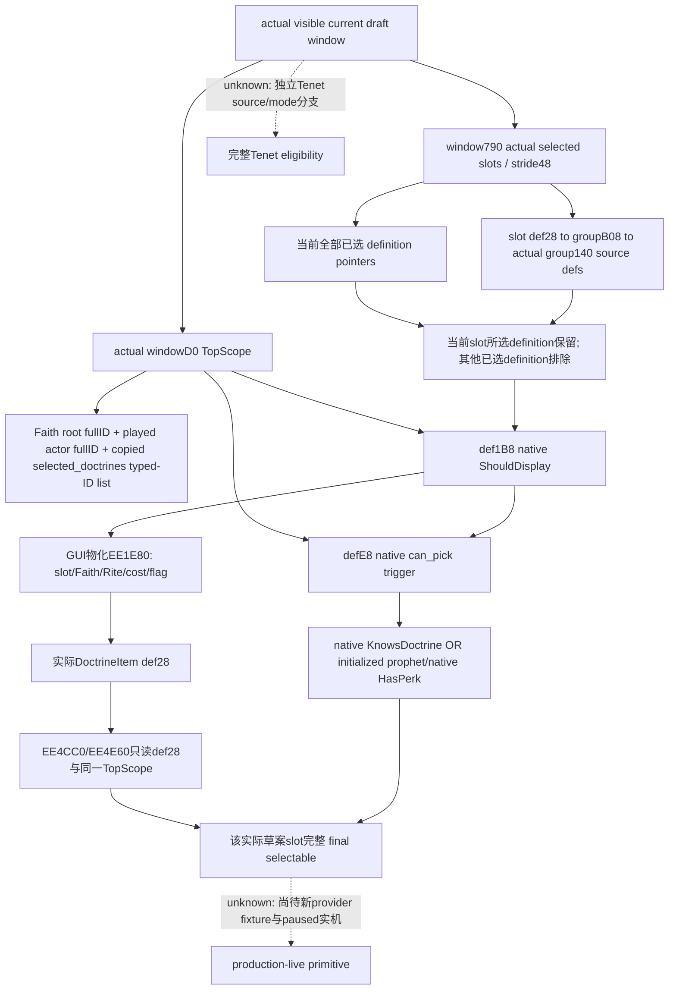

# CK3 1.20.0.2 全实际草案 Doctrine 候选判定

2026-10-01；宗教研究已获用户授权。exact EXE SHA-256 `AE1BA6FF060BA603842F6F4A2DED0AF4B7D3666B3DD271F75FB01B0DA8E81B2D`。按 [原生研究规则](README.md) 先闭 stock/exact-build 树；本包不操作 CK3、GUI、pipe 或 Steam。旧 R6/R7 源及证据冻结不改。

## scope 与候选树

原版 `doctrine_types/_doctrine_types.info:72–95` 指明 `is_shown`/`can_pick` 在 Faith root 求值，后者还读取 actor 与当前 UI 的 `selected_doctrines`。原版 `20_doctrines.txt:1093/1244–1250` 确实用该 list 检查互斥选择。原版 GUI 的最终 enabled 为 native CanPick 与 `pam_know_doctrine` 的 AND；scripted GUI 后者是 native KnowsDoctrine OR prophet perk。

## 已闭 exact-build 输入

[旧 group_model 树](religion_reform12002_group_model.md) 已证明 `ShowWindow14F1950` 的真实 Doctrine 物化源是当前实际 slot 的 group+140 指针数组/count14C。它先保留当前slot自己的 selected definition；其他定义若已在任一 selected slot(window790)使用则排除；随后仅求 `definition+1B8` native trigger。保留分支不跳过 shown。数组扩容和行构造不增加 Doctrine eligibility 条件。这里不是全局 definition registry，也不推断所有 Faith 的所有合法选项。

新 scope closure 是 `14F8820–14F892B`：`EE5BF0` 从传入 Faith fullID 构造 type0xD root；`373A450` 把 window730 保存的 selected definition typed-ID list 复制入 scope；读取 played CharacterID global54DBC00，以 type4 加入 actor；`373AF40` 复制进实际 windowD0。列表里的 Tenet/Doctrine 分别是 type0x28/0x27 的 definition ID，生产者 `2592190` 读取当前 draftB28 的两个实际 definition arrays。它不是 popup row/category 指针别名。

scope 更新只有初始化 caller14F7753 与草案选择刷新 caller14F87C6；后者先由实际 selected slots790 重建 draftB28，再刷新列表与TopScope。`ShowWindow` 修改 category8/group、10/selected definition、50/slot 和 category20/38 当前缓存，不重建 root、actor 或 selected list；因此同一实际草案下切组不会改变 Doctrine 条件的输入。读取窗口里的既存 D0 足够，无需重建 scope。

实际 `EE1E80` 构造的 row+28 仍是 source definition 原指针；附加 slot、FaithID、RiteID、费用与组标志。新增 callee `EE21B0` 只重算 row+38 费用；它不改 def28。已发布 `EE4CC0`/`EE4E60` 最终 getters 只读取 def28，再以传入 TopScope 求 def1B8/E8。故无需 fabricating DoctrineItem、调用 ctor 或 ShowWindow，也能从实际 group source 得到等价的 shown/raw CanPick。费用属于另一已闭包，不能把“可选”当作整个创建命令可执行。

原生 UI 最终选择门为 `not duplicate-excluded AND shown AND can_pick AND (KnowsDoctrine OR prophet)`。knowledge/perk 复用已发布绑定，数据库只读取已初始化 cache；本包不会调用 lazy init getter。未物化组也有当前 selected slot 与真实 group source，可以完整求值。零source/无窗口是合法观测状态；读取失败另列。

## 交付边界

本轮首先交付上述 native tree 与必要新 exact spans；证明脚本为 `native_bridge/research/religion_reform12002_fullchoices_native.py`，ABI 为同名前缀 JSON。artifact 在 `Z:\ck3_mod_rewrite\artifacts\g2-offline-2026-10-01\religion-reform\fullchoices`，旧 12 spans/25 anchors 与旧 getter/knowledge fixtures 直接复用，不重跑。

Doctrine 等价 readonly provider 的施工已具备输入；后续最小 provider 使用当前窗口790各slot真实group140来源、当前D0与 native raw/knowledge/perk，发布每个source的 duplicate/shown/raw/knowledge/final bool，绝不发布全registry或构造假行。provider和一次实际多slot C++ fixture完成之前 readiness 是 **research**；没有新 paused artifact，不声明 live。

Tenet 的 global source、selectedTenets778、category18、raw pick source 与知识/Faith status由独立 `religion_reform12002_tenet_sources*` owner 闭合；本篇的 Doctrine 等价证明不外推到 Tenet。
