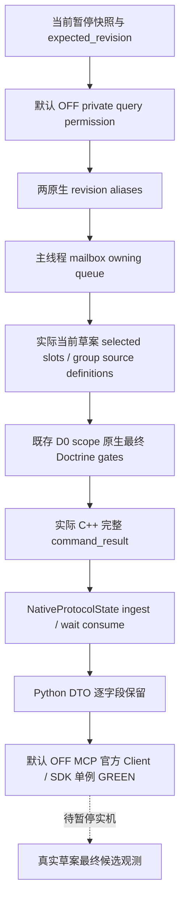

# CK3 1.20.0.2 全草案 Doctrine choices Python 查询

2026-10-01。输入状态入口是已完成的 [全 Doctrine provider](religion_reform12002_fullchoices_provider.md)；[原生树](religion_reform12002_fullchoices.md) 保留此前研究阶段记录。EXE SHA-256 为 `AE1BA6FF060BA603842F6F4A2DED0AF4B7D3666B3DD271F75FB01B0DA8E81B2D`。本页独立于已冻结的 R7 draft-groups 与原 reform-context 查询。

新 leaf 消费原生完整 `command_result`，读取当前真实草案的所有 selected slot→group source definition，并透传原生最终 `final_selectable`。其范围为 `actual_current_draft_selected_slot_group_sources`；未打开 popup 的实际草案组也包含在内。没有全局 registry 枚举、假 DoctrineItem、ShowWindow 或选择动作。

| 接口 | 固定值 |
| --- | --- |
| Native step | `query-player-religion-draft-doctrine-choices-v1` |
| Domain / result payload | `player_religion_draft_doctrine_choices_v1` / `player_religion_draft_doctrine_choices` |
| Backend | `ck3-1.20.0.2-native-player-religion-draft-doctrine-choices-v1` |
| Schema | `ck3_12002_current_draft_full_doctrine_choices_v1` |
| Driver | `query_player_religion_draft_doctrine_choices_private_v1` |
| MCP | `ck3_query_player_religion_draft_doctrine_choices_v1` |
| Permission / CLI | `allow_private_player_religion_draft_doctrine_choices_query` / `--private-player-religion-draft-doctrine-choices-query` |

公开输入只有 `expected_revision`；共享 transport 把它对应的 native revision 同时写入原生 `expected_revision` 与 `expected_snapshot_revision`。默认 permission / CLI 关闭。查询保留 `read_only=true`、`advertised=false`，没有 actor、target、slot 参数或 mutation。

`doctrine_gates_complete=true` 表示当前实际草案全部 Doctrine slot source 的最终选择门已求出；费用、名称、创建命令资格和完成结果仍由各自查询或实机动作验收。Tenet 不在本 DTO 中。每行的 `passed_shown`、`native_can_pick`、`native_knows_doctrine`、`native_has_prophet` 保持 bool / null：null 是原生短路未执行该分支，最终 `final_selectable` 仍是实际 bool。Python 不把 null 改成 false，也不重新推导最终结果。零 source slot 保留该 slot 与空数组。

唯一新增的完整 C++ owning-queue packet 为 `visible-four-slots.json`，原始字节 SHA-256 `ced894ce0769bef6a56896aee92b77604c002d284af9c703bce1944e36878bd8`。4 个实际 slot 的来源数为 6/6/3/0，共 15 行、5 个最终可选项；同组两 slot 的自身保留和跨 slot 重复排除分别存在，另含 shown false、CanPick false、knowledge / prophet false、native known true 和合法空来源。完整 protocol_version=1、accepted/build/read-only metadata 来自 C++ serializer，Python 只在内存中更改请求关联 nonce。

新增 unit 只消费这一包，走真实生产 `NativeProtocolState.ingest → wait_for_command_result → leaf query`，验证整 DTO 等值、最终 true / false 与短路 null、revision aliases 和缓存已消费。原 provider 的 prophet/zero-source/zero-slot/hidden fixture、旧 R7 单元及 SDK 矩阵作为已有证据复用。

当前状态为 **static-ready query；R8 production native 接线、候选构建与暂停实机待验收**。Native wrapper 为 `/O2 /W4 /WX` 1 case / 8 checks GREEN，query leaf 新单例验收记录见 `Z:\ck3_mod_rewrite\artifacts\g2-offline-2026-10-01\religion-reform\fullchoices-query-python\wire-result.json`；最终路径、SHA、日／周报告字段见同目录 `final-source-package.json`。

共享 Python owner 已登记默认 OFF Driver / MCP / CLI，并执行唯一新增 official SDK case，**1 passed / 1.97 秒 GREEN**。实际 C++ packet 经真实 `NativeProtocolState.ingest / wait`、生产 `NativeDriver` wrapper 和官方 MCP Client，整 native DTO 等值；4 slots / 15 sources / 5 final-selectable、完整 gate 与原生 optional null 保留，同时验收 OFF discovery、read-only 和 CLI 默认 false。SDK receipt 为 `Z:\ck3_mod_rewrite\artifacts\g2-offline-2026-10-01\python-routes\draft-doctrine-choices-actual-sdk.json`，SHA-256 `3c3c48b7a56758750accdeb26c49b6477394ebf3d3733851bef826a7c7919d2c`。新增 SDK test 为 `test_g2_player_religion_draft_doctrine_choices_mcp_wire.py`，由 shared owner 独占冻结。

本次只补文档与清单，未重跑原 unit / native / SDK 矩阵，旧 R7 查询保持冻结。本包没有 CK3、pipe、UI、Steam 或 live 操作。Root 后续完成 R8 named native query / candidate 接线并采集真实暂停草案；目前未声称 fixture-live 或完整宗教 OODA。全草案 Tenet sources、资源与创建动作由各自独立工作包推进。
