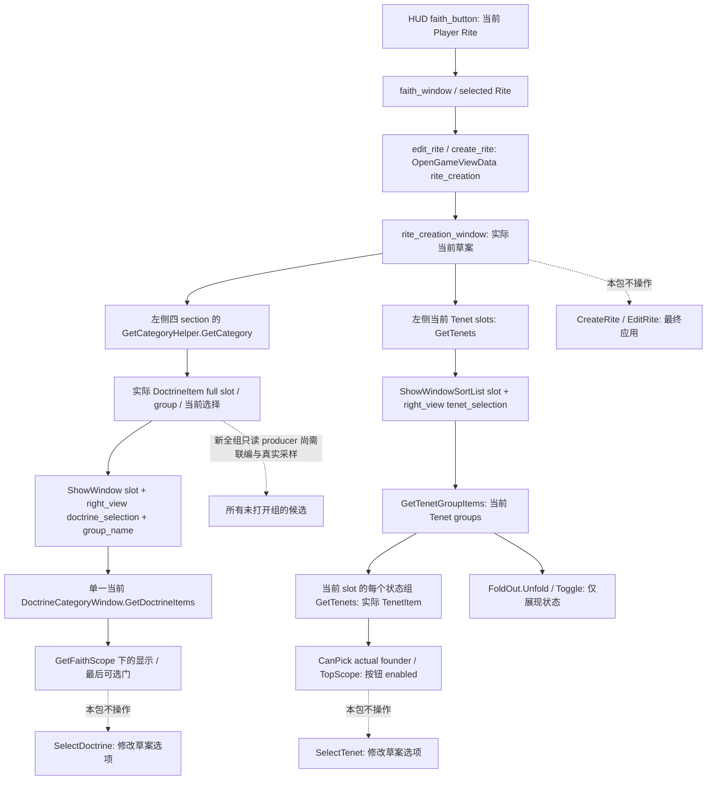

# 1.20.0.2 Rite 草案：全教义组选组与 Tenet 候选 GUI 路线

状态为 **stock GUI source-verified / research**。本包只读取冻结原版 GUI 与简中／英文定位文案，未访问 CK3、pipe、UI 或 Steam，也未改已冻结的 Python query、native provider 或策略。用途是让 root 在真实暂停场景逐组预览，而不把当前单组 popup 当成全部教义候选。本包没有 live artifact 或 G2 credit。

冻结为 CK3 **1.20.0.2 Crozier / Steam25588574**，EXE SHA-256 `AE1BA6FF060BA603842F6F4A2DED0AF4B7D3666B3DD271F75FB01B0DA8E81B2D`。所有 stock 路径相对 `Z:/ck3_mod_rewrite/artifacts/migrations/2026-09-30/post-update-1.20.0.2/installation/game/`。原字节哈希、行号与逐行原文在 `Z:/ck3_mod_rewrite/artifacts/g2-offline-2026-10-01/religion-reform/group-gui/stock-evidence.json`，SHA-256 `c2c4f07341716f587e35f36890ca740453c2bb4522891ca0365debca323fde7c`。

## 实际数据上下文

四个左侧 section 都是当前草案的 **DoctrineItem 组选组入口**。它们使用 `GetCategoryHelper(...).GetCategory`，不是右侧候选列表，也不是四个互斥的页面。窗口 `_show` 虽把 `faith_creation_doctrine_page` 设为 `main_group`（`window_rite_creation.gui:20`），这四个 grid 本身没有按该变量切页的 visible 条件；GUI 同时放在左侧 scrollbox 内。每个 section 内的实际组数由当前 datamodel 决定，不从全 registry 补组。

| 左侧 name | 当前 datamodel / 行 | 简中／英文 section 文案 |
| --- | --- | --- |
| `doctrines_grid_main_group` | `RiteCreationWindow.GetCategoryHelper('main_group').GetCategory`，315 | 主要教义 / Main Doctrines |
| `doctrines_grid_marriage` | `GetCategoryHelper('marriage').GetCategory`，346 | 婚姻教义 / Marriage Doctrines |
| `doctrines_grid_crimes` | `GetCategoryHelper('crimes').GetCategory`，373 | 罪行教义 / Crime Doctrines |
| `doctrines_grid_clergy` | `GetCategoryHelper('clergy').GetCategory`，399 | 神职人员教义 / Clergy Doctrines |

每个左侧 row 使用 `widget_doctrine_selection_item`（979），顺序加入 `DoctrineItem.GetFaith`、`GetRite`、`GetDoctrine`、`DoctrineType.GetGroup` context（980–983）。显示组名来自 `DoctrineGroupType.GetName(Faith.Self)`（1031），显示当前选项来自 `DoctrineType.GetNameNoTooltip(Faith.Self)`（1043）。`DoctrineItem.GetSlotIndex` 是原生草案 slot，不能把 section 内 row index 当成它。

点击左侧 row 会依次调用以下三个表达式（991–993）：

```text
RiteCreationWindow.GetDoctrineCategoryWindow.ShowWindow(DoctrineItem.GetSlotIndex)
GetVariableSystem.Set('faith_creation_right_view', 'doctrine_selection')
GetVariableSystem.Set('doctrine_group_name', DoctrineGroupType.GetName(Faith.Self))
```

右侧 `doctrine_selection` 的显示由 `faith_creation_right_view` 决定（802–803），标题读 `doctrine_group_name`（1396），列表建立 `GetDoctrineCategoryWindow` 和 `GetFaithScope` context（1409–1410），实际候选 datamodel 是 **`DoctrineCategoryWindow.GetDoctrineItems`**（1414）。因此这里只显示最后一次打开的那个组。



现有 native 单组 reader 的 `window+0x888` 是一个 inline `DoctrineCategoryWindow`，`category+0x20` 是当前 Doctrine popup；`window+0x7A8` 则是**当前 slot 已物化 Tenet rows 的状态分组**，不是未打开全部 slots 的 Tenet 候选。成员定位复用[旧候选专题](religion-reform12002-choices.md)，本包没有重新逆向布局；其全域解释以新 group-model owner 的闭合来源为准。

新 owner 已闭合 `ShowWindow` callback `0x14FAA20 → 0x14F1950`：它清当前 category `+0x20/+0x38`，按 selected slot 的 group 构造当前 popup，末尾 `0x14F1E4D → 0x14F3E60(owner_window, category+0x38)`。`0x14F3E60` 先清 window `+0x7A8` groups/count，再仅用当前 category Tenet rows 生成状态组。**Doctrine 和 Tenet 都没有靠打开几次累积全部 slots 的候选 cache。**要做 GUI 全 slot 预览，须逐个实际 `ShowWindow/ShowWindowSortList` 并在下一次切换前冻结当前组结果。全组 producer 由另包继续，后续原生专题为 `religion_reform12002_group_model.md`；当前单组读取与左侧组选组 datamodel都不能冒充全候选完成。

## Root 可执行的预览步骤

以下是导航指令，不是本包已经执行的实机结果。使用 root 的当前画面／GUI dump 定位实际显示的按钮和组名；本文不提供未经采样的像素坐标。

| 步骤 | 定位与按钮／快捷键 token | 实际 stock onclick 与副作用边界 |
| --- | --- | --- |
| 1. 打开本人 Rite 视图 | HUD 的 `faith_button_container` → `faith_button`；快捷键 token `hud_faith` | `hud.gui:3753–3756`：context `GetPlayer.GetRite`，`OpenGameViewData('faith', Rite.Self)`。优先这个入口；topbar `piety`（6857）传的是本人 Faith，不能据此保证同一个 selected Rite。只开视图。 |
| 2. 留在信条页 | `faith_window` 的 `tabs`，信条页按钮；token `tab_1` | `window_faith.gui:435–443`：`FaithWindow.SetActiveTab('tab_beliefs')`。不进入其它宗教页。这里只冻结 shortcut token，未获得物理键映射。 |
| 3. 打开实际草案 | `actions` 下可见的 `edit_rite`、`create_rite` 或 `create_rite_puppet` | 1320／1364／1379：`OpenGameViewData('rite_creation', FaithWindow.GetSelectedRite)`。按钮文字分别为“修改礼仪 / Modify Rite”或动态“改革…礼仪 / Reform the … Rite”“创建分支…礼仪 / Create Branched … Rite”。开窗会初始化预览模型，窗口 `_show` 重设 right-view 等 GUI 变量；这些入口没有调用 `CreateRite/EditRite`。 |
| 4. 逐个打开 Doctrine 组 | `rite_creation_window` 的 `left_side` → `doctrines` scrollbox → 四个上述 grid；每个当前 row 的 `doctrine_group_name` | 点左侧 `widget_doctrine_selection_item`，触发 991–993 的 `ShowWindow(slot)` 与两个 UI 变量 setter，物化／替换右侧当前组 popup。按当前 datamodel 的实际 row 遍历，不猜 slot。 |
| 5. 每组只读采样 | `right_side` → 可见 `doctrine_selection` → `contents` | 保持暂停，用当前只读 query 记录组标题、actual scope 与候选；切到下一个左侧组会替换单组 popup，不自动保留前一组。点右侧 candidate 会触发 `SelectDoctrine`（1253），它不属于本路线。 |
| 6. 返回主预览 | 当前 `doctrine_selection` 下 `cancel`；文案 key `CANCEL` | 1425：只 `VariableSystem.Clear('faith_creation_right_view')`。它未调用清空 native candidate cache，不能据此认为 native rows 已不存在。 |
| 7. 逐个打开 Tenet slot 候选 | 左侧 `tenets_grid` 中每一个实际 slot 图块 | 197–198：`ShowWindowSortList(TenetItem.GetSlotIndex)`，再设 right-view 为 `tenet_selection`；不调用 `SelectTenet`。当前 slot 的候选与 groups 会被下一个 slot 替换，每次采样后再点下一 slot。 |
| 8. 查看当前 slot 的各 Tenet 状态组 | `right_side` → `tenet_selection` → `contents` → `vbox_creation_tenet_group_foldout` | 每组标题 `TenetGroupItem.GetGroupTitle`，`oncreate` 默认 `BindFoldOutContext`／`Unfold`（1437–1438）。若折叠，标题开关来自 `button_expandable_toggle_field`，实际 onclick 是 `PdxGuiFoldOut.Toggle`（`misc_components.gui:250`），只改折叠展现，不是选择或资格。这些状态组不代替左侧 slots 的遍历。 |
| 9. 返回／关闭预览 | Tenet `cancel`；窗口 header `button_close` | 1598 只清 right-view；45／67 调 `RiteCreationWindow.Close`。本路线不使用右侧 `SelectTenet`（1476），也不使用底部 `CreateRite/EditRite`（599／612／625）。 |

只有 `faith_window`（`window_faith.gui:9–10`）与 `rite_creation_window`（`window_rite_creation.gui:6–7`）在这些来源中明确带 `widgetid`。其余表内标签是 stock `name` 或 type；重复 row 的 `doctrine_group_name` 不是全窗口唯一 ID。需先限制到所属 grid／可见右侧 panel，再用当前渲染组名定位。左侧与右侧均有 scrollbox；滚动本身只改变可见区域，不替换当前 slot。

Tenet sort 使用 `GetTenetSortController`（1567），dropdown 的 `OnOrderBySelectionChanged` 与 `sort_order.RevertSortOrder` 分别见 `shared/lists.gui:931/942`。它们会改预览排序，逐组采样可保持默认排序，不将排序／折叠当作候选合法性。hover tooltip 可更新 GUI 文本 cache；本文只以明确 onclick 区分组选组、修改草案与应用动作，没有声称每个界面 getter 都无 UI 缓存写入。

## Tenet 的完整按钮门与折叠边界

当前实际 popup `vbox_creation_tenet_group_foldout` 的唯一 row-button `enabled` 是：

```text
TenetItem.CanPick(RiteCreationWindow.GetFounder.Self, TopScope.Self)
```

证据为 `window_rite_creation.gui:1448–1478`。父 vbox 的 `visible=PdxGuiFoldOut.IsUnfolded`（1449）只控制展现，随后 `GetFaithScope`（1450）提供实际 `TopScope`，每组 `GetTenets`（1466）给实际 row。内层 `widget_tenet_item` 原本在 `window_faith.gui:2312–2314` 有 `Not(Faith.HasTenetStatus(...,'unknown'))` enabled block；creation 行 **1493 的 `blockoverride "tenet_enabled" {}` 已把它清空**。通用 `button_group` 默认定义（`preload/defaults.gui:124–129`）没有另一 enabled/visible 表达式。图标 validity、glow 或选中 `down` 状态不是另一个 row 的可选门。

因此，对当前已物化 row，正确 founder／scope 输入的原生 `CanPick` 是 stock 最终 **button-enabled** 值，无需再添加未知 gate。它不代表窗口目前展开或能被鼠标点到，更不代表最后创建宗教命令已合法。

Founder 等价由原生 group-model owner 的已有 exact-build 研究闭合，本包没有重扫 `EE0AD0`：literal `0x4565F20` 注册 `0x22C060`，callback `0x22C13A → 0x14FBBB0`，后者 `0x14FBBBE` 调 `0x14F0E70`；`GetFounder` 读取 window `+0xCC` full CharacterID，并用 storage `0x5C67568`／entry full ref `+0x18` 解析。当前窗口 reader 已要求该 full ref 等于当前 played full ref，故这一 current-window scope 中，provider 的 actual played actor 参数与 GUI founder 一致。这条等价不可外推到任意创建模型或自造 actor。

已冻结旧联合 query 的 Tenet `final_can_pick=null` 保持其历史输入，本包不改它。新 overlay 可根据这条完整 stock 链发布当前已物化 Tenet row 的最终 enabled 和独立 readiness；**未打开 Doctrine 全组及其它 Tenet slots 的来源仍需新 group-model producer**，最后门与候选全集两项不能互相替代。

## 原字节 source pins 与交付边界

| Stock 文件 | SHA-256 |
| --- | --- |
| `gui/hud.gui` | `77d0beedefe23eee22b24c1c0b160ae5ee8ec938868d3f4b7ae76296347a6ac6` |
| `gui/window_faith.gui` | `67924e58ccba26d95853ac48af35d91a774f5ce6d2e7f32a0a033de3b9d51521` |
| `gui/window_rite_creation.gui` | `9476299fdbf0975e41923eac9b192d3fe0b2cd74a4da0d928d0da7974b7ea9f8` |
| `gui/preload/defaults.gui` | `7ba220ab2de42d68d1123353d20da55203dacf3e8fa699046cdf274d46296698` |
| `gui/shared/misc_components.gui` | `a7b6ae3a96652fff1b7a4532b04abeb16551601a17d3d877986bee0a1edb5c34` |
| `gui/shared/lists.gui` | `71c6dd9036ed54d53d95e6229782924325f262d208f4e971775237bd4852e5ac` |

四份简中／英文定位 yml 的完整 SHA 也在 stock artifact；section 文案分别来自 `rite_creation_window_l_english.yml:135–138`、`rite_creation_window_l_simp_chinese.yml:119–122`，入口按钮 key 分别来自英文 11／144／146 与简中 10／127／129，Tenet 标题来自 `religion_core_tenets_l_*.yml:3`。这里只读取既有文案，不创作或翻译其它语言。

本包完成的是 stock 数据上下文、preview 导航、副作用边界及 Tenet GUI 最后门证明。没有执行导航，没有新的 paused 样本，没有 provider／MCP 变更，没有重复原生验证或旧矩阵，也没有提交 Git。下一步由原生 owner 冻结全组 source／overlay，由 root 联编并实际暂停预览、逐组互证；不得用 authored 全表、折叠状态或当前单组列表冒充所有合法候选。
