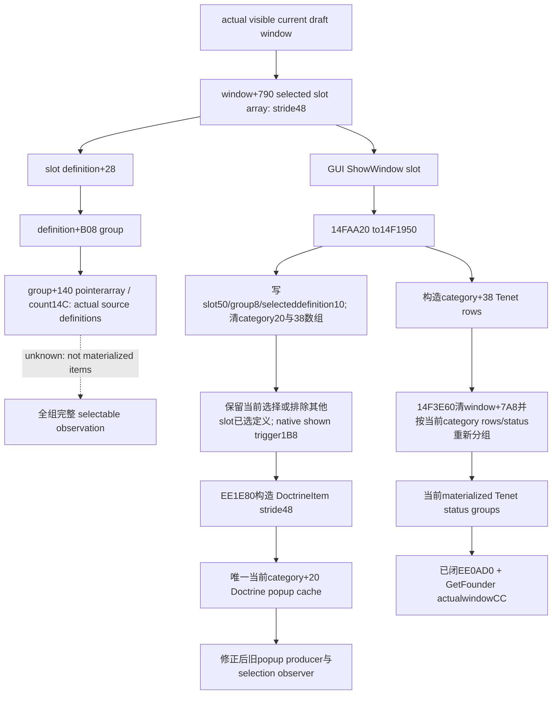

# CK3 1.20.0.2 草案分组源缓存与物化边界

2026-10-01，宗教用户授权；只读后台施工，不触碰 CK3/UI/pipe/Steam。exact EXE SHA-256：`AE1BA6FF060BA603842F6F4A2DED0AF4B7D3666B3DD271F75FB01B0DA8E81B2D`。以 [native README](README.md) 与 [stock 分组 GUI](religion_reform12002_group_gui.md) 为输入。

## 原版到 native 的树

`window_rite_creation.gui:991` 的 Doctrine slot 调用 `DoctrineCategoryWindow.ShowWindow(DoctrineItem.GetSlotIndex)`；`:197` 的 Tenet slot 调用 `ShowWindowSortList(TenetItem.GetSlotIndex)`。它们是改变当前 model/cache 的物化操作，查询口不会调用。

## 已闭合结论

- `CRiteCreationWindow` constructor 的 `14F244E` 写 `window+888 = window`，是 inline category owner；`14F2478/14F247F` 初始化当前 Doctrine array(window+8A8)为空；`14F24A2` 的 category+50 slot index 初始化为-1。
- `ShowWindow 14FAA20→14F1950` 与 `ShowWindowSortList 14FABB0→14F1E60→14F1950` 都修改 model；`14F19CF` 写 slot index，`14F19D7/14F19DE` 从 window+790 的选中 slot取definition，`14F19E3/14F19EE` 写当前 selecteddefinition/group，`14F19F6/14F1A02` 清 category+20/+38。
- `14F1A0B/14F1A12` 读取该实际 group 的 definition pointerarray+140/count14C。它是各实际选中 slot 的物化源，能后台读取；它本身不是 complete selectable items。Native 还排除其他 slot 已选定义、求 `definition+1B8` trigger，再调用 `EE1E80` 创建候选行。
- DoctrineItem 实际 stride 是 **0x48**。正确链是 `14FA982` descriptor `4435128` → vtable `45657B8` → indexed getter `1510920`，`1510953/151095C` 的 index×9×8；`14F1A6D/14F1B91` 和 `EE1E80` 互证。旧 choices 文档/ABI 把另一种数组的 `1514980/0x50` 关联进来，属于需要纠正的生产布局错误。
- 最小修正仅共享 header `religion_reform12002_choices.hpp` 的 `kDoctrineItemStride:0x50→0x48`。旧 choices 和 selection 两个实际 reader 都引用同一常量，无需改两个 C++ 文件。旧冻结树保持原样，外部 candidate 和实证交中央 owner 在 R5FINAL 后作为 R6应用；旧 ABI 作为历史证据保留，本篇新 ABI 记录正确链。
- `14F1950` 尾部 `14F1E4D` 进入 `14F3E60(ownerwindow,category+38)`。后者先清 window+7A8 groups，再只按当前 category Tenet rows重新生成 status groups。它不是所有未打开 slot 的跨组完整 Tenet cache。
- GUI `GetFounder` literal `4565F20` → 注册 `22C13A` typed callback `14FBBB0` → `14FBBBE` 调用 `14F0E70`；leaf从 **window+CC** 复制完整 Character ID，typed getter通过 storage/full identity+18解析 Character。共用 current-window reader已要求该fullID==playedfullID，因此当前合法scope里 founder==实际played Character；Tenet GUI唯一 enabled 为 `CanPick(founder,TopScope)`。

## readonly 交付

新 group_model 查询只复制 actual window 下的 selected slot identities、各slot实际group definition source keys、当前category slot/group/cache counts，以及当前物化 Tenet groups 的最终 native CanPick。source definition 列表明确不代表未来草案合法候选；没有调用构造、ShowWindow、排序、切组或选择。

所有事实来自 current draft owner；缺窗口、隐藏窗口、已物化空集合和读取失败分开。native constructor getter和缓存指针不对外序列化。`ReadCurrentDraftGroupModel12002` 复用现有 `DraftChoiceBindings`，不会二次调用旧 Doctrine popup reader或selection。

当前 readiness 为 **static-ready**：exact 新模型证据 `group-model/native/result.json` 12 spans、25 anchors GREEN；actual C++ `/W4 /WX /O2` 一次必要 fixture完成6个检查、5份实际 JSON，覆盖两实际group源、正确0x48 selected rows、current group identity、Founder与最终Tenet true/false、物化前已有源缓存、隐藏窗口、真实帧变化与owner绑定。fixture `group-model/fixture-attempt-01/result.json`。

独立 R6 correction receipt 是 `group-model/stride-candidate/result.json`：旧header的实际四行 O2 deterministically失败；外部候选改唯一共享header后 `/Od`、`/O2` 各3检查／2实际JSON GREEN，显示 A selectable、B native blocked、C hidden、D knowledge blocked，包含两层实际producer及convenience路径。测试源码原字节已收进 `native_bridge/src/religion_reform12002_stride_multirow_test.cpp`，SHA `da309eeb2e8ee7944fde746b3a76dff581e379af9673d0cf0d377dc0dbb67077`。worker没有修改旧冻结header，由中央 owner在R5FINAL后唯一应用。

所有 artifact位于 `Z:\ck3_mod_rewrite\artifacts\g2-offline-2026-10-01\religion-reform\group-model`；`delivery-result.json` 记录本包source SHA、dependencies、独立修正收据和日报／周报字段。没有 paused live证据，不声明 live。下一步是中央 owner发布该只读model/cache入口，暂停实机确认实际selected groups/当前物化缓存；全组 GUI物化流程继续按stock入口执行，source列表仍不冒充全组合法候选。
