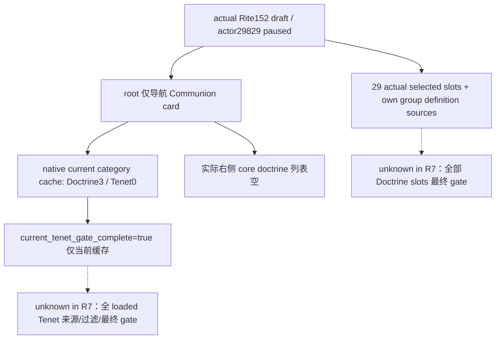

# CK3 1.20.0.2：R7 真实草案组来源与 Tenet 空缓存样本

记录：2026-10-01 20:56:30 Asia/Shanghai。状态为 **`fixture-live` 的只读模型 primitive**：R7 的 actual draft group query 已有真实 paused SDK artifact。它发布实际草案组来源及当前物化缓存，不代表全 Doctrine/Tenet 最终选择能力或宗教 OODA。记录者只读取 root 已产出的文件，没有游戏调用；root 本轮只导航，没有 SelectDoctrine、SelectTenet、创建/编辑/改革。

## 精确输入

CK3 `1.20.0.2`，EXE SHA-256 `AE1BA6FF060BA603842F6F4A2DED0AF4B7D3666B3DD271F75FB01B0DA8E81B2D`。实际 actor/founder **29829**，source Rite **152**。两个 query 前后 snapshot 均为 paused，日期 `53169336`；前后各自 actor、日期与虔诚余额一致。来源 query 为 `ck3_query_player_religion_draft_groups_v1`，域 `player_religion_draft_groups_v1`，`group_source_scope=actual_selected_slot_group_definition_sources`。

| 原始查询 | native revision / epoch | selected slots | 当前 category |
| --- | --- | --- | --- |
| [仅打开草案](Z:/ck3_mod_rewrite/artifacts/g2-offline-2026-10-01/targeted-sdk-r7/r7-draft-groups-readonly-20261001T122903Z/003-ck3_query_player_religion_draft_groups_v1.json) | `3` / `40428` | **29** | 未物化、slot -1、当前 key null |
| [导航 Communion card 后](Z:/ck3_mod_rewrite/artifacts/g2-offline-2026-10-01/targeted-sdk-r7/r7-draft-groups-readonly-20261001T123302Z/003-ck3_query_player_religion_draft_groups_v1.json) | `5` / `68622` | **29** | `category_materialized=true`，slot **1**；native缓存 key为 `doctrine_marriage_type` / `doctrine_monogamy` |

原始包逐项保留 29 个实际 selected slot、各自稳定 definition/group key 与实际 group source definitions。它们来自已证明的 `window+790`、实际 stride48 和 group+140 定义表，并不是把全局 catalogue 拼成最终候选。

## 空缓存与实际画面须同时保留

[仅草案截图](Z:/ck3_mod_rewrite/artifacts/g2-offline-2026-10-01/live-run-07/gui/20261001T122902796073Z.png) SHA-256 `e082de906a6c044a2d2905d02511914411d883d5fb6bc1540b3bdbf706e2089d`。[导航后截图](Z:/ck3_mod_rewrite/artifacts/g2-offline-2026-10-01/live-run-07/gui/20261001T123301857797Z.png) SHA-256 `e8dc0eec831e9aec6d7bdc652fc1984ca41fca6d97b3638ebf874db3620e0476`，已实际视觉查看：右侧标题“核心教义”、名称排序控件已显示，背景候选列表为空；Communion tooltip 是悬停内容。本记录不推断该空列表的原因，也不把悬停当作选择完成。

同一导航后实际 native group model 返回：

| 字段 | 原始值 | 证据范围 |
| --- | --- | --- |
| current_doctrine_cache_count | **3** | 当前 native category 的 Doctrine cache |
| current_tenet_source_count / current_tenet_group_count | **0 / 0** | 当前物化 category 的 Tenet source/status-group cache |
| current_tenet_choices | **[]** | 此缓存逐行 gate 的空集合 |
| current_tenet_gate_complete | **true** | 仅上述当前物化缓存的 gate 遍历完成 |
| all_group_materialized_choices_complete | **false** | 没有全组最终候选完成资格 |

`current_tenet_scope=current_materialized_category_status_groups` 的边界必须与字段一起消费。空缓存的遍历完成不能证明全数据库没有 Tenet、所有未打开组没有候选，或全 Tenet 最终资格已闭。画面进入 Tenet/core doctrine 视图与 native category 仍有 marriage Doctrine cache 是这次样本的两项事实，本包不扩展为 reader 故障结论。

## 新后台入口与资格

R8 已独立静态闭合两个更完整的只读入口：[全部实际 Doctrine slot final choices](religion_reform12002_fullchoices_provider.md)使用同一真实 draft TopScope、各组定义来源及原生 trigger/知识门，无需切 popup；[Tenet 全来源与最终输入](religion_reform12002_tenet_sources_provider.md)使用实际全 loaded Tenet DB `5D1DEB8→EF0/EFC`、原生 `14F2030` 来源过滤、源 Faith/mainRite uint8状态及实际 actor/TopScope 最终门，完全不由当前缓存的零值推导完成。两者最高 **static-ready**，本 R7 artifact 不冒充这两个新 query 的实机验收。

原 R7 model/query/source pins保持冻结，新文档没有改编译输入。下一步是中央 R8 dedicated named queue/candidate 与 root 的真实 paused query，逐项对照 29 个 actual Doctrine slots、全 loaded Tenet source 与过滤。没有动作或资源结果、本代/完整 OODA 或战争增量。

## 日/周字段

2026-10-01 / 2026-W40：R7 draft group readonly model真实 paused artifact，actual29 slots / founder29829 / Rite152；保留 Tenet导航后空cache及false全组资格边界。测试复用原 provider/完整packet/SDK/named证明，本轮只归档 root 实机输入，没有重跑。新 R8 source37 与 SDK3静态ready单独计数，不合并为 R7全选择 live credit。Git commit/push交 root，本记录者没有 Git或游戏操作。
