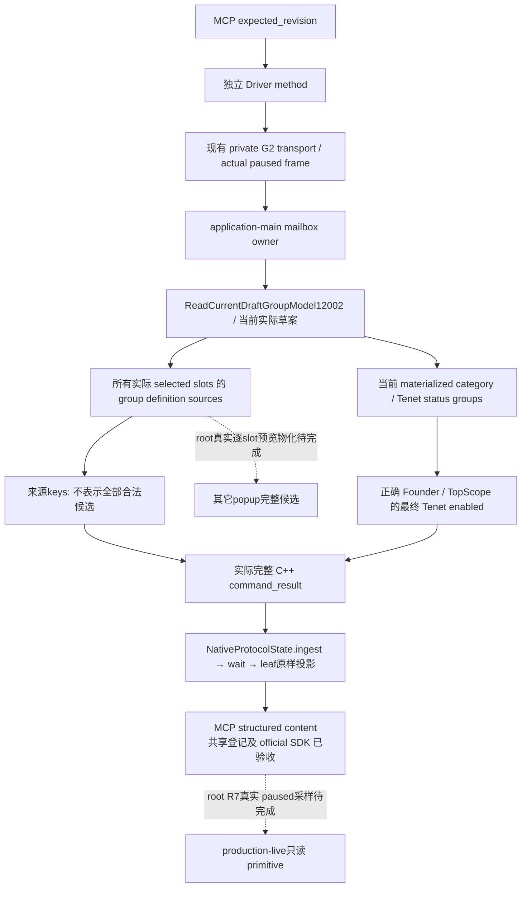

# 1.20.0.2 草案组模型：独立只读 Python／MCP 查询

状态为 **static-ready query**：共享 Driver／CLI／MCP 已登记，实际回包的官方 SDK 单例已通过；放入 R7 队列，真实 paused 验收仍待 root。不改 R6 或已冻结的 reform query 16 文件；L4／L6 输入保持冻结。本包新增独立 transport、实际原生回包 fixture、unit 和本文，SDK test 由共享 Python owner 独占并冻结。未访问 CK3、pipe、UI 或 Steam，无宗教选择、提交或战争研究。

冻结 CK3 **1.20.0.2 Crozier / Steam25588574**，EXE SHA-256 `AE1BA6FF060BA603842F6F4A2DED0AF4B7D3666B3DD271F75FB01B0DA8E81B2D`。输入是已冻结的[草案组模型](religion_reform12002_group_model.md)及[原版 GUI 导航](religion_reform12002_group_gui.md)，本包不重扫原生最终门或复制全 registry。

## 查询合同

| 层 | 实际约定 |
| --- | --- |
| selector | `query-player-religion-draft-groups-v1` |
| domain key | `player_religion_draft_groups_v1` |
| backend | `ck3-1.20.0.2-native-player-religion-draft-groups-v1` |
| 原生结果字段 | `result.player_religion_draft_groups` |
| 原生 DTO schema | `ck3_12002_current_draft_group_model_v1` |
| Python leaf／method | `player_religion_draft_groups_private_transport.py`／`query_player_religion_draft_groups_private_v1` |
| MCP tool | `ck3_query_player_religion_draft_groups_v1` |
| permission／CLI | `allow_private_player_religion_draft_groups_query`／`--private-player-religion-draft-groups-query` |
| 输入 | 仅 `expected_revision`；无 actor、target、slot、地址或 setter |

复用 `read_private_g2_native_query_v1`，public revision 从当前 paused snapshot 绑定到请求里的两个 native revision aliases。完整 `command_result` 的 `accepted/private_build/read_only/advertised` 由实际 C++ mailbox serializer 输出；Python 不补信封 metadata。旧 pipe 协议不新增游戏动作。

## 三种观测范围

`selected_slots` 是 window `+0x790` 实际选中 slot 模型，保持 `selected_array_index`、当前 definition key、group key 以及该 group `+0x140` 来源 definition keys。`group_source_scope=actual_selected_slot_group_definition_sources`；这些 keys 尚未经过当前 slot 的原生候选构造、排除和最终选择门，不能对外称作 legal choices。`all_group_materialized_choices_complete` 保持原生 **false**，不因为所有来源读取成功改成 true。

`current_category_slot/group_key/selected_definition_key` 与 cache counts 描述 **最后实际物化的当前 category**。window `+0x7A8` 只是该当前 category Tenet rows 重新组成的状态组，不是所有未打开 slots 的跨组缓存。provider 不调用 `ShowWindow`、`ShowWindowSortList`、构造、切组、排序、选择或最终提交。

`current_tenet_choices` 独立发布当前已物化 Tenet row 的 `final_can_pick` bool，并由 `current_tenet_gate_complete` 表示当前 category 的这一读取是否完整。founder 已由原生 exact-build 链证明为当前合法窗口 `+0xCC` full CharacterID；foldout 只影响显示，旧 inherited unknown 门在 creation 内被 empty override 清除。这里复用该已闭合最终门，不重算知识、perk 或 native triggers。它不是全部 slots 的 readiness，也不是创建宗教动作的资格。

已观测缺窗口／隐藏窗口为 `available=true / draft_observed=false`，source Rite 为 null，category 尚未物化；native 原有空数组和 `-1` slot 状态保留，不能把它们解读成所有候选都为空。当前实际草案已存在但某 category 未打开时，slot/group 的来源仍有独立可读价值；当前 materialized choices 保持相应独立 flag。原生读取失败保留 unavailable reason 和原有默认／空数组，不补 mock 草案。

`capture_epoch` 是 owning-thread query identity，独立于 snapshot revision。完整代际 Character/Rite refs、unicode key、合法零 count、true/false 最终门均原样保留；leaf 深拷贝 DTO，不追加 fallback 来源或策略评分。

## 必要验收与剩余

2026-10-01 **19:26:37 Asia/Shanghai**，新 mailbox 的四份实际完整 C++ 回包消费验收 **2 tests GREEN**。仅运行 [新增 unit](../../ck3_autonomous_player/tests/unit/test_ck3_12002_player_religion_draft_groups_wire.py)，覆盖生产 `NativeProtocolState.ingest → wait_for_command_result → query`，逐字段比较整个原生 DTO 与 Python 输出；private permission OFF 时零请求。不重复旧 reform/native 矩阵。原字节 fixture 和 [provenance](../../ck3_autonomous_player/native_bridge/research/fixtures/ck3_12002_player_religion_draft_groups/provenance.json) 已冻结，只有测试期请求 nonce 在内存中相关。

| 实际完整 C++ case | 验证结果 |
| --- | --- |
| `visible-multi-slots` | 两个 actual selected slots，各有两个 group source keys；当前 category 已物化，正确 founder 等于 played full ID，当前 Tenet 最终 `final_can_pick=true`；全组 completeness 保持 false |
| `absent-window` | 已观测 scope absence，available=true、draft_observed=false、source Rite null；当前 category=-1，最后门未就绪 |
| `hidden-window` | 缓存窗口隐藏，不宣称当前草案已观测；空列表不冒充完整候选 |
| `known-empty` | 真实可见草案已观测，selected slots／cache 为合法0；当前 category=-1，当前 Tenet 门未就绪 |

这四个 wrapper cases 是 parent 指定的新增范围；source-only、Tenet false 和 native failure 的原 group-model 库夹具证据复用，不扩第二组 wrapper 矩阵，也不把未重跑的路径写成新增 Python 端到端通过。原生 `/O2 /W4 /WX` caller 本轮 **4 cases / 21 checks GREEN**；其 receipt 位于 `query-group-mailbox/attempt-001/result.json`，SHA-256 `cd0b7dbe940b44d36f26104c81939bc1db4b747eb388a33ceed5dcee4eab8061`。callbacks 都属于夹具进程，未运行真实 CK3 getter，不是 fixture-live。

共享 Python owner 已登记默认关闭的生产 wrapper、MCP tool 和 CLI。[新增官方 SDK 单例](../../ck3_autonomous_player/tests/unit/test_g2_player_religion_draft_groups_mcp_wire.py) **1 passed in 1.72s**：actual `visible-multi-slots` 经生产 `NativeProtocolState.ingest → wait`、NativeDriver wrapper 和官方 `mcp.Client` 到达 structured content，整个原生 DTO 深度等值；`all_group_materialized_choices_complete=false` 与当前 Tenet 最后门 true 均保持。验收包括 OFF 时 tool 不发现且零请求、只读 annotation、CLI 默认 false／显式打开、缓存已消费。只运行这一个新增 SDK case，旧 2 unit／4 packet、原生矩阵均复用，无 mock metadata。

SDK test 是新增第 9 文件，由 Python owner 冻结；SHA-256 `819962539c0446c41367529b5d5bb816c081065577a9c6dc8fb4f5d344802666`。SDK 回执为 `Z:/ck3_mod_rewrite/artifacts/g2-offline-2026-10-01/python-routes/draft-groups-actual-sdk.json`，SHA-256 `80f53d5f34e05e3f519fa5cc739cf37e017f735eff3f43f42b04bdb99f96c71f`。新 runtime/group-mailbox 是独立 R7 增量；L4／L6 candidate 不包含这个新接口。

artifact 为 `Z:/ck3_mod_rewrite/artifacts/g2-offline-2026-10-01/religion-reform/group-query-python/`，`wire-result.json` SHA-256 `c0833b155fd7861ad6f45ee79328f8ef38a118c15db85256a7c7e0241ef999a2`，原字节 packet provenance SHA-256 `e29e509b5401e2c8eefcce39dfab00c48caacd4c1df65ed8e5f59d81b6c929bf`。最终 9 文件 source manifest 留下精确路径、SHA、实际 packet／SDK proof、day/week 字段与未完成项。最终仍需 root 的 R7 联编、真实 paused 查询及逐 slot GUI 物化互证，没有本包 live 或 G2 credit。未打开组的来源定义仍不等于最终可选候选。
