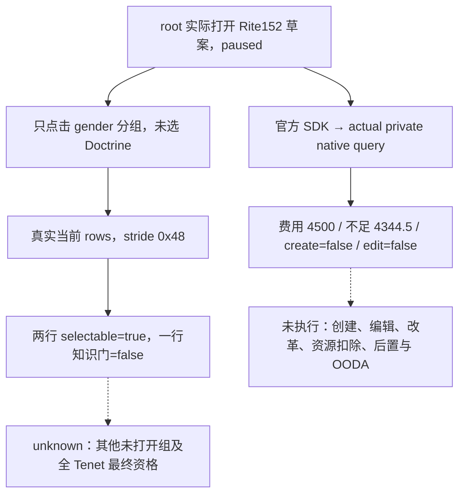

# CK3 1.20.0.2：R6 真实 Rite 草案与三行 Doctrine popup

记录时间：2026-10-01 20:17:49 Asia/Shanghai。状态：**`fixture-live`：真实 paused 草案费用、最终窗口 gate 与当前 materialized Doctrine 三行观测**。本专题由 root 提供的原始截图和官方 SDK 返回包归档；记录者没有触碰游戏。没有选 Doctrine/Tenet、创建/修改 Rite、改革动作、资源扣除或完整 OODA。

## 精确版本与实机输入

CK3 `1.20.0.2`；EXE SHA-256 `AE1BA6FF060BA603842F6F4A2DED0AF4B7D3666B3DD271F75FB01B0DA8E81B2D`。来源是 root 的 R6 live lane，角色 full ID **29829**、当前/source Rite **152**、Faith **23**（`catholic`）、Religion **8**（`christianity_religion`）。所有查询前后 snapshot 均 `paused=true`，`date_raw=53169336`，角色与虔诚余额 `15550000 / 100000 = 155.5` 保持相同。

| 观测 | 根 artifact | native revision / capture epoch | 当前窗口 |
| --- | --- | --- | --- |
| 仅打开 Rite 创建预览 | [SDK 返回包](Z:/ck3_mod_rewrite/artifacts/g2-offline-2026-10-01/targeted-sdk-r6/r6-visible-rite-draft-preview-20261001T120240Z/003-ck3_query_player_religion_reform_context_v1.json) | `9` / `79872` | present / visible / draft_observed 均 true；候选数组合法为空 |
| 点击左侧 gender 分组、未选候选 | [SDK 返回包](Z:/ck3_mod_rewrite/artifacts/g2-offline-2026-10-01/targeted-sdk-r6/r6-visible-rite-draft-preview-20261001T120558Z/003-ck3_query_player_religion_reform_context_v1.json) | `12` / `103292` | 真实当前 popup 的 3 条 Doctrine row |

[创建预览截图](Z:/ck3_mod_rewrite/artifacts/g2-offline-2026-10-01/live-run-06/gui/20261001T115903894283Z.png) SHA-256 `3e3d46a9cc7f9200e5e0bed670633014a862c12e35b30f1b258656a091375ebb`；[gender popup 截图](Z:/ck3_mod_rewrite/artifacts/g2-offline-2026-10-01/live-run-06/gui/20261001T120557583591Z.png) SHA-256 `fa1a11e8410d6171375591fabe0a4798449084d06956b07a87030f8196923353`。两个截图已实际视觉查看；第二张显示男性主导、男女平等、女性主导三行，最后一行有不可选的斜线状态。

## 费用与窗口最终结果

两个 SDK 返回包均实际读取：`editing_owned_current_rite=false`、`piety_cost_raw=450000000`（**4500**）、`piety_missing_signed_raw=434450000`（**4344.5**）、`has_enough_piety=false`。预览截图的费用是 4500，不足额显示 **4345**；这是 UI 的整数显示与原生有符号定点数结果之差，不应把 bridge 的 4344.5 改成 4345。余额 155.5 与 `4500 - 155.5 = 4344.5` 一致。

`current_draft_cost_ready=true` 与 `current_draft_final_eligibility_ready=true` 表示读取成功；实际 `can_create_rite=false`、`can_edit_rite=false`。可观测结果为 false 仍是合法最终结果。费用本身不代替最终 gate，`other_resource_costs_observed=false` 原值保留，本轮没有资源扣除证据。

## 真实三行与 stride 修复

当前 `doctrine_gender` 实际 native rows 为：

| stable key | ShouldDisplay | native CanPick | KnowsDoctrine | HasProphet | selectable |
| --- | --- | --- | --- | --- | --- |
| `doctrine_gender_male_dominated` | true | true | true | `null`（原生短路） | true |
| `doctrine_gender_equal` | true | true | true | `null`（原生短路） | true |
| `doctrine_gender_female_dominated` | true | true | false | false | false |

`selectable_doctrine_keys` 实际仅含 `doctrine_gender_male_dominated` 和 `doctrine_gender_equal`。女性主导虽然原生 trigger 门通过，但知识与 prophet 均 false，最终 blocker 为 `doctrine_not_known_and_no_prophet`。另外两行的 `native_has_prophet=null` 是已知 Doctrine 的原生 OR 短路，不表示最终 gate 缺失。

旧 reader 的 `0x50` stride 已经由实际四行 fixture 复现故障，R6 最小修复只把共享 header constant 改为 **`0x48`**；生产 choices reader 与 selection reader 同用此 constant。该 header 已测试/应用版本 SHA-256 为 `7039142144dd39e2de527b7d0b49f2f1935f8af2252cb9fed0e06741aa201b4e`。此次真实 popup 读到三个不同 stable key、正确 popup_index 0/1/2 和独立最终知识门，给修复增加 paused 多行实证；[原有故障、exact ABI 与必要夹具](religion_reform12002_stride_correction.md)直接复用，没有重复矩阵。

## Readiness 与下一入口

本次当前窗口、草案 costs/final eligibility、当前 Doctrine selection 的真实观测有 paused artifact；尚不代表完整创建或改革能力。聚合字段 `final_choice_legality_readiness=false` 与旧 raw popup 的 `final_can_pick=null` 均保留，当前三行的最终值只由 `current_doctrine_selection` 明确发布。初次零候选是尚未展开分组的合法空集合，不能推导无可选 Doctrine。

后续后台独立任务分别闭合全部实际 Doctrine slots 的同一 TopScope 资格、Tenet 真实数据库过滤、原生 AI rare 调度及 piety 以外资源扣除语义。R7 group provider/mailbox/SDK/source 已冻结，本记录只新增专题文件，不改变 R7 编译输入。真实后续 paused、按 slot 验证由 root 串行持有游戏完成。

## 日/周报告字段

2026-10-01 / 2026-W40：完成实际 Rite152 preview 的费用与 false 最终 gate、gender popup 的真实三行与 stride48修复实证。`fixture-live` 增量限上述只读观测；没有改革动作、OODA或战争研究增量。原始失败四行 artifact、修复 Od/O2、当前 SDK 返回和两张截图全部保留，后续输入与未闭合范围如上。Git commit/push 由 root 协调；本代理没有写 Git。
