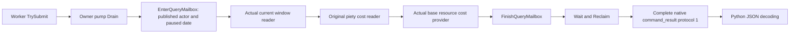

# CK3 1.20.0.2 宗教草案基费只读队列

2026-10-01；状态：`static-ready query wrapper`。本包把已有的真实窗口观测与
[`religion-reform12002-resource-costs.md`](religion-reform12002-resource-costs.md) 中的基费读取器接入拥有线程队列。
它没有访问本地 CK3，没有构造游戏命令，没有选择教义、创建/编辑 Rite 或打开草案。
`fixture-live`、`production-live primitive`、G2 qualification 均未增加。

固定构建为 CK3 **1.20.0.2 Crozier / Steam25588574**，游戏 EXE SHA-256：
`AE1BA6FF060BA603842F6F4A2DED0AF4B7D3666B3DD271F75FB01B0DA8E81B2D`。
本地测试 EXE 的哈希是另一个字段，不能充当游戏构建或实机证据。

## 接口和实际范围

| 项目 | 值 |
| --- | --- |
| Private selector | `query-player-religion-draft-resource-costs-v1` |
| Domain | `player_religion_draft_resource_costs_v1` |
| Backend | `ck3-1.20.0.2-native-player-religion-draft-resource-costs-v1` |
| 返回键 | `result.player_religion_draft_resource_costs` |
| 构建开关 | `XAR_CK3_ENABLE_G2_PLAYER_RELIGION_DRAFT_RESOURCE_COSTS_PRIVATE_QUERY_V1` |
| Owning context | `PlayerReligionDraftResourceCostsMailboxContext12002` |
| 待中央注册的专用槽 | `permitted_executor_religion_draft_resource_costs12002` |

生产 handler 接收发布快照、revision 和可选 `expected_snapshot_revision` / `expected_revision`。
窗口由 `BindCurrentRiteCreationWindow12002` / `ReadCurrentRiteCreationWindow12002` 在拥有线程解析；
费用由 `BindRiteCreationCostsImage12002` / `ReadCurrentRiteCreationBaseResourceCosts12002` 读取。
输入不接收角色、目标或窗口地址。内部窗口地址只传给原费用读取器，不进入 JSON。

新包装 DTO 的 schema 是 `ck3_12002_player_religion_draft_resource_costs_query_v1`：

| 字段 | 来源与含义 |
| --- | --- |
| `available` | 窗口观测完成；可见草案还要求其实际费用读取成功 |
| `window_present` / `draft_observed` | 实际窗口存在 / 可见且已解析到玩家草案 |
| `failure` | 成功为 `null`；失败保留实际窗口或费用读取原因 |
| `capture_epoch` | 实际执行 stamp 的 `pump_epoch`，不伪装成发布 revision |
| `date_raw` / `played_character_id` | 当前发布快照的身份；实际窗口观测必须匹配 |
| `current_draft_window` | 原 `ck3_12002_current_rite_creation_window_v1` serializer 原样输出 |
| `base_resource_cost_quote` | 实际新资源费用 provider 的完整 DTO 原样输出 |

嵌套基费 schema 为 `ck3_12002_rite_creation_base_resource_costs_v1`，scope 固定
`native_command_draft_base_fee_quote`，quote source 为
`native_piety_getter_plus_exact_CCost_initialization`。十个 Q100000 槽的名字只公布
`gold`、`prestige`、`piety`；其余七项名字保留 `null`。
原生初始化证明其余九个槽为零，只有 piety 槽取实际草案 getter 的报价。
`draft_quote` 保留旧 piety DTO 的原契约，包括负值有意义的 `piety_missing_signed_raw` 和
旧 `other_resource_costs_observed=false`；新向量观测由外层自己的字段表示。

`actual_debit_observed=false` 与 `post_action_net_resource_change_observed=false` 始终保留。
本次基费与创建后的脚本事件、选项或未来价格修饰器是不同阶段；本查询没有推算或声称最终净资源变化。

源码中的无窗口/隐藏窗口分支是合法 `observed` absence：原窗口 DTO 保留存在性和可见性，
`draft_observed=false`，费用读取器接收实际空窗口并返回 `draft_unavailable`，有效费用向量保持 `null`。
本包没有为这些既有窗口状态另扩测试矩阵；本次新用例只验收可见草案的完整传输。

## 一次新验收



artifact 根：`Z:\ck3_mod_rewrite\artifacts\g2-offline-2026-10-01\religion-reform\resource-query\attempt-001`。

**GREEN，MSVC `/O2 /W4 /WX`，7 checks / 1 case / 1 完整 command_result。**

- `result.json` SHA-256：`6f76e32a46192db0795fd27b3b71d675f9369803dbea55ce8826501106250926`。
- 实际 C++ 包 `wire/visible-base-fee.json` SHA-256：
  `d954c0c2746f1d9a9d67b1cf3724d2e826fffa76d1db5e0f8827ebfb62b850b6`。
- 真实当前草案 source Rite full ID `0x80000000`；actor full ID `0x03000004`；date `53175816`。
- 实际基费向量为 `[0,0,9000000,0,0,0,0,0,0,0]`；带符号的 piety 差额为 `-2500000`，可负担。
- 两轮原费用 reader 一共只调用 6 个原费用回调；没有草案操作、其他 domain helper 或游戏 command。
- 新 provider 与原费用 provider 的已冻结 `/O2` objects 直接复用；原 provider 测试及旧 12 场景主函数没有运行。
- 不手填 DTO，不补造成功 command envelope，不在生成后替返回包补协议 metadata。

fixture 复用了既有拥有线程和 memory helper；其旧主函数改名后从未调用。
admission 使用现有 `permitted_executor` 精确指向新资源费用 callback，验收 submit、owner drain、
actual provider、Finish、wait/reclaim 和原生 serializer。本次没有声称专用生产槽、共享 dispatch、
MCP SDK 或实机已经通过。

可复用命令（已有 GREEN 后不重复运行）：

```text
Z:\ck3_mod_rewrite\tools\.venv\Scripts\python.exe ck3_autonomous_player\native_bridge\research\religion_reform12002_resource_costs_mailbox_tests.py --artifacts Z:\ck3_mod_rewrite\artifacts\g2-offline-2026-10-01\religion-reform\resource-query\attempt-001 --frozen-objects Z:\ck3_mod_rewrite\artifacts\g2-offline-2026-10-01\religion-reform\query-mailbox\attempt-003\O2 --resource-provider Z:\ck3_mod_rewrite\artifacts\g2-offline-2026-10-01\religion-reform\resource-costs\provider-O2
```

## 交接与报告字段

五个本包源文件为新 mailbox header/CPP、single-case C++ test、Python runner 和本页。
完整路径、SHA 与 proof 在同 artifact 域 `resource-query/delivery-result.json`。
费用 provider 七源及 native tree 仍归原 owner，未修改。

日/周报告由协调者合并，避免并行编辑：

- 日期 / ISO 周：`2026-10-01` / `2026-W40`。
- 完成：宗教草案基费只读 owningqueue、完整协议包和单个真实 native caller fixture。
- 原因：让已闭合的原生基费读取器进入可消费查询链，而不继续保留总费用不可知的笼统结论。
- 测试：新 `/O2 /W4 /WX` 7 checks / 1 packet GREEN；原矩阵与费用 provider 验收复用，未重复运行。
- 状态变化：`static-ready library` → `static-ready query wrapper`；没有 live 或 G2 计分变化。
- RED：本次新编译/执行无 RED；实机边界和实际扣款尚未验收。
- 下一步：Python leaf 消费实际原字节包；中央接入专用槽、dispatch/CMake 和默认关闭的 MCP 查询；
  根协调者使用实际可见 paused 草案完成实机报价观测。
- Commit / push：根协调者负责统一提交和推送；本包 agent 没有执行 Git。
