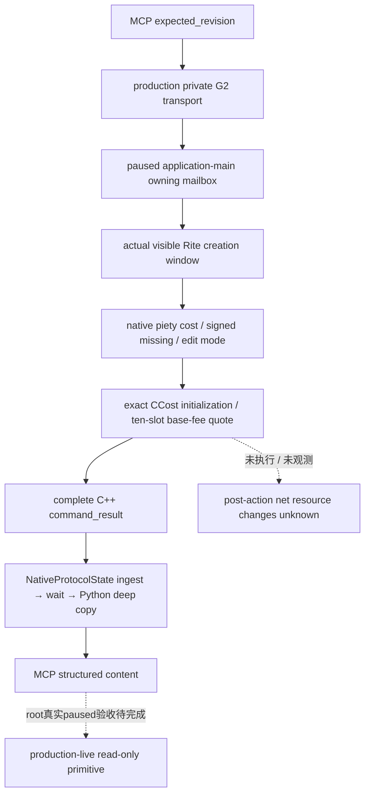

# 1.20.0.2 草案原生资源基费：只读 Python 查询

状态为 **static-ready query**：本包消费[原生 draft base resource costs](religion-reform12002-resource-costs.md)，新增独立 Python leaf、实际完整 C++ command_result 的原字节 fixture 与必要消费测试。共享 Driver／MCP／CLI 已由中央 Python owner 登记，实际回包的官方 SDK 单例已通过；正式实机由 root 验收。本包不访问 CK3、pipe、UI 或 Steam，不执行宗教创建或资源扣除。

冻结 CK3 **1.20.0.2 Crozier / Steam25588574**，EXE SHA-256 `AE1BA6FF060BA603842F6F4A2DED0AF4B7D3666B3DD271F75FB01B0DA8E81B2D`。

| 层 | 合同 |
| --- | --- |
| selector／domain | `query-player-religion-draft-resource-costs-v1`／`player_religion_draft_resource_costs_v1` |
| backend | `ck3-1.20.0.2-native-player-religion-draft-resource-costs-v1` |
| 原生结果／schema | `result.player_religion_draft_resource_costs`／`ck3_12002_player_religion_draft_resource_costs_query_v1` |
| Python leaf／method | `player_religion_draft_resource_costs_private_transport.py`／`query_player_religion_draft_resource_costs_private_v1` |
| MCP tool | `ck3_query_player_religion_draft_resource_costs_v1` |
| permission／CLI | `allow_private_player_religion_draft_resource_costs_query`／`--private-player-religion-draft-resource-costs-query`，默认关闭 |
| 参数 | 仅 `expected_revision`；无 actor、target、资源 setter 或执行参数 |

## 报价范围

完整 wrapper 保持实际 window presence、draft observation、failure、capture epoch、date 和 played CharacterID，嵌入原有 window serializer 与原生 `base_resource_cost_quote`。实际窗口不存在或隐藏时可返回合法 observed absence，但费用 quote unavailable、向量为 null；Python 不补十个零值冒充观测。本次 transport 单例不扩跑 absence 矩阵。

`scope=native_command_draft_base_fee_quote` 是原生命令的草案基础费用报价：exact-build 证明原生 `CCost` 的 `0x50` 十槽先清零，然后只覆写 index 2 的虔诚费用。provider 使用当前真实草案的 native piety getter 并保留这一原生初始化事实。index 0/1 分别为 gold/prestige；其余未命名槽保持 null 名称，不猜测资源类型。`native_base_fee_slots_raw` 使用 signed Q100000，`draft_quote` 保留带符号的 piety missing；负数表示当前余额足够的报价差额，不做绝对值。

`draft_kind` 由原生 owning-current-Rite edit 判定产生；不以 reform 布尔变量替代。`actual_debit_observed=false`、`post_action_net_resource_change_observed=false` 始终原样保留。后续脚本和事件可能改变资源，当前基费向量不能当作实际扣款或整条行动的净成本，也不能从费用足够推断最终创建合法。嵌套旧 piety-only quote 的 `other_resource_costs_observed=false` 保持其原有 scope，不覆盖成新外层十槽 quote 的 flag。

## 验证与交接

原生 owning queue `/O2 /W4 /WX` 单场夹具 **1 case / 7 checks GREEN**，实际完整包的十槽为 `[0,0,9000000,0,0,0,0,0,0,0]`，signed missing 为 `-2500000`，actual debit／net flags 为 false。实际 reader、submit/drain/finish/wait/reclaim/serializer 运行在独立夹具进程；native getters 为 stub，没有访问 CK3；不是 fixture-live。原包 `resource-query/attempt-001/wire/visible-base-fee.json` SHA-256 `d954c0c2746f1d9a9d67b1cf3724d2e826fffa76d1db5e0f8827ebfb62b850b6`；原生 receipt SHA-256 `6f76e32a46192db0795fd27b3b71d675f9369803dbea55ce8826501106250926`。

Python fixture 原字节复制至 `ck3_autonomous_player/native_bridge/research/fixtures/ck3_12002_player_religion_draft_resource_costs/native-current-draft.json`，provenance 记录原包、原生 receipt 和源文件 SHA。必要 unit 只运行新增单例，经过生产 `NativeProtocolState.ingest → wait_for_command_result → leaf query` 并逐字段比较整个 DTO。测试仅在内存中替换请求 nonce，不补写完整信封 metadata。官方 SDK 由共享 Python owner 接入后记录独立证明；不重跑旧 query/native 矩阵。

本次新增消费单例 **1 passed in 0.27s**，完整十槽 quote、负 signed missing 和 debit／net flags 原样到达 Python；新增 unit／source pins 在 `religion-reform/tenet-resource-python/resource_costs/` 收口。`wire-result.json` SHA-256 为 `553fbf281d8e4d05e1879f181ceef34eb1d51c95686abe2c5733c7f98ad34b87`。

共享 Python owner 的[新增官方 SDK 单例](../../ck3_autonomous_player/tests/unit/test_g2_player_religion_draft_resource_costs_mcp_wire.py) **1 passed in 1.80s**：真实完整原包经生产 `NativeProtocolState → NativeDriver → official mcp.Client` 进入 structured content，整个原生 DTO 深度等值，十槽报价、负 signed missing 及 `actual_debit_observed=false / post_action_net_resource_change_observed=false` 保持。并验证默认 OFF 时 tool 不发现且零请求、只读 annotation、CLI 默认 false／显式打开以及缓存只消费一次。本包没有重跑原来的 unit 或 native 矩阵。

SDK 源文件 SHA-256 `f7d67ffdbbc590f7a151a89d2a7ae9ee3f5bed07b4490910009bd59a491e2f2b`；回执 `Z:/ck3_mod_rewrite/artifacts/g2-offline-2026-10-01/python-routes/draft-resource-costs-actual-sdk.json` SHA-256 `8de7fcd253aa762b071053ef85397880459de01e30dab4e19f305f69c60de533`。SDK owner 的 proof 为 `RESOURCE-COSTS-SDK-READY.json`，SHA-256 `a05e11e83b42a8682f6b3e9b23cbf8595d82bb4ddefeeaf4d9ff22cf7399bf94`。最终 6 文件清单包含该 SDK test 的冻结 pin、必要原包证明、day/week 字段和剩余项，外部 `final-source-package.json` 保持独立于历史 pre-SDK receipt。

没有新 query 的真实 paused artifact 前，readiness 为 **static-ready query**；专用 owning queue 注册实证、R8 整体联编和真实 paused 验收由 root 继续。当前 quoted base fees 不代表实际净扣费或最终创建合法。
