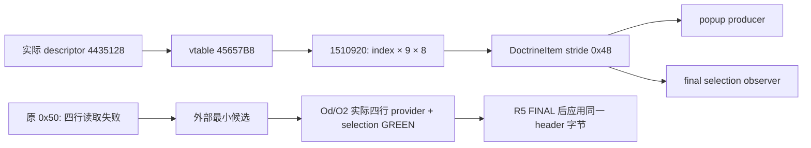

# 1.20.0.2 Doctrine 弹窗多行读取纠错

2026-10-01，R5 FINAL 后在 R6 源窗口应用。实际 `DoctrineItem` 行步长为 **0x48**。旧读取常量 0x50 只在单行夹具中通过；实际四行布局能确定复现 `doctrine_definition_unavailable`，不能把旧单行通过记录用作多行正确性的证据。

EXE SHA-256 为 `AE1BA6FF060BA603842F6F4A2DED0AF4B7D3666B3DD271F75FB01B0DA8E81B2D`。`DoctrineCategoryWindow.GetDoctrineItems` 的 `14FA982` 绑定 descriptor `4435128`，其 vtable `45657B8` 的 indexed getter 为 `1510920`，索引按 9×8 计算。原生 `ShowWindow 14F1950` 的 `14F1A6D` / `14F1B91` 也以 0x48 迭代。旧专题误关联的 `1514980` 属于其他数组；旧冻结 ABI/artifact 保留为历史，新模型 native receipt 提供正确索引证据。

修复只有一个既有源文件：`native_bridge/include/xar_bridge/religion_reform12002_choices.hpp` 的 `kDoctrineItemStride` 从 0x50 改为 0x48。`religion_reform12002_choices.cpp:48` 与 `religion_doctrine12002_selection.cpp:42` 共用此常量，同时修正 collection producer 与最终 selection observer。无需修改两个 CPP。

新增回归源为 `native_bridge/src/religion_reform12002_stride_multirow_test.cpp`，与已经通过的外部夹具原字节相同，SHA-256 `da309eeb2e8ee7944fde746b3a76dff581e379af9673d0cf0d377dc0dbb67077`。四行分别覆盖可选择、原生拒绝、隐藏与知识拒绝；外部 patched `/Od`、`/O2` 各 3 项必要检查、2 份实际 C++ JSON GREEN。旧矩阵没有重跑，S 应用后不重复相同验证。

证据根目录为 `Z:\ck3_mod_rewrite\artifacts\g2-offline-2026-10-01\religion-reform\group-model`：`stride-candidate/result.json` 保留旧四行故障与候选通过记录；`native/result.json` 保留 12 个 native spans、25 个指令锚点及 Founder getter 链。`stride-candidate/header-apply-result.json` SHA-256 `c41b5e321cce4a7023f201d883fc66fa6a1d6ed6cf1488ce72104335b8d86291` 记录应用、原/新 header pins、两个消费者及报告字段。

应用后的 header SHA-256 为 `7039142144dd39e2de527b7d0b49f2f1935f8af2252cb9fed0e06741aa201b4e`，与 tested candidate 完全相同。首次 apply 的换行规范化造成字节摘要差异，已恢复候选原字节，相关 harness 元数据保留。

状态为 `static-ready` 多行纠错，不代表已经完成 paused 实机候选验收。R6 构建与真实弹窗观察由 root 继续。未打开组的全部源定义、当前 slot 缓存边界与完整 GUI 导航属于独立 [group GUI 专题](religion_reform12002_group_gui.md)，不随此修复冒充完整最终 choices。
