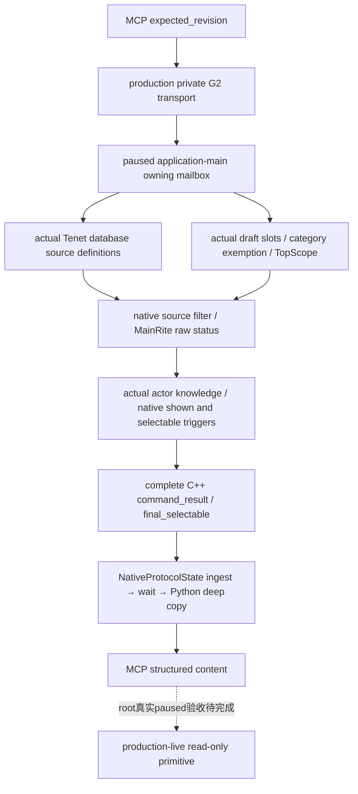

# 1.20.0.2 草案 Tenet 全源最终候选：只读 Python 查询

状态为 **static-ready query**：本包接入[当前草案 Tenet source observer](religion_reform12002_tenet_sources.md)，新增独立 Python leaf、实际完整 C++ command_result 的原字节 fixture 与必要消费测试。共享 Driver／MCP／CLI 已由中央 Python owner 登记，实际回包的官方 SDK 单例已通过；正式实机由 root 验收。本包不访问 CK3、pipe、UI 或 Steam，不选择或提交 Tenet。

冻结 CK3 **1.20.0.2 Crozier / Steam25588574**，EXE SHA-256 `AE1BA6FF060BA603842F6F4A2DED0AF4B7D3666B3DD271F75FB01B0DA8E81B2D`。

| 层 | 合同 |
| --- | --- |
| selector／domain | `query-player-religion-draft-tenet-choices-v1`／`player_religion_draft_tenet_choices_v1` |
| backend | `ck3-1.20.0.2-native-player-religion-draft-tenet-choices-v1` |
| 原生结果／schema | `result.player_religion_draft_tenet_choices`／`ck3_12002_current_draft_tenet_sources_v1` |
| Python leaf／method | `player_religion_draft_tenet_choices_private_transport.py`／`query_player_religion_draft_tenet_choices_private_v1` |
| MCP tool | `ck3_query_player_religion_draft_tenet_choices_v1` |
| permission／CLI | `allow_private_player_religion_draft_tenet_choices_query`／`--private-player-religion-draft-tenet-choices-query`，默认关闭 |
| 参数 | 仅 `expected_revision`；无 actor、target、slot、地址或 setter |

## 实际来源与最终门

observer 从游戏实际 Tenet database global `0x5D1DEB8` 的 `+0xEF0/+0xEFC` 来源集合枚举真实定义；读取当前窗口实际 Tenet slots、当前 category 的 exemption，并调用原生 `0x14F2030` source filter。它并不依赖 R7 当前 popup 的 Tenet cache，更不把缓存为零当成所有 Tenet 都不可选。root 在 R7 的 Communion 导航后曾观测到 Tenet cache 为零而当前 Doctrine category 仍为 marriage/slot 1；这一旧 query 结果不能为新 query 提供全 Tenet readiness，也没有证明空缓存的原因。

新 query 的 `sources` 包含实际定义顺序、重复排除、能否物化、来源 faith 的 main Rite raw status、actor faith raw status、额外知识、prophet、shown/selectable trigger、原生 CanPick 等价 gate 和最终 `final_selectable`。source main Rite 与 actor Faith 的状态保持独立。`slots` 是当前真实选中槽的 ID 和 key；`slots_share_source_predicate=true` 描述当前草案共享的来源／谓词，Python 不为每个 slot 伪造 category/item，也不重新计算最终门。

`scope=actual_current_draft_all_tenet_sources_shared_slot_predicate` 和 `tenet_gates_complete` 仅表示这份当前真实草案 source/filter/final predicate 观测范围。它不是所有未来草案、宗教创建动作或完整宗教 OODA 的完成标志。窗口不存在或隐藏时，原生合法 absence 保持 `available=true / draft_observed=false / tenet_gates_complete=false` 和空数组；本次单场 transport 验证没有扩跑 absence 矩阵。读取失败保留原生 reason，不补 mock 列表。

## 验证与交接

原生 owning queue `/O2 /W4 /WX` 单场夹具 **1 case / 7 checks GREEN**，完整实际包包含 8 个来源定义和真实 slots 7/11。它使用实际 reader/key copier 与 submit/drain/finish/wait/reclaim/serializer，原生 getter 在独立夹具进程中由真实输入 stub 代替，没有访问 CK3；不是 fixture-live。原包 `query-tenet-sources-mailbox/attempt-001/wire/actual-multiple-sources.json` SHA-256 `9f0adadd05c0b94a5b32043efc6ba5bb7f9fca32fe1664899f3fc68b32ba0a86`；原生 receipt SHA-256 `0ca9b6505d609d9265d852fb4c888f5c18d13613b9c895740e6f3222d5cd2a7a`。

Python fixture 原字节复制至 `ck3_autonomous_player/native_bridge/research/fixtures/ck3_12002_player_religion_draft_tenet_choices/native-current-draft.json`，provenance 记录原包、原生 receipt 和源文件 SHA。必要 unit 只运行新增单例，经过生产 `NativeProtocolState.ingest → wait_for_command_result → leaf query` 并逐字段比较整个 DTO。测试仅在内存中替换请求 nonce，不补写完整信封 metadata。官方 SDK 由共享 Python owner 接入后记录独立证明；不重跑旧 query/native 矩阵。

本次新增消费单例 **1 passed in 0.27s**，原生 8 条 source 的状态、过滤和最终门全部原样到达 Python；新增 unit／source pins 在 `religion-reform/tenet-resource-python/tenet_choices/` 收口。`wire-result.json` SHA-256 为 `86bea5a5bcb283ef5a71cced87cc5b80d3b66f013b8e0bedaa836a35e8caaaaf`。

共享 Python owner 的[新增官方 SDK 单例](../../ck3_autonomous_player/tests/unit/test_g2_player_religion_draft_tenet_choices_mcp_wire.py) **1 passed in 1.80s**：真实完整原包经生产 `NativeProtocolState → NativeDriver → official mcp.Client` 进入 structured content，整个原生 DTO 深度等值，8 source 的 raw status、native filter 与最终 true/false 结果保持。并验证默认 OFF 时 tool 不发现且零请求、只读 annotation、CLI 默认 false／显式打开以及缓存只消费一次。本包没有重跑原来的 unit 或 native 矩阵。

SDK 源文件 SHA-256 `64a4f41de5e4e9d2ed50dc0772c03b192e775afefa8dade840a60b24ae06e756`；回执 `Z:/ck3_mod_rewrite/artifacts/g2-offline-2026-10-01/python-routes/draft-tenet-choices-actual-sdk.json` SHA-256 `cf795afd3f19594221f24479c6737805fcceaf0714ff5e229e77155216ca55b0`。SDK owner 的 proof 为 `TENET-CHOICES-SDK-READY.json`，SHA-256 `3cc6d393a4e191d180ecb94cf9dcb41b72223260ac3e8c2d0792f69ddc631ed6`。最终 6 文件清单包含该 SDK test 的冻结 pin、必要原包证明、day/week 字段和剩余项，外部 `final-source-package.json` 保持独立于历史 pre-SDK receipt。

没有新 query 的真实 paused artifact 前，readiness 为 **static-ready query**；专用 owning queue 注册实证、R8 整体联编和真实 paused 验收由 root 继续。当前 source predicate 的全源完备性不表示已经执行宗教选择或完成整局 OODA。
