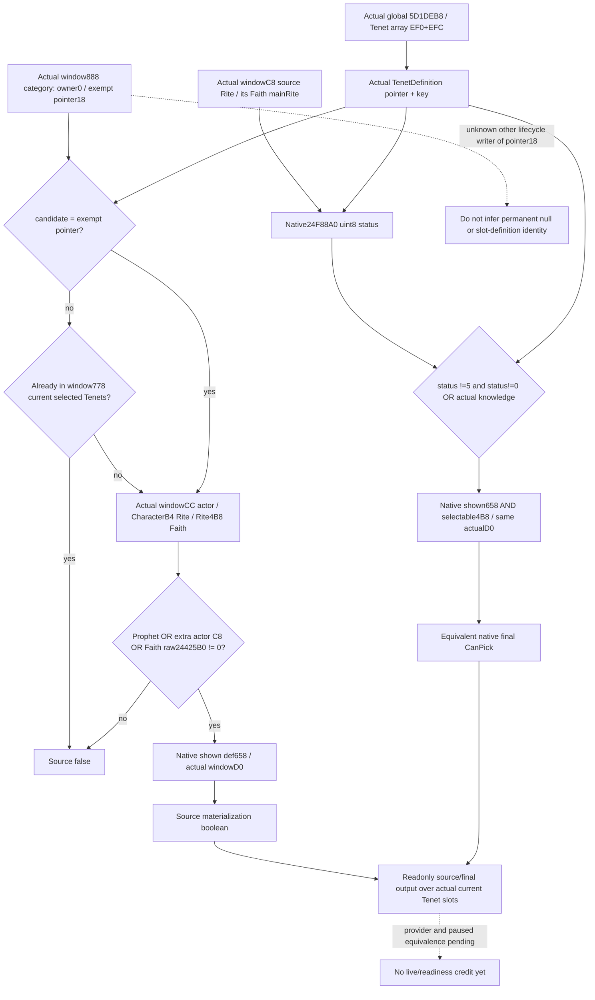

# 1.20.0.2 Rite 草案：Tenet 原生来源、状态与所有实际 slots 的只读入口

本包状态为 **research / native tree static-confirmed**。新增原生树已经闭合候选数据库、完整 `0x14F2030` 筛选、实际 `TenetItem+0x24` 状态来源，以及与旧 `0xEE0AD0` 最后门的连接。一次验证为 **5 个新 spans、42 个新 anchors、4 个冻结 proof 文件 pins GREEN**。没有实现新 provider、访问 CK3／pipe／UI／Steam、构造原生对象、修改草案或研究战争；旧 reform/window/eligibility、R7 groups/native13/mailbox/named3 均保持冻结。

冻结版本是 CK3 **1.20.0.2 Crozier / Steam25588574**，EXE SHA-256 `AE1BA6FF060BA603842F6F4A2DED0AF4B7D3666B3DD271F75FB01B0DA8E81B2D`，101039736 bytes。EXE 来自 `Z:/ck3_mod_rewrite/artifacts/migrations/2026-09-30/post-update-1.20.0.2/installation/binaries/ck3.exe`。本包新增证据在 `Z:/ck3_mod_rewrite/artifacts/g2-offline-2026-10-01/religion-reform/tenet-sources/native/`；对应 [验证器](../../ck3_autonomous_player/native_bridge/research/religion_reform12002_tenet_sources_native.py) 与 [ABI 输入账本](../../ck3_autonomous_player/native_bridge/research/religion_reform12002_tenet_sources_abi.json)。

## 先复用的原生树

[group-model](religion_reform12002_group_model.md) 已用 12 spans／25 anchors 证明真实 `window+0x888` inline category、slot 数组、`ShowWindow`、状态组重建；本包只引用其冻结结果，没有重扫旧完整 spans。[旧 choices](religion_doctrine12002_choices.md) 提供完整 `TenetItem.CanPick 0xEE0AD0` 与 `0x28B0B60` extra Tenet collection；[Tenet rows](religion_doctrine12002_tenet_rows.md) 提供 `0x24F88A0` 状态查询、`0x24F7E40` main Rite 判定和 `0xA11CC0` 实际指针成员查询。[fullchoices](religion_reform12002_fullchoices.md) 新闭合真实 `window+0xD0` TopScope：Faith typed fullID、当前草案 `window+0x730` selected-doctrines saved-list 和真实 played actor。该作用域不引用 category group／selected-slot cache，不需要为 Tenet 再造 TopScope。

[原版 GUI 证据](religion_reform12002_group_gui.md) 已证明 Tenet creation row 最后 `enabled` 仅为 `TenetItem.CanPick(actualFounder, actualTopScope)`，内层通用 `tenet_enabled` 被空 blockoverride 覆盖。本包不重复读取 stock 全表。最后门是 button-enabled；最终 `CreateRite/CanCreateRite` 仍属于[eligibility](religion-reform12002-eligibility.md) 的不同判定。

## Tenet 来源与 Doctrine 来源不同

`0x14F1950` 的 Doctrine 半段取 `category.group+0x140` pointer array／`+0x14C` count。Tenet 半段则在 `0x14F1BEE` 读取已存在的 **global `0x5D1DEB8`**，遍历数据库 **`+0xEF0` TenetDefinition* array／`+0xEFC` count**。`0x14F1C69` 对每个真实数据库 definition 调 `0x14F2030(actualCategory, definition)`；返回真才调用 `0xEE0220` 构造当前 category 的实际 TenetItem。group `+0x140` 不是 Tenet 源。

这条数据库来源已包含原生运行时加载的 definition；只读 producer 应使用现存数组中的真实指针和 definition `+0x18` key，不能用 authored 全表、Doctrine group 数组或自造 definition 补候选。数组的 registry 顺序可发布为 source index，但 GUI 后续排序不等于该顺序。

## 完整候选筛选 `0x14F2030`

完整函数范围 `[0x14F2030,0x14F21F0)`，SHA-256 `40ff14677cddd3eb7bdb3861d05fc7b6feb60ddb43f8a0a8fdde81b37e789ad4`，ABI 为 `bool(actualCategory*, actualTenetDefinition*)`。

1. `category+0x18` 是 **TenetDefinition* 指针**。`0x14F2048` 比较 candidate pointer 与该字段；相等仅跳过重复排除。这个字段不是整数 mode，不能映射成 create／edit／reform，也不能无证据标成选中 slot 的 definition。
2. candidate 不等于该 pointer 时，在 owner window `+0x778` array／`+0x784` count 中扫描当前草案 TenetItem，stride `0x70`，definition pointer `+0x28`。已经选在任何当前 slot 中则返回 false。
3. actor 来自 owner window `+0xCC` full CharacterID，Character storage entry 的 full ID `+0x18` 必须匹配。Character `+0xB4` 是 Rite full ref，Rite `+0x4B8` 才是 Faith full ref；两次 storage 查询均核对对象 `+0x08` full generation。
4. 对有效 actor，以下任一成立才继续：原生 Prophet perk definition 在 `0x2919360(actor)` perks collection 中；candidate 在 `0x28B0B60(actor)` extra Tenet collection 中；`0x24425B0(actorFaith,candidate)` 的原始 uint8 状态非零。前两项都调用既有 `0xA11CC0` 实际指针成员查询。
5. 最后只执行 `0x372DF30(candidate+0x658, actualWindow+0xD0)` shown trigger。此处没有执行 selectable trigger `candidate+0x4B8`，所以“会物化为候选”不等于“按钮最终可选”。

函数自身对于原生无效 actor sentinel 会直接走 shown trigger；真实 played-window provider 必须沿已有 window reader 的 full actor 身份结果，不把该分支当成有效玩家观测。

### 三份独立的实际状态

| 输入 | 精确来源 | 语义边界 |
| --- | --- | --- |
| Actor perks | Character `+0x1B0` extension 的 `+0x220` 指针集合，native getter `0x2919360` | extension 缺失时 native getter 返回默认 collection；不是 bool getter |
| Actor extra Tenet collection | Character `+0x1C8` extension 的 `+0xC8` collection，native getter `0x28B0B60` | 不能用 personal Tenets `+0x88` 或 learned doctrines `+0xE0` 替代；进一步游戏名义仍保留 raw source 名 |
| Actor Faith 原始 Tenet 状态 | `0x24425B0`：Faith `+0x98` main Rite → Rite `+0x788` array／`+0x794` count，16-byte entry 的 definition `+0`、uint8 `+8` | 原生返回原始状态，不是 bool；缺 entry 返回 0，filter 对任意非零返回值放行这项 |

新增 reviewed leaf `[0x24425B0,0x2442632)` 包含两条 return，排除后面的 INT3 padding；SHA-256 `90ed25c9ba02cc41f3c4679aed6f8555301f2c9c7e72285c5f35879e710fa09e`。**它直接读 main Rite 状态表，不执行 `0x24F88A0` 的 core-list 特判**，不能把两个查询当成同一 API。

## 实际条目 raw 状态与最终 `CanPick`

`0x14F1950` 从 owner window `+0xC8` 解析 **selected source Rite**，将其作为 `0xEE0220` 第二个参数。该 source Rite 不一定是 actor 当前 Rite。构造函数只把 slot index 写到 item `+0x20`，把 source Faith／Rite full IDs 写到 `+0x30/+0x34`；`+0x24` 暂先写 5，随后必经 `0xEE033D → 0xEE0420` 刷新。

`0xEE0420` 读取实际 item 的 source Faith／Rite full IDs。`0x24F7E40(sourceRite)` 为真则直接用该 main Rite；为假则解析 **source Faith 的 `+0x98` main Rite**。`0xEE0507` 调 `0x24F88A0(basisRite,candidate)`，`0xEE050F` 将 AL 写入 item `+0x24`。后续 `0xEE05FE → 0x24425B0` 是单独的显示文本状态输入，不是 `+0x24` 最后门的写源。

因此 item `+0x24` 是原生 **uint8 Tenet status**。0–4 的已证状态语义复用 Tenet rows ABI；5 是构造前置 sentinel，在 `0xEE0AD0` 中直接不可选。不得把该 byte 标为 creation/reform mode。

旧完整 `0xEE0AD0` 最后门只读 item `+0x24/+0x28`、实际 founder、实际 TopScope：

```text
if actual_item.raw_status == 5: false
knowledge = Contains(actor_extra_C8, definition) OR Contains(actor_perks, native_prophet)
if actual_item.raw_status == 0 AND NOT knowledge: false
nativeShown(definition + 0x658, actualTopScope)
AND nativeSelectable(definition + 0x4B8, actualTopScope)
```

除 sentinel 5 外的非零 raw status 通过此处 knowledge gate，之后仍须两条原生触发器返回真。最终门没有读取 slot `+0x20`、source IDs `+0x30/+0x34`、显示字符串、category group 或 category selected slot。



图中 invalid actor sentinel 的分支由上文单列；actor/Faith/source Rite 的身份失败是读取状态，不能当作合法零状态发布。

## 全部当前实际 Tenet slots 的最小只读方案

真实 category 只有一个 inline `window+0x888`；左侧当前 Tenet slots 则是 `window+0x778` 的真实 TenetItem 行。**不需要为每个 slot 制造 category。**完整 `0x14F2030` 只读取 category 的 owner `+0` 和 pointer `+0x18`，完全不读取 group `+8`、Doctrine selection `+0x10`、selected slot `+0x50`。旧 `ShowWindow 0x14F1950` 与 `ShowWindowSort 0x14F1E60` 都没有写 category `+0x18`；原有 constructor `0x14F2471` 将其初始化为 null。上述调用路径没有把某个 Tenet slot definition 写到该字段的证据。

对同一实际窗口／草案帧，candidate source gate 的输入与 slot 无关，item raw status 的 source Rite／Faith 也与 slot 无关，最后 `EE0AD0` 不读 slot。可以在新独立 provider 中发布所有实际 slot IDs 与这一共享 candidate 结果，直接组合真实 native inputs；无需调用物化器、constructor、scope builder或 GUI。不能因为 category 唯一就把所有其它 slots 的来源永久标成 unknown。

推荐新增能力分两层，使用同一 native owner 的现存 actual window／played fullID／date或epoch输入：

| 层 | 只读做法与输出 | 验收边界 |
| --- | --- | --- |
| 独立当前 source observer | 读已存在 Tenet registry、window778 actual slot IDs、category18 raw pointer→真实 registry key，直接对实际 category 调 `14F2030`；输出每个真实 definition 的 `source_can_materialize` | 已闭原生来源，最小独立价值是解释 authored registry 中哪些 Tenets会进入真实草案候选，不只复述当前 popup |
| 全 actual Tenet slots 最后值 | 从 windowC8 解析 source Faith.mainRite，调用旧 `24F88A0` 取 raw status；读取真实 actor extra C8／perks 并用实际 D0 执行 shown658／selectable4B8，按完整 `EE0AD0` 表达式合并；每个 actual slot 引用共享候选集 | 不构造假 TenetItem；是完整原生输入等价合并。实施后必须与真实已物化 row 的 `EE0AD0` 和至少两个实际 slot 的 GUI结果互证 |

新 provider 应分别发布 `source_can_materialize`、`native_status_raw`、`final_can_pick`，而不是把 source bool 命名为 CanPick。当前 real category 已物化的实际 row 可直接走旧 `EE0AD0` 作比对，不作为其它 slots 的伪对象。已有 slots 通过实际 TenetItem `+0x20` 取 slot ID；registry rows 与实际 slots 是两种来源，不能把 registry index当 slot ID。

**建议 public input** 是现有 current-window 查询上下文，可选一个真实 Tenet key 过滤返回；actor、Faith、Rite、raw地址和mode均由当前 native owner 解析。slot 参数只允许现存 `window778` 行的实际 slot ID，用于映射相同帧的候选结果，不能构造任意不存在 slot。没有窗口时保留窗口 unavailable；同一有效窗口的合法 false 与 raw0必须正常返回。输出当前 category18 的 source/key用于解释，但不猜该字段的生命周期含义。

category18 在其它生命周期是否另有 setter 尚未查明；该缺口仅影响给这个 pointer 起更高层语义名称，不影响直接消费本帧真实 pointer或证明此 leaf 不读 slot。真实 all-slot producer 的新编译／fixture及 paused等价样本仍待实施，本包没有将方案当成能力完成。

## 一次验证、source pins 与进度字段

验证命令（显式工作目录为 source tree，后台只读 frozen EXE）：

```text
Z:\ck3_mod_rewrite\tools\.venv\Scripts\python.exe ck3_autonomous_player\native_bridge\research\religion_reform12002_tenet_sources_native.py --exe Z:\ck3_mod_rewrite\artifacts\migrations\2026-09-30\post-update-1.20.0.2\installation\binaries\ck3.exe --output-dir Z:\ck3_mod_rewrite\artifacts\g2-offline-2026-10-01\religion-reform\tenet-sources\native --source-root Z:\ck3_mod_rewrite\.task-tmp\g2src --evidence-root Z:\ck3_mod_rewrite\artifacts\g2-offline-2026-10-01\religion-reform
```

结果为 GREEN，无 harness/capability RED。完整新 native byte SHA和42个指令位于 ABI manifest／`native/result.json`；旧 proof仅检查冻结文件pin，没有重新读取其旧完整 EXE函数范围：

| 冻结 proof | SHA-256 |
| --- | --- |
| `group-model/native/result.json` | `9ecf634701016c9d0818ed5f4a8f4ac06d68f51feeb0d52ddd4142e4cf04c75f` |
| `research/religion_doctrine12002_choices_abi.json` | `c2e70f17e3138768a12063de5f46978541cb47d434223b671a75bfe44a83f173` |
| `research/religion_doctrine12002_tenet_rows_abi.json` | `2da08d26e972de73a5289ff4f364b5f94ccf7b5348b53fd8cc57eb54cb9ee790` |
| `native_bridge/research/religion_reform12002_fullchoices_abi.json` | `ea5ade80c42b6ca1bc1aef5cdede1a53a2aaf555b6dbdd4fcb259cbe791aaf85` |

发送给协调者合并当天／当周报告的字段：2026-10-01 / 2026-W40；完成 Tenet source tree／status byte provenance／all-actual-slot readonly实施入口；原因是现有 popup不覆盖未打开 slots；readiness仍research，原生输入树static-confirmed；验证5spans42anchors4旧pinsGREEN；本包未占用CK3，无新liveartifact，无provider/MCP/action/G2 credit；剩余为新provider／fixture、root联编与真实paused两slot等价采样；commit/push由协调者合并本包三个新增文件后记录。本包文档完成时刻与三个source SHA通过同目录 `delivery-result.json` 交付，不倒填日／周会议，也不重复旧矩阵。
