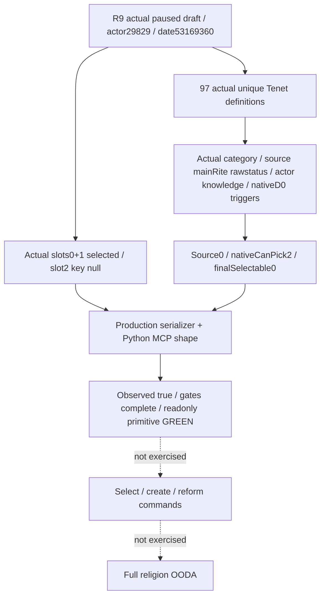

# R9：全部当前 Tenet 来源与空 slot 的真实暂停读取

状态为 **production-live primitive（当前真实草案的 targeted readonly query）**。Root使用R9/L9实际生产bridge与Python MCP结果成功读取3个Tenet slots和97个实际原生sources，第三个空slot的 `selected_tenet_key=null` 被完整保留。当前帧原生最终可选数为0，查询仍正确返回 `status=observed / available=true / tenet_gates_complete=true`。这证明生产读取与nullable slot shape已真实通过，不代表已选择Tenet、创建／改革宗教、AI策略或完整OODA。

## 实际 artifact 与帧

主证据为 `Z:/ck3_mod_rewrite/artifacts/g2-offline-2026-10-01/targeted-sdk-r9/r9-tenet-ai-faction-readonly-20261001T142357Z/003-ck3_query_player_religion_draft_tenet_choices_v1.json`，116573 bytes，SHA-256 **`f7fd2fd96e249c6c1af8ad2a453332803c80f4989c568b23615b9ece329e6b90`**。计数采用该MCP packet的 `structuredContent`，不是将 `content.text` 中的同一JSON再当另一份观测。未重新读取旧VM／fixture或执行新实机测试。

| 实际结果字段 | 值 |
| --- | --- |
| Exact build／EXE SHA | 1.20.0.2／`AE1BA6FF060BA603842F6F4A2DED0AF4B7D3666B3DD271F75FB01B0DA8E81B2D` |
| Schema | `ck3_12002_current_draft_tenet_sources_v1` |
| Backend | `ck3-1.20.0.2-native-player-religion-draft-tenet-choices-v1` |
| Scope | `actual_current_draft_all_tenet_sources_shared_slot_predicate` |
| Query／能力状态 | `status=observed`、`available=true`、`draft_observed=true`、`tenet_gates_complete=true`、`unavailable_reason=null` |
| Actor／日期 | 29829／date raw53169360 |
| Capture／snapshot | epoch16560、`native:2`、queried/native/snapshot revision2 |
| 来源身份 | source Rite152／source Faith23／source main Rite152 |
| 真实category18 | present=false、key=null |
| 读取边界 | `read_only=true`；该artifact仍标 `advertised=false`，不把targeted验收冒充已启用通用工具发现 |

Root执行上下文为 h98 paused、PID101408。Root报告L9 Git源码前缀 `f54ad34`、candidate DLL SHA前缀 `e467db…`、official head前缀 `e60a` CI GREEN；这些是root交接的前缀，本包没有读取Git／CI或补造完整SHA。Root只打开草案预览后关闭，没有select／create，action0、timeadvance0。EXE、actor、日期和revision的完整输入以本份actual MCP payload为准。

## 一次成功计数：三个slots、97个sources

| Actual slot ID | 当前选择 |
| --- | --- |
| 0 | `tenet_armed_pilgrimages` |
| 1 | `tenet_communion` |
| 2 | `null`：合法原生空slot，编号仍存在 |

全部97个source keys唯一，source indices覆盖0–96，`slots_share_source_predicate=true`。输出使用真实registry和本帧真实category，不制造每slot独立category，也不将空slot从列表丢掉。

| 原生观测字段 | true数量／分布 |
| --- | --- |
| `already_selected`／`duplicate_excluded` | 2／2 |
| `source_can_materialize`／`filtered_out` | 0／97 |
| `native_extra_knowledge`／`native_has_prophet`／`knowledge` | 2／0／2 |
| `passed_shown`／`passed_selectable_trigger` | 97／66 |
| `native_can_pick`／`final_selectable` | 2／0 |
| `native_status_raw` | 95个0、2个4 |

这份帧的97个source均未通过candidate物化条件；原生最后可选表达式对2个条目返回真，输出另保留2个已选／重复排除条目的计数。因为source物化条件均为false，最终 `final_selectable=0`。这是一份**合法已观测的零候选结果**；不是source列表缺失，也不是native读取失败。该结果只适用于本帧角色／当前草案，不外推所有宗教、角色或游戏阶段。

## 与R8修复证据的关系

[R9空slot修复专题](religion_reform12002_tenet_sources_r9_blank_slot.md) 保留R8失败与root唯一597-byteVM诊断；本包只引用既有proof，不重读或重跑。原生路径先证明missing-selected slot从global `5D1F6C0`取Null singleton；R9两叶reader／serializer把该精确singleton解释为合法空选择，保留slotID。此次actual MCP观测从原先 `selected_tenet_definition_unavailable` 转为完整97sources与空key成功。

既有 source-apply receipt 为 `religion-reform/tenet-sources-r9-blank-slot/source-apply-delivery-result.json`，SHA `0068886e0d6f83f135640b661c1a9ef81aa15e42b818e58b4f8d3ee83b0846fd`。既有rootVM artifact SHA `86740aa5fd306987994c76122dc7d0756f4407b42bd7e2ff71d412ebeecbfa5f`；既有单个O2实际provider／serializer fixture JSON SHA `8bee8bc19398cf9006a68e5538492c779c7be26fcd45f2a408ade7c66899df84`。这些hash来自先前冻结交付，此处不重新审计。

能力输入沿用[完整Tenet原生树](religion_reform12002_tenet_sources.md)与[provider专题](religion_reform12002_tenet_sources_provider.md)。旧R8 attempt没有被新GREEN覆盖，FullDoctrine、AI改革意愿、费用与其它域的live结论由各自owner维护；本文件只增加Tenet只读primitive证据。

## 日／周收口字段与后续边界

2026-10-01／2026-W40：完成R9真实暂停MCP Tenet query验收，3个actual slots／第三nullable key／97个source完整可读，source0与final0为已观测合法值；readiness由static-ready提升为本帧 **production-live readonly primitive**。原因是原R8空slot会使整个Tenet来源查询unavailable，现已恢复决策所需的真实观测。该本包只写本专题和source-only receipt，没有修改代码、测试、shared files、原R9修复文档、旧artifact、Git或CK3。

本地计数helper首次把MCP `content.text` 与 `structuredContent` 两个表示算作两个匹配，产生parser attempt RED；已保留 `religion-reform/tenet-sources-live-r9/read-attempt-001.json`，随后只采用structuredContent完成一次成功计数。它不构成游戏能力RED，没有重复live／fixture。

剩余是其它真实draft／角色状态下的策略输入覆盖，以及经原生树指导的宗教选择／结果验证；这些没有在本次只读工作中执行。不能把97sources、ACK或一帧GREEN声明成改革完成、G2宗教动作完成或完整OODA。Git commit/push与中央日／周报告由root合并，root已报告candidate前缀 `e467db…`／official CI前缀 `e60a`；本文及source-only manifest的最终提交在协调者收口时记录。
