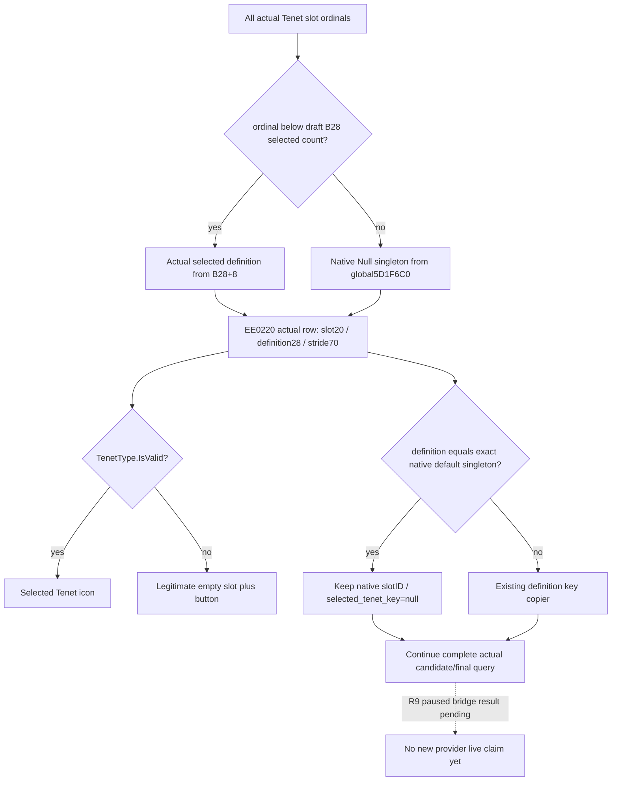

# R9：真实草案第三个空 Tenet slot 的最小读取修复

当前修复状态为 **static-ready**：两份 production code leaf已应用，1个新增实际 provider／serializer regression case GREEN；等待 root 用R9新build执行 paused bridge query。根因已有 root唯一 `PROCESS_VM_READ` 真实诊断证据，但该诊断不是新provider的main-thread live验收。原生树、R7／L8／R8历史artifact与旧8case矩阵没有改写或重跑。

## R8 的实际故障

Root于2026-10-01执行可见 paused宗教草案的R8三项只读查询。Doctrine/BaseFee正常 observed；Tenet command ACK／complete成功，内部 `available=false / selected_tenet_definition_unavailable`。该失败位于 reader逐项复制已选slot definition key，发生在遍历candidate与native source/final gate以前。Fail路径会丢弃部分slots／sources，因此不能从失败payload的空数组推测实际slot count。

失败artifact保留在 `Z:/ck3_mod_rewrite/artifacts/g2-offline-2026-10-01/targeted-sdk-r8/r8-draft-three-readonly-20261001T133028Z/006-ck3_query_player_religion_draft_tenet_choices_v1.json`。失败帧为 actor29829、date raw53169360、capture_epoch26988、revision2。Root截图显示两项已选Tenet及第三个加号入口；本包没有操控或读取游戏UI。

## 先闭合的 exact native 与 stock语义

游戏仍冻结为1.20.0.2 / EXE SHA-256 `AE1BA6FF060BA603842F6F4A2DED0AF4B7D3666B3DD271F75FB01B0DA8E81B2D`。[此前来源树](religion_reform12002_tenet_sources.md) 已闭 `window778/784`、真实item stride70、definition28和`EE0220`构造参数；本次没有先假设ABI偏移错误。

本次新增 `0x14F6E40..0x14F7E1F` 完整native span，SHA-256 `715c7e94807fc7a722bb7f3971a907d8727a8da4dc6981a33146bff443c71ec0`。一次新proof为 **1 span／16 anchors GREEN**：

| 位置 | 精确行为 |
| --- | --- |
| `14F70B0`／`14F70B7` | rsi取actual draft B28，r12取actual window778 Tenet array |
| `14F7185`／`14F7189` | actual slot ordinal对比草案B28的已选definition count `+14`，数量不足跳placeholder分支 |
| `14F718B`／`14F718F` | 已选槽存在时，从B28 `+8`有序definition数组读实际pointer |
| `14F7195` | 数量不足时，从 **global RVA `5D1F6C0`** 读取原生默认Tenet definition singleton |
| `14F71E2`／`14F7247` | allocation/既有array两分支均按`0x70`真实item stride |
| `14F7205 → 14F7212`／`14F7252 → 14F725F` | 默认或已选definition同样作为r8传入 `EE0220`，创建合法实际slotitem |
| `14F719C`／`14F7264`／`14F7281` | 保留真实slot编号并继续构造全部slots，不只构造已有definition数量 |

所以原生missing-selected slot使用一个有效存在的 **Null definition对象** 占位，不是从actual slots集合删掉该行，也不是要求已选key必定非空。

Stock `window_rite_creation.gui`（SHA `9476299fdbf0975e41923eac9b192d3fe0b2cd74a4da0d928d0da7974b7ea9f8`）L190让左侧slots走GetTenets，L197用真实slotID打开候选，L214–215 `tenet_enabled` override为yes。`window_faith.gui`（SHA `67924e58ccba26d95853ac48af35d91a774f5ce6d2e7f32a0a033de3b9d51521`）L2336只有 `TenetType.IsValid`显示icon，L2352–2354专门在 `Not(TenetType.IsValid)`显示button_plus。空slot是原生正常选择入口。

## Root唯一实际指针采样

本包只编写诊断脚本，没有打开CK3。Root在 **2026-10-01 13:46:43 UTC** 运行 `tenet-sources-r9-blank-slot/read_selected_tenet_slots_vm.py`，它复用已有VM_READ基础，精确读取实际窗口链、window778的16-bytearray header、每row slot20/status24/definition28、default global5D1F6C0及已选definition前40bytes/key。没有pipe、nativecalls、内存写、线程控制、GUI动作或全域扫描。

实际artifact为 `Z:/ck3_mod_rewrite/artifacts/g2-offline-2026-10-01/religion-reform/tenet-sources-r9-blank-slot/actual-selected-slots.json`，SHA-256 **`86740aa5fd306987994c76122dc7d0756f4407b42bd7e2ff71d412ebeecbfa5f`**。Root PID93880／actor29829／date53169360，597 remote bytes，before/after frame相同，`first_failure_is_exact_native_default=true`。

| Actual array index／slotID | Definition结果 |
| --- | --- |
| 0／0 | `tenet_armed_pilgrimages`，ObDG tag `4744624F`，正常key |
| 1／1 | `tenet_communion`，ObDG tag `4744624F`，正常key |
| 2／2 | pointer `00000240C0C00010`等于actual global5D1F6C0 singleton，rawstatus0、Null tag `4E756C6C`、key size0/capacity15 |

这份实际证据确定原始失败是 **合法原生空slot被reader当作key复制失败**。没有stride70或definition28错误，也没有真实缺损模型。

## 两叶修复与一次新fixture

[header](../../ck3_autonomous_player/native_bridge/include/xar_bridge/religion_reform12002_tenet_sources.hpp) 只增加 default global RVA／bindings指针，公开函数签名保持一致。[reader／serializer](../../ck3_autonomous_player/native_bridge/src/religion_reform12002_tenet_sources.cpp) 对本帧真实definition pointer **精确等于native default singleton** 的slot保留原生ID、跳过key复制，serializer输出 `selected_tenet_key=null`。其它实际definition仍经过原来的key复制；其它失败路径、source/final gates、stride、作用域和动作边界保持原实现。

修复先以外部candidate施工，再在root实际采样确认后正式应用S这两叶。Source SHA分别为 header **`75c12b1ed4a67336874d124ab51d23c30e21e014ca980e9557e4b0f79770df75`**、CPP **`6810caba63a90530c5e85c938cd9f67be503426ce2dd283d4a928b2ecad43a24`**。R8历史receipt保留原SHA，新candidate／sourcepins另入R9交付manifest。

[新增fixture](../../ck3_autonomous_player/native_bridge/src/religion_reform12002_tenet_sources_blank_slot_test.cpp) 只跑 **1个新生产路径case**：3个真实布局slot，其中前2有key、第三使用Null singleton；执行实际provider／serializer，要求slots0/1/2全部保留、第三key为null、完整8sources继续返回且可选值正常。MSVC **O2／W4／WX GREEN**，复用旧GREEN core/window/key-copy objects，旧8case main未执行；native functions在离线fixture中为typed callbacks，不冒充真实native执行。

外部实际serializer JSON `fixture/native-default-third-slot.json` SHA为 **`8bee8bc19398cf9006a68e5538492c779c7be26fcd45f2a408ade7c66899df84`**。已验证的外部candidate与正式S两代码文件逐字节相同，按root指令直接复用这次GREEN，不重复测试。可复现 [runner](../../ck3_autonomous_player/native_bridge/research/religion_reform12002_tenet_sources_blank_slot_run_tests.py) 和 [新增native proof](../../ck3_autonomous_player/native_bridge/research/religion_reform12002_tenet_sources_blank_slot_native.py) 单独保留，旧runner不改。

## 收口字段

2026-10-01／2026-W40：完成真实R8 Tenet capability RED根因定位、一个新native span／16 anchors、root唯一597-bytepausedVM诊断、两叶最小读取修复、1必要新O2生产fixture与nullable slot key shape。旧payload ACK成功不代表Tenet capability成功；原始RED保留，新代码readiness为static-ready，actual empty-slot field已实证。剩余root R9全SDK联编／Python shape消费／pausedbridge重采；不需要更多VM_READ，本包没有关闭窗口／游戏或研究战争。提交、push及中央R9报告由协调者汇总。
