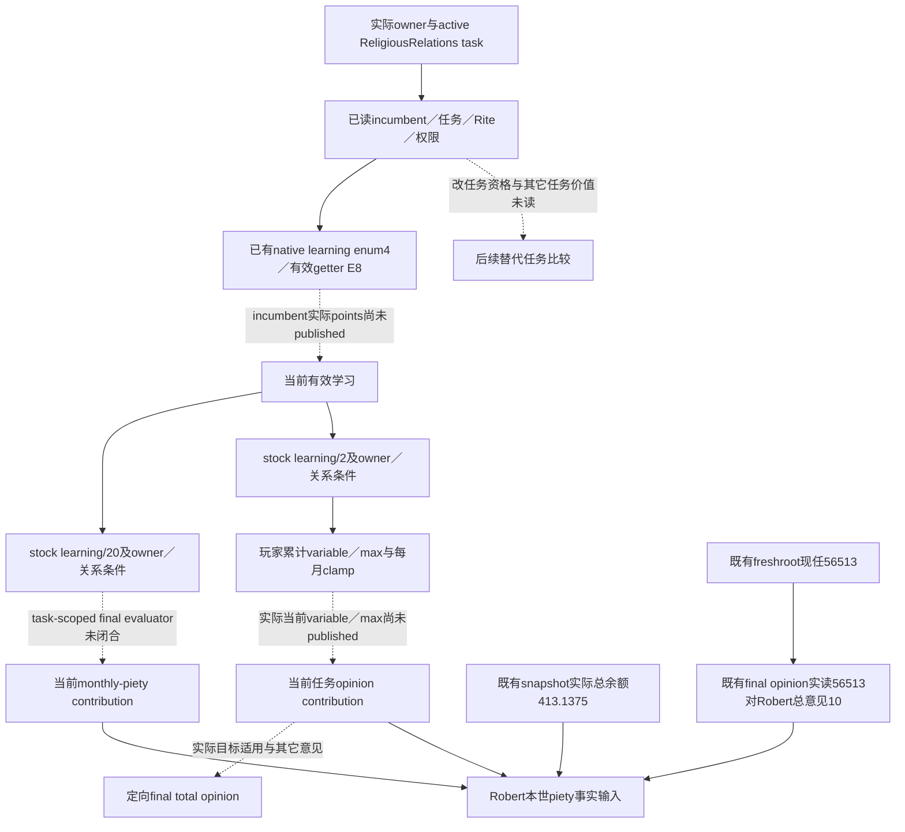

# CK3 1.20.0.3：ReligiousRelations 学习与敬虔／意见价值

本页服务 Robert 本世的 piety 决策：stock/native收益树为 **research**，学习只读源码为 **static-ready**，既有总piety／现任总意见口已有新的 **production-live primitive**。宗教已全面开放；这里只追当前 `task_religious_relations` 的有效学习、月度敬虔和意见贡献，不进行神职任命、切换任务或更改信仰。当前 task 的已读 `CanReassign=false`是原生可用观察，不能当作只读价值观察的禁令。

先复用 [realm-priest 原生树](religion-realm-priest-council-native-ai-12003.md)及 [宗教治理／意见](religion-governance-opinion-native-ai-12003.md)。新知识与施工材料冻结在 `artifacts/g2-maintainer-2026-10-02/resume-12003/m4-council/role-coverage/religious-relations-value-12003/`；原 rolecoverage、realm-priest、Chancellor 专题不在本包改写。

## Exact build 与实际起点

游戏 CK3 `1.20.0.3 Crozier`／Steam build `25652598`，EXE SHA-256为
`94B55397ABB687A3DCD436805A5D885E6BE90FA6C693FEB44A9E3BBEEADE02A6`。
复用已有版本与 ABI 证据，不重新 hash EXE、验证 ABI、运行旧夹具或重新扫描宗教治理的29个 stock files。

ROOT实际 v21 clergy004 的 [compact extract](Z:/ck3_mod_rewrite/artifacts/g2-maintainer-2026-10-02/resume-12003/m4-council/religion-realm-priest-12003/actual-v21-clergy-01/ACTUAL-CLERGY-EXTRACT.json)，SHA `b43a4205d9bf7d292d41cec52500ecbe674201d1da72cbd69eb873277f22a6cc`，绑定 owner29829、candidate=incumbent56513、active task7162、双方Rite152、public/native revision2/9、raw53222304。其 `native_valid_position=true`、`native_valid_character=true`、`native_can_reassign=false`，context matches且无读取 failure。当前 root已观察 ReligiousRelations／general／infinite／not frozen；task current/max 的合法 null是完成进度，不是月度产出的缺失值。

这是已有 **production-live primitive** 的实读身份／任务／权限起点。incumbent learning和任务 piety／opinion 最终贡献尚未实读；本页不重读该raw004、不重发query，也不固定未来任务或人选为这些旧ID。

## 已知 stock 输入与 native 分界

当前已冻结 `00_court_chaplain_tasks.txt` SHA `ddd7e89eb6bd27e485ce254dbe14e63d129fad4e98dc2c6dc13ba39ce6b95661`，ReligiousRelations 行1–232；`99_court_chaplain_values.txt` SHA `216f07c8b65800faf373691a9247c913fbccd933161c8e2cebe3a37bf144e3f3`。这些 pins直接复用 realm-priest 包；下面 stock 公式仍需正确 owner／councillor scope 的最终 native 求值，不能当作当前Robert实际量。

| 价值项 | 已定位 authored 输入 | 实际所需值 |
| --- | --- | --- |
| Owner monthly piety | `court_chaplain_religious_relations_total_piety_gain`，学习基础 `learning/20`，再含 owner perk、erudition/family、consulted、culture／celestial条件 | 当前实际 `council_owner_modifier.monthly_piety` contribution；不是总piety月收入或 spiritual fulfillment |
| 同 Faith theocratic opinion | `court_chaplain_religious_relations_opinion_modifier`，学习基础 `learning/2` 加条件输入；玩家按 max/24 每月累计并 clamp 到 max | 当前累计变量与 maximum、实际modifier；不是直接宣布56513→Robert的总意见或 endorsement |
| 无 head＋lay clergy 的额外意见 | `court_chaplain_religious_relations_no_hof_opinion_modifier`，councillor Faith无head parameter或没有religious_head，且councillor Rite为lay clergy时取普通当前opinion/2，其它分支0 | 当前有效制度分支与额外same-Faith贡献；不减半piety，也不撤掉普通theocracy modifier |

任务表达的 opinion modifiers是 `theocracy_government_opinion_same_faith`与 `same_faith_opinion`。它们的适用目标与实际总意见保留分界；不能只凭“主教”称谓断言对某个角色全部生效。具体56513→29829总意见可以沿现有 signed-int32最终 getter `0x28BC490(owner,toward)`观察，不能由task maximum手算替代。

窄stock冻结已闭：任务166–182的三个modifier均作用于council owner；`_council_tasks.info:34`直接说明，task effect root为councillor并保存其 liege scope。值文件9–105的敬虔base-relative加成来自 clerical-justifications、erudition、family-business、consulted-house、owner culture empowerment的0.2及celestial-hierarchy；opinion max114–199没有敬虔中的文化0.2项。玩家任务monthly186–225以max/24累计并clamp，`on_start`147–154先将liege累计变量设0；当前opinion helper取已有变量，AI的直接max fallback不能当作玩家已满额。具体行窗及scope注释见 [stock/native冻结](Z:/ck3_mod_rewrite/artifacts/g2-maintainer-2026-10-02/resume-12003/m4-council/role-coverage/religious-relations-value-12003/stock-native/RELIGIOUS-RELATIONS-STOCK-NATIVE.md)。native资源或进度的Q100000表示不能未经getter证据套给任务贡献。

有效 learning 的 exact `.3`注册已有独立证据：enum4、`Character+0xD8+4*4=+0xE8`，signed int32 points，经 indexed getter `0x28B16B0`。本页直接复用 [LEARNING-PE-EVIDENCE](Z:/ck3_mod_rewrite/artifacts/g2-maintainer-2026-10-02/resume-12003/m4-council/religion-realm-priest-12003/native/LEARNING-PE-EVIDENCE.json)，SHA `4326f8497bbd998b08cf08d660f02626fb368ae733ba54dca7ce6d2206538e85`。已知 getter能解锁当前技能事实，但技能事实本身不能代表完整任务产出。

## 现存可直接读取的资源／意见口

| MCP / 当前字段 | 真实范围 | 当前执行材料 |
| --- | --- | --- |
| `ck3_take_snapshot(include_native_command_history=False)`，顶层 `played_character_piety={raw,scale:100000}` | 玩家总piety余额，不是总月产或任务贡献 | 可直接复用ROOT已有fresh snapshot；本包没有重复调用 |
| `ck3_query_campaign_root_context_v1(expected_revision)` | fresh council.positions中的实际chaplain fullID／task | 用其position key选择角色，不固定56513或list ordinal |
| `ck3_query_active_scheme_sway_outcome_opinion_private_v1(expected_revision,target_character_id)`，`target_opinion_of_actor` | 任意实际正fullID target→played actor的signed int32总意见；不要求activeSway／event；还分开发布两项Sway modifier | 可绑定fresh chaplain，既有private opt-in即可，不需新getter或flag |

Sway-outcome生产reader `ReadSwayOutcomeOpinionV1`只解析recipient／actor并调用 `target_opinion(recipient,actor)`；Python leaf只要求target不同于玩家。本页依据真实source范围复用此口，而非按工具名称限制它。总monthly-piety和task-specific yield／opinion component仍没有当前发布字段。现root capture helper的 `payload_path`只支持dict；bishop recipe只需ROOT-owned小接线按`position_key`选positions list中的row，不构建新framework。

## 当前有效学习的最小只读施工

ROOT已授权五个生产叶子的外置补丁，当前v22冻结不改：native候选profile header、候选reader和transport三叶；Python composition contract／private transport两叶。原三role shared profile和final-gates范围保留，只有composition专用profile增加chaplain→learning／+E8。Python复用现有query_step区分composition context，不新增MCP参数、schema字段、runtime flag或策略。当前目标仅是既有query中的incumbent learning事实；不用候选最大化算法或新增任命权限，CanReassignfalse保持其原义。

唯一新native focused case最终GREEN（0.152492s），复用ROOT copied currentv22 archive `ce824deff6f48d0fcf48b5e9219f00f5af21e57d11e1d608aa4b198c9cb62db1`、严格新对象和生产reader／codec／Crozier renderer。synthetic角色背景采用owner29829/inc56513/task7162，learning17与D8=3／E0=9／E4=14不同，证明实际走E8学习路由。所发971-byte genuine内层composition wire SHA `8d12fb4d37abbcd53db258a6eb6b4be0b31ab349426dd238c48757adac16cae8`被Python生产composition DTO decoder唯一一次消费GREEN（0.0905943s）；原默认builder、final-gates不扩chaplain及Steward默认的三个必要controls通过。没有伪造outer application-main envelope或再造第二份native wire。

首link依赖closure失败保留，旧v14 archive不称currentv22。首次focused snapshot ID长32没有留既有NUL空间，reader在invalid_request就退出；诊断证明captures1/producer0，故这是fixture输入错误，没有学习读取结论。仅缩短fixture ID并必要重编受影响test object；生产hunks没有为此修改，旧GREEN对象／旧cases不重跑。源码现在static-ready，尚未应用到实际v22，56513真实学习数值仍未读；ROOT后续统一合入、build和newPID paused验收。

## V22 实际余额与现任对 Robert 的总意见

ROOT实际 [三调用capture](Z:/ck3_mod_rewrite/artifacts/g2-maintainer-2026-10-02/resume-12003/m4-council/role-coverage/religious-relations-value-12003/actual-v22-piety-chaplain-opinion-01/result.json) GREEN并official close，native/source `b59464e0367bafbdc0d344aeb2c6f9ababcb4716`、ROOT上下文PID119508，同Robert episode `native-29829-2bc2d599f7f9`。initial/final均paused、native10／public revision2、raw53222376，0day／0action／0checkpoint。

| 实际输入 | 当前帧值 | 意义 |
| --- | --- | --- |
| `played_character_piety` | raw41313750／scale100000，**413.1375 piety** | 玩家当前总余额；不是月增或ReligiousRelations累计贡献 |
| freshroot chaplain | **56513**，`task_religious_relations`／general／null target／frozen=false／infinite | 后续target fullID由此row动态绑定，不来自旧004或固定ordinal |
| `target_opinion_of_actor` | target56513→actor29829，**+10**，available，native10／raw53222376 | 当前现任对Robert的总意见；不是学习贡献、任务component、clergy approval或temple endorsement |

这些事实现在可以参与真实资源／关系决策，不能把+10倒算为learning20或把413.1375归因于该任务。三个query均为已有口；ROOT仅apply外置helper的三行list-selector与一行finite piety投影，MCP已有opt-in／providers／flags没有新增。离线解释首attempt把direct snapshot误当MCP packet，`KeyError: packet`先于任何值提取；仅修该archive形状后成功解释，原capture无RED、无重query。结果和各原始文件pins见 [ACTUAL-VALUES-EXTRACT.json](Z:/ck3_mod_rewrite/artifacts/g2-maintainer-2026-10-02/resume-12003/m4-council/role-coverage/religious-relations-value-12003/ACTUAL-VALUES-EXTRACT.json)。

本页尚无 counter-policy。stock输入树已冻结，既有总余额／总意见口已明确，任务-scoped modifier数字caller仍需沿actual task→type→三个owner modifier declarations定位其求值和raw scale。ROOT独占实际paused采集、native/shared/MCP源码、状态与发布；本包不加入正在冻结的v22候选。
