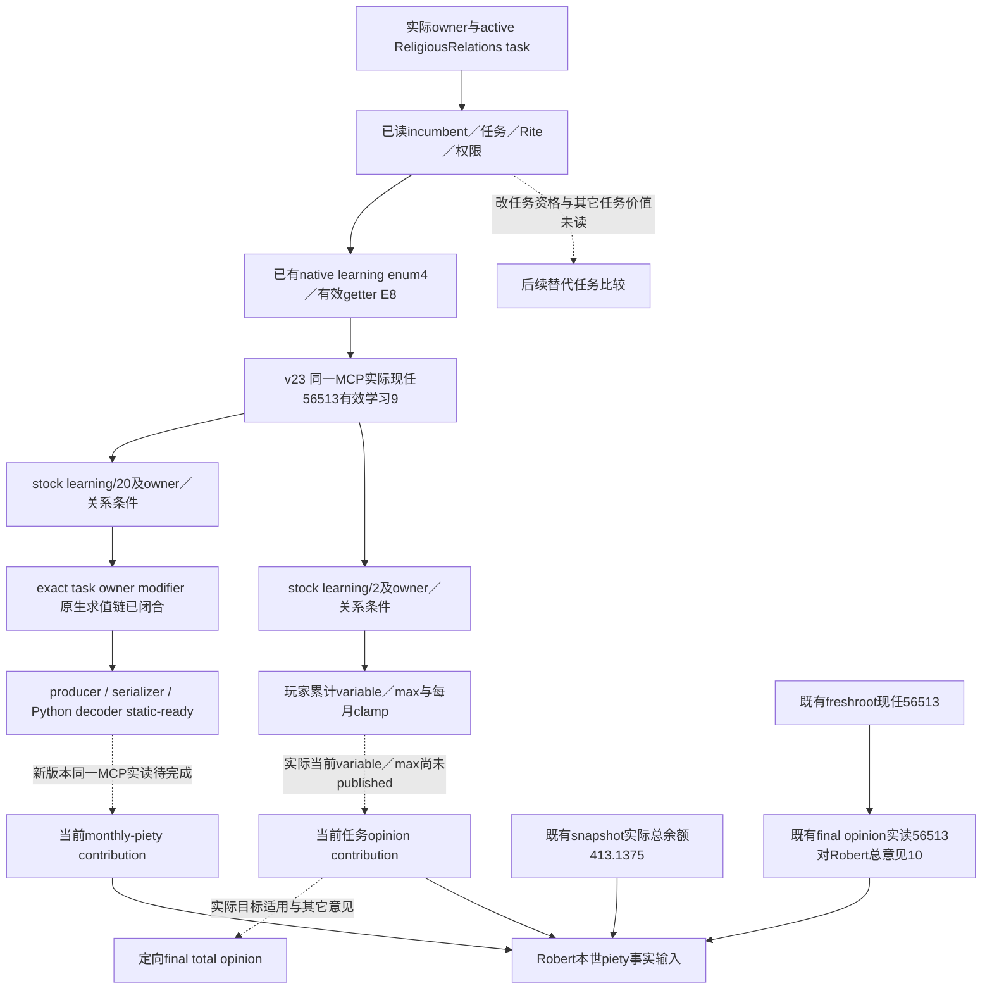
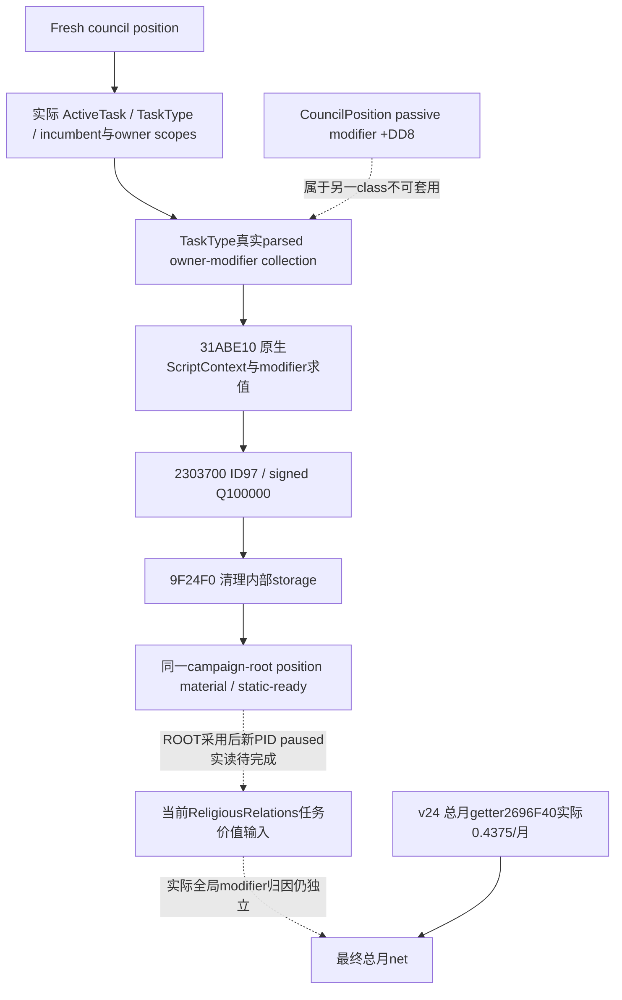

# CK3 1.20.0.3：ReligiousRelations 学习与敬虔／意见价值

本页服务 Robert 本世的 piety 决策：当前祭司有效学习、总月敬虔与既有总piety／现任总意见口已为 **production-live primitive**；任务单项 owner modifier 的 exact 原生求值链和最小同口生产补丁为 **static-ready**，尚未采用到实际游戏、尚无实际贡献值。宗教已全面开放；这里只追当前 `task_religious_relations` 的有效学习、月度敬虔和意见贡献，不进行神职任命、切换任务或更改信仰。当前 task 的已读 `CanReassign=false`是原生可用观察，不能当作只读价值观察的禁令。

先复用 [realm-priest 原生树](religion-realm-priest-council-native-ai-12003.md)及 [宗教治理／意见](religion-governance-opinion-native-ai-12003.md)。新知识与施工材料冻结在 `artifacts/g2-maintainer-2026-10-02/resume-12003/m4-council/role-coverage/religious-relations-value-12003/`；原 rolecoverage、realm-priest、Chancellor 专题不在本包改写。

## Exact build 与实际起点

游戏 CK3 `1.20.0.3 Crozier`／Steam build `25652598`，EXE SHA-256为
`94B55397ABB687A3DCD436805A5D885E6BE90FA6C693FEB44A9E3BBEEADE02A6`。
复用已有版本与 ABI 证据，不重新 hash EXE、验证 ABI、运行旧夹具或重新扫描宗教治理的29个 stock files。

ROOT实际 v21 clergy004 的 [compact extract](Z:/ck3_mod_rewrite/artifacts/g2-maintainer-2026-10-02/resume-12003/m4-council/religion-realm-priest-12003/actual-v21-clergy-01/ACTUAL-CLERGY-EXTRACT.json)，SHA `b43a4205d9bf7d292d41cec52500ecbe674201d1da72cbd69eb873277f22a6cc`，绑定 owner29829、candidate=incumbent56513、active task7162、双方Rite152、public/native revision2/9、raw53222304。其 `native_valid_position=true`、`native_valid_character=true`、`native_can_reassign=false`，context matches且无读取 failure。当前 root已观察 ReligiousRelations／general／infinite／not frozen；task current/max 的合法 null是完成进度，不是月度产出的缺失值。

这是已有 **production-live primitive** 的实读身份／任务／权限起点。该 v21 帧尚未读取 incumbent learning或任务 piety／opinion 最终贡献；后续 v23 实际学习见下文。本页不重读该raw004、不重发query，也不固定未来任务或人选为这些旧ID。

## 已知 stock 输入与 native 分界

当前已冻结 `00_court_chaplain_tasks.txt` SHA `ddd7e89eb6bd27e485ce254dbe14e63d129fad4e98dc2c6dc13ba39ce6b95661`，ReligiousRelations 行1–232；`99_court_chaplain_values.txt` SHA `216f07c8b65800faf373691a9247c913fbccd933161c8e2cebe3a37bf144e3f3`。这些 pins直接复用 realm-priest 包；下面 stock 公式仍需正确 owner／councillor scope 的最终 native 求值，不能当作当前Robert实际量。

| 价值项 | 已定位 authored 输入 | 实际所需值 |
| --- | --- | --- |
| Owner monthly piety | `court_chaplain_religious_relations_total_piety_gain`，学习基础 `learning/20`，再含 owner perk、erudition/family、consulted、culture／celestial条件 | 当前实际 `council_owner_modifier.monthly_piety` contribution；不是总piety月收入或 spiritual fulfillment |
| 同 Faith theocratic opinion | `court_chaplain_religious_relations_opinion_modifier`，学习基础 `learning/2` 加条件输入；玩家按 max/24 每月累计并 clamp 到 max | 当前累计变量与 maximum、实际modifier；不是直接宣布56513→Robert的总意见或 endorsement |
| 无 head＋lay clergy 的额外意见 | `court_chaplain_religious_relations_no_hof_opinion_modifier`，councillor Faith无head parameter或没有religious_head，且councillor Rite为lay clergy时取普通当前opinion/2，其它分支0 | 当前有效制度分支与额外same-Faith贡献；不减半piety，也不撤掉普通theocracy modifier |

任务表达的 opinion modifiers是 `theocracy_government_opinion_same_faith`与 `same_faith_opinion`。它们的适用目标与实际总意见保留分界；不能只凭“主教”称谓断言对某个角色全部生效。具体56513→29829总意见可以沿现有 signed-int32最终 getter `0x28BC490(owner,toward)`观察，不能由task maximum手算替代。

窄stock冻结已闭：任务166–182的三个modifier均作用于council owner；`_council_tasks.info:34`直接说明，task effect root为councillor并保存其 liege scope。值文件9–105的敬虔base-relative加成来自 clerical-justifications、erudition、family-business、consulted-house、owner culture empowerment的0.2及celestial-hierarchy；opinion max114–199没有敬虔中的文化0.2项。玩家任务monthly186–225以max/24累计并clamp，`on_start`147–154先将liege累计变量设0；当前opinion helper取已有变量，AI的直接max fallback不能当作玩家已满额。具体行窗及scope注释见 [stock/native冻结](Z:/ck3_mod_rewrite/artifacts/g2-maintainer-2026-10-02/resume-12003/m4-council/role-coverage/religious-relations-value-12003/stock-native/RELIGIOUS-RELATIONS-STOCK-NATIVE.md)。native资源或进度的Q100000表示不能未经getter证据套给任务贡献。

有效 learning 的 exact `.3`注册已有独立证据：enum4、`Character+0xD8+4*4=+0xE8`，signed int32 points，经 indexed getter `0x28B16B0`。本页直接复用 [LEARNING-PE-EVIDENCE](Z:/ck3_mod_rewrite/artifacts/g2-maintainer-2026-10-02/resume-12003/m4-council/religion-realm-priest-12003/native/LEARNING-PE-EVIDENCE.json)，SHA `4326f8497bbd998b08cf08d660f02626fb368ae733ba54dca7ce6d2206538e85`。已知 getter能解锁当前技能事实，但技能事实本身不能代表完整任务产出。

## 现存可直接读取的资源／意见口

| MCP / 当前字段 | 真实范围 | 当前执行材料 |
| --- | --- | --- |
| `ck3_take_snapshot(include_native_command_history=False)`，顶层 `played_character_piety={raw,scale:100000}` | 玩家总piety余额，不是总月产或任务贡献 | 可直接复用ROOT已有fresh snapshot；本包没有重复调用 |
| `ck3_query_campaign_root_context_v1(expected_revision)` | fresh council.positions中的实际chaplain fullID／task；v24还发布独立 `player_monthly_piety_v1` 总月值 | 用其position key选择角色，不固定56513或list ordinal；总月口实际0.4375／月见下节与独立专题 |
| `ck3_query_active_scheme_sway_outcome_opinion_private_v1(expected_revision,target_character_id)`，`target_opinion_of_actor` | 任意实际正fullID target→played actor的signed int32总意见；不要求activeSway／event；还分开发布两项Sway modifier | 可绑定fresh chaplain，既有private opt-in即可，不需新getter或flag |

Sway-outcome生产reader `ReadSwayOutcomeOpinionV1`只解析recipient／actor并调用 `target_opinion(recipient,actor)`；Python leaf只要求target不同于玩家。本页依据真实source范围复用此口，而非按工具名称限制它。总monthly-piety已由v24同一root口发布并实读；task-specific yield／opinion component尚未实读，其中敬虔项的当前最小增量见下节。现root capture helper的 `payload_path`只支持dict；bishop recipe只需ROOT-owned小接线按`position_key`选positions list中的row，不构建新framework。

## 当前有效学习的最小只读施工

ROOT已授权五个生产叶子的外置补丁，当前v22冻结不改：native候选profile header、候选reader和transport三叶；Python composition contract／private transport两叶。原三role shared profile和final-gates范围保留，只有composition专用profile增加chaplain→learning／+E8。Python复用现有query_step区分composition context，不新增MCP参数、schema字段、runtime flag或策略。当前目标仅是既有query中的incumbent learning事实；不用候选最大化算法或新增任命权限，CanReassignfalse保持其原义。

唯一新native focused case最终GREEN（0.152492s），复用ROOT copied currentv22 archive `ce824deff6f48d0fcf48b5e9219f00f5af21e57d11e1d608aa4b198c9cb62db1`、严格新对象和生产reader／codec／Crozier renderer。synthetic角色背景采用owner29829/inc56513/task7162，learning17与D8=3／E0=9／E4=14不同，证明实际走E8学习路由。所发971-byte genuine内层composition wire SHA `8d12fb4d37abbcd53db258a6eb6b4be0b31ab349426dd238c48757adac16cae8`被Python生产composition DTO decoder唯一一次消费GREEN（0.0905943s）；原默认builder、final-gates不扩chaplain及Steward默认的三个必要controls通过。没有伪造outer application-main envelope或再造第二份native wire。

首link依赖closure失败保留，旧v14 archive不称currentv22。首次focused snapshot ID长32没有留既有NUL空间，reader在invalid_request就退出；诊断证明captures1/producer0，故这是fixture输入错误，没有学习读取结论。仅缩短fixture ID并必要重编受影响test object；生产hunks没有为此修改，旧GREEN对象／旧cases不重跑。这个阶段的源码为static-ready、尚未应用到实际v22；ROOT后来统一合入并由v23新PID paused验收，真实数值见下节。

## V22 实际余额与现任对 Robert 的总意见

ROOT实际 [三调用capture](Z:/ck3_mod_rewrite/artifacts/g2-maintainer-2026-10-02/resume-12003/m4-council/role-coverage/religious-relations-value-12003/actual-v22-piety-chaplain-opinion-01/result.json) GREEN并official close，native/source `b59464e0367bafbdc0d344aeb2c6f9ababcb4716`、ROOT上下文PID119508，同Robert episode `native-29829-2bc2d599f7f9`。initial/final均paused、native10／public revision2、raw53222376，0day／0action／0checkpoint。

| 实际输入 | 当前帧值 | 意义 |
| --- | --- | --- |
| `played_character_piety` | raw41313750／scale100000，**413.1375 piety** | 玩家当前总余额；不是月增或ReligiousRelations累计贡献 |
| freshroot chaplain | **56513**，`task_religious_relations`／general／null target／frozen=false／infinite | 后续target fullID由此row动态绑定，不来自旧004或固定ordinal |
| `target_opinion_of_actor` | target56513→actor29829，**+10**，available，native10／raw53222376 | 当前现任对Robert的总意见；不是学习贡献、任务component、clergy approval或temple endorsement |

这些事实现在可以参与真实资源／关系决策，不能把+10倒算为learning20或把413.1375归因于该任务。三个query均为已有口；ROOT仅apply外置helper的三行list-selector与一行finite piety投影，MCP已有opt-in／providers／flags没有新增。离线解释首attempt把direct snapshot误当MCP packet，`KeyError: packet`先于任何值提取；仅修该archive形状后成功解释，原capture无RED、无重query。结果和各原始文件pins见 [ACTUAL-VALUES-EXTRACT.json](Z:/ck3_mod_rewrite/artifacts/g2-maintainer-2026-10-02/resume-12003/m4-council/role-coverage/religious-relations-value-12003/ACTUAL-VALUES-EXTRACT.json)。

本页尚无 counter-policy。stock输入树已冻结；任务-scoped modifier数字caller、owner集合和raw scale已由下节exact调用证据闭合。ROOT独占实际paused采集、native/shared/MCP源码、状态与发布；各阶段保留其真实source，新值不倒填进旧v22材料。

## V23 同一 MCP 实际有效学习

ROOT已合入 composition-only 的五个生产叶子，并在新 v23 冷启动上下文执行 [actual-v23-learning-and-sway-cold-01](Z:/ck3_mod_rewrite/artifacts/g2-maintainer-2026-10-02/resume-12003/m4-council/role-coverage/religious-relations-value-12003/actual-v23-learning-and-sway-cold-01/result.json)，single-client共6个registered calls CLOSED GREEN。其中本专题只消费001 fresh snapshot与002既有 `ck3_query_council_composition_candidates_private_v1(position_key="councillor_court_chaplain")`；其余4个Sway调用由其它owner报告。

| 本帧实际字段 | 结果与证据范围 |
| --- | --- |
| Runtime与玩家 | `production-source-2c435dcb`、actor29829、episode `native-29829-2bc2d599f7f9`、raw53222640；ROOT独立执行上下文记录newPID6280，两个学习packet本身没有PID字段 |
| Fresh revision | snapshot `native:3`、frontend revision2、native revision3；query metadata同frontend2／native3 |
| 当前祭司技能 | owner29829、position `councillor_court_chaplain`、incumbent **56513**、`skill_key=learning`、`skill_value=9`，accepted／available／read-only／exact `.3` |
| 候选集合 | 实际provider返回4项eligible；没有候选final-gates、当帧CanReassign或新任命结论 |
| 存量 | 本帧snapshot `played_character_piety={raw:41313750,scale:100000}`，仍是总余额 **413.1375**；没有月增长字段 |

内层 native composition DTO 的 snapshot public/native revision为3/3，属于内部native输出语义；它不能改写外层实际 frontend revision2。本帧 packet未发布task key／task ID；当前职责的较早实读事实保留在原帧，不将它冒充002新字段。内层真实 wire及001／002 pins见 [ACTUAL-LEARNING-EXTRACT.json](Z:/ck3_mod_rewrite/artifacts/g2-maintainer-2026-10-02/resume-12003/m4-council/role-coverage/religious-relations-value-12003/actual-v23-learning-and-sway-cold-01/ACTUAL-LEARNING-EXTRACT.json)。

当前有效学习现在是 **production-live primitive**，复用同一现存 MCP／参数／旗标；未修改final-gates或策略，没有任命／任务切换，旧synthetic17与static夹具仍作为历史源码验证，不替代真实9。没有重复query、学习测试或旧矩阵。该值解除技能输入缺口；任务应用的month-piety、累计opinion／approval仍未实读，也不能把9/20手算当作月度已应用贡献。总月增长的下一只读入口单独记录在 [总月敬虔原生树](monthly-piety-native-ai-12003.md)。

## 当前任务单独敬虔贡献：下一只读增量

ROOT已授权当前ReligiousRelations实际任务贡献的最小只读生产增量，外置包为 `artifacts/g2-maintainer-2026-10-02/resume-12003/m4-council/role-coverage/religious-relations-contribution-12003/`。当前阶段为 **static-ready：exact ABI／生产leaf接线／跨语言fixture已闭，ROOT采用与实读尚待**；补丁基于immutable `production-source-6c87eb77`（完整commit `6c87eb77568601499ab98a43f9cbea4c2ee870f6`），保持已集成总月getter／schema／算法和已冻结总月专题。这里的技能输入是此前实际learning9；未来current task／incumbent仍由freshroot动态绑定，不能把56513或旧task7162固定为每次输入。

现有actual `.3` `ck3_12002_nonwar_council.cpp::Position`已有ActiveTask、TaskType以及原task+0x40的scopes地址；传给现有progress入口的是这个原指针，并非只含两个ID的8-byte副本。GUI任务caller `0x1158F80`复制task+0x40／+0x50组成32-byte原scopes后调用下述builder，包含incumbent／owner fullID与已有target scope。新入口直接复用当前原地址，由原生builder构造完整ScriptContext与保存作用域；不在Python重建、猜测或手算脚本作用域。

同一campaign-root的position row因此只需承载一个独立numeric task-owner modifier material。四个生产叶子是common root DTO/environment header、nonwar council reader、actual root serializer和Python root contract；现存MCP、参数、flags和root-ready语义保留。Native只增加一个组合callback封装三个已闭入口，不扩final-gates、任命或其它策略。

外置补丁新增 `council.positions[].task_owner_monthly_piety_v1={status,value,unavailable_reason}`；available的value为signed `raw`／scale100000，unavailable保留null及 `task_owner_monthly_piety_unavailable`。旧row缺字段仍可解码。新值与既有 `player_monthly_piety_v1`分别命名，原root readiness与总月算法保留；字段本身目前是静态发布候选，不代表实际MCP已经返回该材料。

新exact locator排除已留证：`GetCouncilOwnerModifierDescFor` literal `0x48C8928`的一条登记 `0x61E230→0x31BCE10`读取`+0xDD8`，其source-path／限制文本明确属于 **CouncilPosition** passive职位modifier，不能当作TaskType的owner-modifier字段，也不能复用 `.19` GUI-description签名。

| Exact `.3` 原生节点 | 已闭合语义 |
| --- | --- |
| `0x31ABE10(TaskType*, outModifier, rawTaskScopes)` | 经TaskType+0x1358的clone，求值owner modifier集合+0x438 pointer／+0x444 count；原生ScriptContext根是incumbent，保存owner／councillor scopes。`0x28724A0→0x2872320→0x9D7060`实际求值script values，故learning／owner条件不由我方手算；返回RAX=outModifier |
| owner应用caller `0x291DED0→0x31ABF40` | 遍历ownerCharacter+0x1C0／+0x230的active tasks，只对未冻结任务构造incumbent及owner scopes并读相同+0x438／+0x444集合；确认这里是任务对council owner的集合，而非职位passive modifier |
| outModifier | 大小0x1C0、对齐8；IDs为uint16数组（+0 pointer／+0x0C count），对应signed int64数值数组为+0x68／+0x74 |
| `0x2303700(modifier, int64_t* out, uint16_t id)` | 查找排序后的ID与并行数值；命中返回该raw，项目缺席原生写raw0，RAX=out。`0x23033A0`给出signed Q100000单位 |
| `monthly_piety` ID **0x61／97** | initializer `0x2C4DC5F`将table0x480C290传入0x25F7290；record stride0x38，真实record0x480D988的+0x28 ID=0x61／+0x2C keyword=0x2B6D，分别回链MOD_MONTHLY_PIETY literal0x48159E8和monthly_piety literal0x470E480。此前邻接0x60／prestige0x6F候选已排除 |
| `0x9F24F0(outModifier)` | 释放内部集合而不释放调用者拥有的外层storage；组合callback在取值后清理该storage |

ABI及完整调用证据冻结在 [NATIVE-TASK-OWNER-MONTHLY-PIETY-ABI.json](Z:/ck3_mod_rewrite/artifacts/g2-maintainer-2026-10-02/resume-12003/m4-council/role-coverage/religious-relations-contribution-12003/native-evaluator/NATIVE-TASK-OWNER-MONTHLY-PIETY-ABI.json)，11208B／SHA `440ccb7bad567cc402876d7c9f8d805a973a52f52a04cc188d2fa701946d380d`。原生树4241B／SHA `1684c48db9ff71783b39533d6bc2fd64b13bd0454964684913e87d6b1fef296c`；stock和EXE证据复用，不再扫描已冻结来源。

目标是原生已求值的任务 `council_owner_modifier.monthly_piety` 单项，处于owner gross合并／全局modifiers之前。它能说明当前任务提供的修正值，不能冒充全局倍率之后的最终net归因量；若字段发布raw0，表示原生这一项数值为0，不能用null替代合法0。ROOT的v24总月口已实读raw43750／scale100000，即 **0.4375／月**，同帧root保留56513／ReligiousRelations／frozen=false，但没有fresh learning或任务贡献字段；[总月专题](monthly-piety-native-ai-12003.md)保留独立字段／帧／PID证据。两个数值不用总月差额或余额变化倒算关系。

唯一必要新fixture落在既有 `ck3_12002_nonwar_council_test.cpp`，用 `--task-owner-monthly-piety-only`独立执行，旧cases为0。它经真实 `ReadNonwarCouncilProjection12002::Position`／生产binder，在TaskType和原32-byte scopes上调用已闭三入口，检查ID97、scopes尾部marker、signed数值及cleanup顺序，再由真实root serializer／Crozier renderer输出genuine innerroot。引擎函数体为ABI明确stub，numeric **raw-225000／scale100000（-2.25）是synthetic**；actor29829／inc56513／task7162只是观察背景。总月独立marker88888不是实际0.4375。

首native case GREEN（0.129369s）保留4142-byte wire；首Python productionnormalizer调用在既有scope检查处RED，因为fixtureDTO `primary_title=null`／`government=null`却发布availableCouncil，且此检查先于新数字helper。该harness RED有缓存事实与原receipt，不是getter失败，也未验证新decoder。只补fixture的landed title／capital／held-primary／feudal government背景，生产四leaf源码保持；复用两个GREEN生产objects，只重编改变的fixture object并必要link。第二native context case GREEN（0.129716s），生成4371-byte原wire SHA `7412326624ff7a55a864b30184473fd53e033748800039df286c487faa8fce5d`；随后生产Python normalizer直接消费同一份wire GREEN（0.8380268s），保留task值-225000与总月marker88888，没有造outer envelope或手改JSON。首RED与修复后的 [decoder receipt](Z:/ck3_mod_rewrite/artifacts/g2-maintainer-2026-10-02/resume-12003/m4-council/role-coverage/religious-relations-contribution-12003/modifier-provider/implementation/decoder-02-fixture-context-fixed/GENUINE-TASK-OWNER-PIETY-PYTHON-RECEIPT.json)均保留。

此focused case覆盖新leaf链而非完整 `ReadCampaignRootContextV1` producer；新的row布局会由ROOT正常strict构建重编所有header依赖生产对象，再做实际同一MCP paused验收。本包只验证两个有不同fixture上下文的新case／两次normalizer调用（首RED、修复后GREEN），不重跑旧tests、ABI或矩阵；没有SDK、游戏动作、任务切换、day／M4 credit。外置ROOT config只复用已有freshsnapshot→完整campaign-root两call，已有完整新版本freshroot时直接复用，下一真实采集不固定角色／任务／revision。
