# Research plan: call-ally-command-12003

GENERATED from the supplied research plan; no native semantics are inferred.

Question: How does a current-player call_ally command bind its selected war and native owning queue, and what independent state proves accepted support?

```mermaid
flowchart TD
    n0["Current paused player and fresh observation revision"]
    n1["Resolve full recipient and WarID; player is primary leader"]
    n2["Construct standalone call_ally context and selected type16 WarTarget"]
    n3["Refresh/finalize and complete native selected-target CanSend"]
    n4["Reevaluate all ten immediate native send costs against observed quote"]
    n5["Construct CSend with deep-copied definition/roles/target"]
    n6["Primary+0x40 native clone; manager ownership transfer flags0x0E"]
    n7["Registered outgoing MCP/mailbox and expected-revision binding"]
    n8["Independent newer participant, called-state and actual resource readback"]
    n9["Observed allied army and later actual support in selected war"]
    n0 -->|"selected [static-confirmed] Full IDs, current primary leader, absent recipient and not previously called"| n1
    n1 -->|"bind [static-confirmed] Standalone basic context3076C90 and WarTarget type16/fullID"| n2
    n2 -->|"validate [static-confirmed] Refresh3078A60, finalize3078C90, picker307A690 and final CanSend307C040"| n3
    n3 -->|"quote [static-confirmed] Native evaluator310CEE0 sets send_cost_sampled; compares ten signed slots; unobserved differs from legal zero quote"| n4
    n4 -->|"copy_identity [static-confirmed] Constructor2968170; roles/target/special instance and auxiliary roles reread in copied context"| n5
    n5 -->|"owning_queue [static-confirmed] Actual primary+40 clone86D760, move ownership and native residual destruction"| n6
    n6 -->|"typed_transport [static-confirmed] Registered typed MCP and same-revision FAMILY quote -&gt; owning mailbox -&gt; native receipt"| n7
    n7 -. "accepted_outcome [unknown] Call pending/autoaccept/accept/decline transition and independent participant/resource state" .-> n8
    n8 -. "army_support [unknown] Separate spawned/raised/arrived ally army and useful battle contribution" .-> n9
```



| Edge | Declared status | Evidence IDs | Open question |
|---|---|---|---|
| selected | static-confirmed | contract, sender, stock |  |
| bind | static-confirmed | select, contract, sender |  |
| validate | static-confirmed | contract, sender |  |
| quote | static-confirmed | contract, sender |  |
| copy_identity | static-confirmed | ctor, contract, sender |  |
| owning_queue | static-confirmed | copy, contract, queue, sender |  |
| typed_transport | static-confirmed | contract |  |
| accepted_outcome | unknown | stock, contract | Future Root must independently observe selected-war participation and actual paid resources; queue submission is insufficient. |
| army_support | unknown | contract | Participant membership does not prove an allied army has arrived or fought. |

| Observation design | Value |
|---|---|
| mode | offline-only |
| actor_kind | human |
| owner_scope | Root current player Robert29829 only; workers use isolated file projections |
| identity_kind | generation-id |
| identity_lifetime | Current episode native-29829-2bc2d599f7f9 and exact current full recipient/WarIDs; no cached pointer reuse |
| producer_trigger | not-applicable |
| producer | File-only current stock, exact disassembly, accepted ABI reuse and sender source projection |
| caller | Registered typed ck3_submit_call_ally_to_war_private_v1 and owning-thread SubmitCallAlly are static-ready; this lane performs file-only documentation adoption. |
| consumer | Root source adoption and future fresh query -&gt; submit -&gt; independent outcome evaluation |
| cache_lifetime | Native source19b508ae exact .3 baseline plus subsequent typed g36 source images; each command context is disposable per owning-thread request. |
| expected_signal | Offline source/ABI chain only; no queue ACK or live participant is sampled here |
| zero_sample_meaning | No runtime samples requested or collected; no rejection or successful call is inferred |
| stop_condition | Generate plan/check/graph once; do not attach, advance, queue or operate windows |
| runtime_window_ref | None |

| Evidence ID | Declared layer | File | SHA-256 | Supports |
|---|---|---|---|---|
| chain | exact-build | evidence/exact-chain.json | 8f35bf7a1bc3ee528fd7e8b43fb509d9d4b38721d2f785784275d9cf6daa6690 | Frozen .3 exact disassembly/source fingerprints; original labels preserved. |
| select | exact-build | evidence/selected-war.txt | 1b0d9c727074c22c4aaad7cd84ce6d273baabd08d81b704ee402a199c2f0ddf6 | UI writes type16 plus selected full WarID; wrapper offsets differ from standalone context. |
| ctor | exact-build | evidence/send-constructor.txt | 3db1114328f94a65389d04363a5621d50b678425db249cff72da40c63147e3ad | CSend constructor at2968170 copies context at+20 and adds score fields. |
| copy | exact-build | evidence/accepted-owning-copy-reuse.json | 67b0b811cc1526505274171f4db86cb0fcdcbc9c998f9840f55e6fe01e9f47d7 | Accepted .3 reuse: actual primary+40 owning clone86D760; original continuation label corrected. |
| contract | source-contract | evidence/source-contract.json | 1ee913e8c4aa3f106d245562277f565328e6b88d284c51d5a3eb215597ad7975 | Native sender contract, matching current typed source pins and existing registered MCP/mailbox focused receipts; no actual runtime call. |
| sender | source-contract | evidence/sender-source.cpp.txt | 3a5b02b8090e94cfc03a874133e20e4d4956d5018baa59515fa6980d17772577 | SubmitCallAlly owning-thread frame, selected target, final legality/cost, copied identities, queue and cleanup. |
| queue | source-contract | evidence/owning-queue.cpp.txt | 8d5806d2b57dc8d115bc6cb52ca7e4b6374e6be4b546ab813ea3b3b889324c2a | Native cloning, ownership handoff and residual deleting destructor; ACK is queue status only. |
| stock | source-contract | evidence/call-ally-stock.txt | ce59d7e662a856a3693a1cdace5bdd056831d8f3c6b4f192afe4d9a8a8584171 | Current stock target, autoaccept/accept and decline branches. |
| fixture | offline-fixture | evidence/native-focused-result.json | 2c4547f89c6460eec0181ea3048c8440b702c258cc3d07df27f729100e4c4479 | Actual modified native sender, existing core/queue: 6 focused cases GREEN under /O2 /W4 /WX; no live action. |

Check result (file integrity and declarations only):

```json
{
  "schema": "xar.native-research-plan-check.v1",
  "result": "plan-consistent",
  "proof_layer": "record-structure-and-file-integrity",
  "semantic_correctness_verified": false,
  "live_execution_performed": false,
  "observation_plan_issues": [
    "offline-only plan does not define a live observation window",
    "the real producer trigger must be located before live sampling"
  ],
  "declared_edges_by_status": {
    "counter-policy": 0,
    "inference": 0,
    "live-confirmed": 0,
    "static-confirmed": 7,
    "unknown": 2
  },
  "enumerated_native_edges": 9,
  "declared_cases_by_status": {
    "pending": 3,
    "observed": 0,
    "not-applicable": 0
  },
  "checked_evidence_files": 9,
  "limitations": [
    "Evidence layers and conclusions are author declarations; hashes bind bytes, not their truth.",
    "Counts cover this enumerated graph only, not all CK3 branches.",
    "A consistent observation plan is not authorization to run or manipulate CK3."
  ],
  "plan_sha256": "be050ac67f2af6363a8d175f93f31108500c1f65568728166b83cb65aa77a8ce"
}
```
