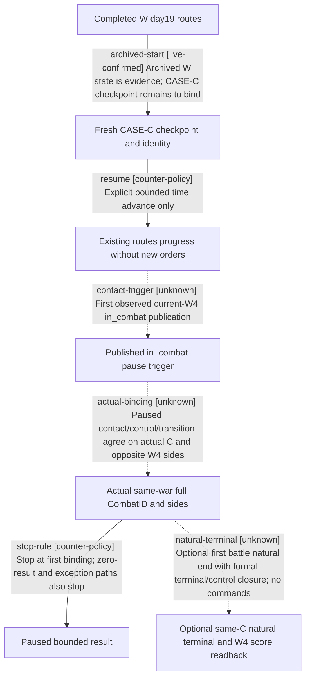

# Research plan: war-film-case-c-first-actual-contact-20260923

GENERATED from the supplied research plan; no native semantics are inferred.

Question: Within a new bounded observation window continuing existing W4 routes from day19, can formal queries bind one first observed actual CombatID to both sides of this same war? After preserving that paused binding, optionally observe this same battle natural end within additional30 days and unchanged overall120 days/600 seconds.



| Edge | Declared status | Evidence IDs | Open question |
|---|---|---|---|
| archived-start | live-confirmed | baseline |  |
| resume | counter-policy | window |  |
| contact-trigger | unknown |  | Requires new CASE-C snapshot; polling can miss short contacts. |
| actual-binding | unknown |  | No CASE-C actual CombatID observed yet; ETA/hypothetical contact is insufficient. |
| stop-rule | counter-policy | window |  |
| natural-terminal | unknown |  | Requires same-C actual terminal journal/control and W4 score evidence; disappearance alone is incomplete. |

| Observation design | Value |
|---|---|
| mode | passive-runtime |
| actor_kind | engine |
| owner_scope | Current W4 allied/enemy CUnits; existing player order continues, NPC orders remain native. |
| identity_kind | generation-id |
| identity_lifetime | One R0005/PID32356/generation1/episode and exact W4. Refresh full public unit IDs; no inferred split/merge identity. Stop on session/war identity change. |
| producer_trigger | daily-tick |
| producer | Normal unpaused movement/contact engine following existing routes; this observation does not add movement orders or force combat. |
| caller | Sole root owner uses advertised speed1/2 and resume/pause; latest published in_combat is only a pause trigger. |
| consumer | Paused public actual-contact, battle-control and battle-transition readbacks, retaining exact C, unit owners and side ordering. |
| cache_lifetime | Fresh snapshots each sample and after every action. Use current public revision, never baseline45 or native44 as replay guards. Paused query identity/date/revision must be compatible. |
| expected_signal | Current W4 unit in_combat followed by one agreed actual full C and opposite combat sides containing W4 allied/enemy units. |
| zero_sample_meaning | No exact combat observed in this window; not proof that AI refuses combat or no combat happened between snapshots. |
| stop_condition | First exact C binding is paused and preserved; optional same-C natural outcome only within additional30 days and unchanged overall120 days/600 seconds/service expiry. All event/identity/war failures stop; completed CASE-W is not extended. |
| runtime_window_ref | sampling-window.json; root-authorized independent case-c-r1 after actual day19 checkpoint binding |

| Evidence ID | Declared layer | File | SHA-256 | Supports |
|---|---|---|---|---|
| baseline | live-observation | baseline.json | 90ee93cd8aa1ccabc04523e0d9f38f2bae56f37710ec70ed8c1e83c5e0bc305c | Archived W day19 starting state only; CASE-C not executed. |
| source | source-contract | source-contract.json | 8f6859bc570a8260025e6b6a577be78b5efa1c78ab2d1ec32b03da40fedd0e87 | Existing public tool signatures and exact combat/day conventions; no repeated static research. |
| window | source-contract | sampling-window.json | 3e0d13a11e30b07bcf0c77b7cb93dbac8569f02e66a2fceae51e17db7f08ef38 | New independent bounded intent; neither W extension nor runtime proof. |

Check result (file integrity and declarations only):

```json
{
  "schema": "xar.native-research-plan-check.v1",
  "result": "plan-consistent",
  "proof_layer": "record-structure-and-file-integrity",
  "semantic_correctness_verified": false,
  "live_execution_performed": false,
  "observation_plan_issues": [],
  "declared_edges_by_status": {
    "counter-policy": 2,
    "inference": 0,
    "live-confirmed": 1,
    "static-confirmed": 0,
    "unknown": 3
  },
  "enumerated_native_edges": 4,
  "declared_cases_by_status": {
    "pending": 2,
    "observed": 0,
    "not-applicable": 0
  },
  "checked_evidence_files": 3,
  "limitations": [
    "Evidence layers and conclusions are author declarations; hashes bind bytes, not their truth.",
    "Counts cover this enumerated graph only, not all CK3 branches.",
    "A consistent observation plan is not authorization to run or manipulate CK3."
  ],
  "plan_sha256": "3b6bb785cd0069be9849ecdf395410effdbc5e79a897c9cbd571c866a5675e35"
}
```
