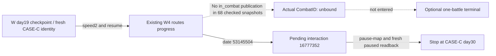

# CASE-C observed result graph

Solid edges reflect this window's official readbacks. Dashed edges remain unknown or not entered. The graph does not infer that no short battle occurred between samples. [readback.json](readback.json) contains exact source paths, hashes and the 68 sampled snapshot references. The checked preparation plan remains [r2](../war-film-case-c-20260923-r2/plan.json).
