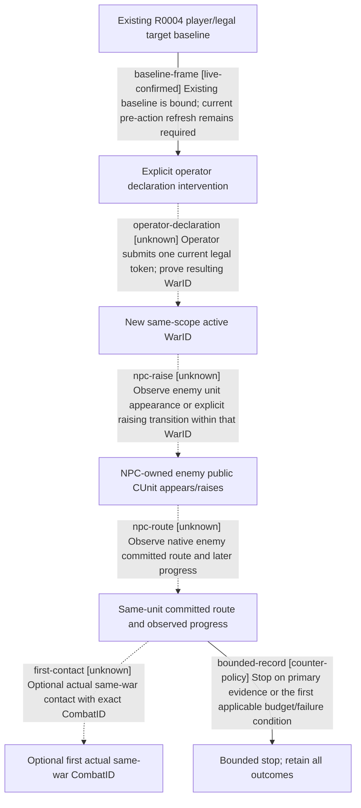

# Research plan: war-film-case-w-native-npc-response-20260923

GENERATED from the supplied research plan; no native semantics are inferred.

Question: After a new official run restores the frozen day-zero save (or records a separate new start), which same-war NPC raising, committed movement and optional first-contact transitions can public native tools observe after one explicitly operator-declared legal war?



| Edge | Declared status | Evidence IDs | Open question |
|---|---|---|---|
| baseline-frame | live-confirmed | baseline |  |
| operator-declaration | unknown |  | No declaration has been submitted by this preparation package. |
| npc-raise | unknown |  | Require before/after ownership and war membership; pre-existing troops do not prove raising. |
| npc-route | unknown |  | Require same full CUnit or explicit split/merge successor binding, not flag animation. |
| first-contact | unknown |  | No projected encounter or simulator input is an actual battle. |
| bounded-record | counter-policy |  |  |

| Observation design | Value |
|---|---|
| mode | passive-runtime |
| actor_kind | ai |
| owner_scope | NPC31549 and its published same-war army scope only; human29829 initiates war as an explicit intervention, never as evidence of autonomous AI declaration. |
| identity_kind | generation-id |
| identity_lifetime | One newly bound official run/PID/connection/episode and exact WarID; R0004 is historical only. Full CUnit/CombatID are read from fresh formal rows and retired on disappearance/split/merge unless a successor is explicit. |
| producer_trigger | daily-tick |
| producer | Normal NPC daily wartime military/coordinator processing after the separately recorded operator declaration; samples observe published raising/route/contact state, not unexposed score intermediates. |
| caller | The unique owner of the new official run uses advertised resume-map/pause-map time slices; paused official query readbacks never force an NPC order. |
| consumer | Current snapshot/war-army rows and narrow army/reinforcement/contact/battle queries, hash-bound to checkpoint, frame/time and raw footage. |
| cache_lifetime | Refresh snapshot after every action/publication/time slice; every paused query uses that public revision and retains returned native revision/date. Historical public6/native5 is baseline only. |
| expected_signal | New exact WarID, NPC-owned full public CUnit appearance/raising, committed route and later progress; optionally one actual CombatID shared with the same war and sides. |
| zero_sample_meaning | No enemy army or route inside the bounded window means not observed in this window; already present troops are not proof of a new raise decision. No combat means contact not observed, not that the AI refuses combat. |
| stop_condition | Stop after one same-war enemy public CUnit has an observed post-declaration appearance/raising state and a committed route plus a later position/progress read, or after 30 observed game-calendar days / 12 paused sampling rounds / 12 wall minutes, whichever occurs first. Only if needed for the film and existing bound armies/routes make one contact feasible within remaining budget: capture at most one actual CombatID. Total hard limits including primary window: 45 game-calendar days, 16 paused sampling rounds, 15 wall minutes. No repeated chases or second battle. Stop also on any failure_stop in the window. |
| runtime_window_ref | sampling-window.json (prepared future official run; R0004 has ended and supplies historical baseline only) |

| Evidence ID | Declared layer | File | SHA-256 | Supports |
|---|---|---|---|---|
| baseline | live-observation | baseline.json | df2678d0e429aabbeed7350076e7ebc4192fb28f37acce26f5368f2183c64f05 | Existing R0004 baseline only; no CASE-W action or NPC behavior has been observed. |
| source | source-contract | source-contract.json | 953436af616957116030880c67726f516a62aa751321e066904eb160ad7b62d1 | Existing official tool signatures and their observation limits. |
| window | source-contract | sampling-window.json | 35c8f9007978fb7a7c315a4a9567a3554a6451ab8035f17c39b4328ba78f353f | Explicit bounded proposed sampling procedure, not permission or successful execution. |

Check result (file integrity and declarations only):

```json
{
  "schema": "xar.native-research-plan-check.v1",
  "result": "plan-consistent",
  "proof_layer": "record-structure-and-file-integrity",
  "semantic_correctness_verified": false,
  "live_execution_performed": false,
  "observation_plan_issues": [],
  "declared_edges_by_status": {
    "counter-policy": 1,
    "inference": 0,
    "live-confirmed": 1,
    "static-confirmed": 0,
    "unknown": 4
  },
  "enumerated_native_edges": 5,
  "declared_cases_by_status": {
    "pending": 2,
    "observed": 0,
    "not-applicable": 0
  },
  "checked_evidence_files": 3,
  "limitations": [
    "Evidence layers and conclusions are author declarations; hashes bind bytes, not their truth.",
    "Counts cover this enumerated graph only, not all CK3 branches.",
    "A consistent observation plan is not authorization to run or manipulate CK3."
  ],
  "plan_sha256": "7ecddd2873142ff6f64ba9a425fab2d80bcd10f5137d2cf6e4d9233583d8cbec"
}
```
