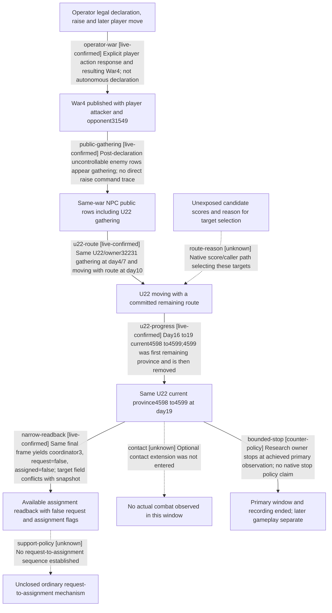

# Research plan: war-film-case-w-native-npc-response-20260923-result

GENERATED from the supplied research plan; no native semantics are inferred.

Question: Which NPC public-unit gathering, committed-route and later location transitions were actually observed in the closed R0005 War4 window after explicit operator intervention?



| Edge | Declared status | Evidence IDs | Open question |
|---|---|---|---|
| operator-war | live-confirmed | readback |  |
| public-gathering | live-confirmed | readback |  |
| u22-route | live-confirmed | readback |  |
| u22-progress | live-confirmed | readback |  |
| route-reason | unknown |  | Published committed orders do not expose target candidate scores, scheduling cause or objective fallback branch. |
| narrow-readback | live-confirmed | readback |  |
| support-policy | unknown | readback | Two typed unavailable results and later false flags do not prove thresholds or assignment cause; target2633 versus4598 remains unresolved. |
| contact | unknown | readback | No actual CombatID was observed; no battle, reinforcement join, retreat or termination mechanism is tested. |
| bounded-stop | counter-policy | readback |  |

| Observation design | Value |
|---|---|
| mode | passive-runtime |
| actor_kind | ai |
| identity_kind | generation-id |
| producer_trigger | daily-tick |
| owner_scope | NPC-owned uncontrollable public CUnit rows of War4 in R0005; player CharacterID29829 declaration, raising and movement are separate interventions. |
| identity_lifetime | PID32356 / connection-generation1 / episode native-29829-fcaa3906d404; same full public CUnit plus owner within the observed roster; no inferred successor after disappearance. |
| producer | Ordinary wartime time progression produced new published state; exact per-unit candidate scoring and caller execution are not observed by these readbacks. |
| caller | Root owner advanced seven bounded time slices then paused. This result extraction performs no game calls and authorizes no new sampling. |
| consumer | Official paused snapshots and same-revision army-strength/reinforcement assignment queries; copied JSON receipts only. |
| cache_lifetime | Each sample retains public/native revisions and date; equal published frames have equal military projections. This is not frame synchronization with raw video. |
| expected_signal | Observed U22/owner32231 gathering, committed route, then current province4598 to4599 at day19, with previous route first province removed. |
| zero_sample_meaning | No battle in this bounded window is no observation of contact, not evidence of combat refusal. First public row appearance is not an identified raise command. |
| stop_condition | Closed at 2026-09-22T22:03:23.643654+00:00, date53144784/day19 after seven time advances; optional contact was not entered. w131 verifies the same final frame after recording. Later responses belong to a separate case. |
| runtime_window_ref | ../war-film-case-w-20260923-r1/sampling-window.json; closed outcome in readback.json:end_receipt |

| Evidence ID | Declared layer | File | SHA-256 | Supports |
|---|---|---|---|---|
| readback | live-observation | readback.json | ee48673ff78ec2bb8f43b7f1b357740e04b93fd928fc65fae20c6e3b6c3f8927 | Exact-byte copy of the offline extraction of existing R0005 live receipts, with every original JSON path/size/SHA. Confirms published observations only; unexplained projection difference remains explicit. |

Check result (file integrity and declarations only):

```json
{
  "schema": "xar.native-research-plan-check.v1",
  "result": "plan-consistent",
  "proof_layer": "record-structure-and-file-integrity",
  "semantic_correctness_verified": false,
  "live_execution_performed": false,
  "observation_plan_issues": [],
  "declared_edges_by_status": {
    "counter-policy": 1,
    "inference": 0,
    "live-confirmed": 5,
    "static-confirmed": 0,
    "unknown": 3
  },
  "enumerated_native_edges": 8,
  "declared_cases_by_status": {
    "pending": 0,
    "observed": 2,
    "not-applicable": 1
  },
  "checked_evidence_files": 1,
  "limitations": [
    "Evidence layers and conclusions are author declarations; hashes bind bytes, not their truth.",
    "Counts cover this enumerated graph only, not all CK3 branches.",
    "A consistent observation plan is not authorization to run or manipulate CK3."
  ],
  "plan_sha256": "6987482902d8381b83984254f0c2f4b94ecb97d4a2b222d5473173bb97343a96"
}
```
