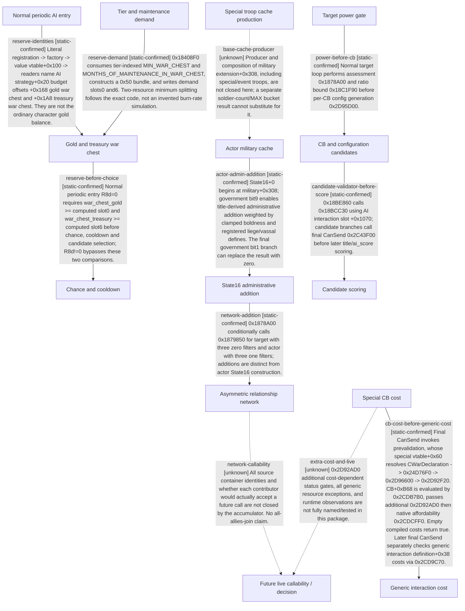

# Research plan: war-film-declaration-inputs-20260923

GENERATED from the supplied research plan; no native semantics are inferred.

Question: What exactly precedes C01-C02 military, CB cost, and score choices in the ordinary AI declaration path?



| Edge | Declared status | Evidence IDs | Open question |
|---|---|---|---|
| reserve-identities | static-confirmed | static-contract |  |
| reserve-demand | static-confirmed | static-contract |  |
| reserve-before-choice | static-confirmed | static-contract |  |
| actor-admin-addition | static-confirmed | static-contract |  |
| network-addition | static-confirmed | static-contract |  |
| power-before-cb | static-confirmed | static-contract |  |
| candidate-validator-before-score | static-confirmed | static-contract |  |
| cb-cost-before-generic-cost | static-confirmed | static-contract |  |
| base-cache-producer | unknown |  | Producer and composition of military extension+0x308, including special/event troops, are not closed here; a separate soldier-count/MAX bucket result cannot substitute for it. |
| network-callability | unknown |  | All source container identities and whether each contributor would actually accept a future call are not closed by the accumulator. No all-allies-join claim. |
| extra-cost-and-live | unknown |  | 0x2D92AD0 additional cost-dependent status gates, all generic resource exceptions, and runtime observations are not fully named/tested in this package. |

| Observation design | Value |
|---|---|
| mode | offline-only |
| actor_kind | ai |
| owner_scope | ordinary periodic actor-specific declaration attempt, R8d=0; not all declaration callers |
| identity_kind | generation-id |
| identity_lifetime | Actor, target, title and selected CB bound to one future attempt; no pointer reuse across revisions |
| producer_trigger | daily-tick |
| producer | 0x187AB90 with native caller scheduling |
| caller | AI strategy periodic context; nonzero R8d is separately scoped |
| consumer | 0x18BDDA0 candidate validator then scoring; final chosen interaction |
| cache_lifetime | military+0x308 and war-chest budget are prior native producer outputs; paused reads do not refresh them |
| expected_signal | future same-attempt entry mode, reserve demand/actuals, State16, assessment, cost vectors and rejection/selection |
| zero_sample_meaning | no attempt or earlier gate rejection; never proof that all CBs or war inputs were examined |
| stop_condition | offline package only; no live execution is authorized here; future run must stop on identity drift or its frozen window |
| runtime_window_ref | None |

| Evidence ID | Declared layer | File | SHA-256 | Supports |
|---|---|---|---|---|
| static-contract | source-contract | war_film_declaration_inputs_static_20260923.json | bffd617f742e63f99e9a37a414a78275279f09f6ac22f202e5f840277fb14adb | Exact native bytes and registration chains with bounded analyst interpretations; not a live observation. |

Check result (file integrity and declarations only):

```json
{
  "schema": "xar.native-research-plan-check.v1",
  "result": "plan-consistent",
  "proof_layer": "record-structure-and-file-integrity",
  "semantic_correctness_verified": false,
  "live_execution_performed": false,
  "observation_plan_issues": [
    "offline-only plan does not define a live observation window"
  ],
  "declared_edges_by_status": {
    "counter-policy": 0,
    "inference": 0,
    "live-confirmed": 0,
    "static-confirmed": 8,
    "unknown": 3
  },
  "enumerated_native_edges": 11,
  "declared_cases_by_status": {
    "pending": 3,
    "observed": 0,
    "not-applicable": 0
  },
  "checked_evidence_files": 1,
  "limitations": [
    "Evidence layers and conclusions are author declarations; hashes bind bytes, not their truth.",
    "Counts cover this enumerated graph only, not all CK3 branches.",
    "A consistent observation plan is not authorization to run or manipulate CK3."
  ],
  "plan_sha256": "89d658ae4d6e10e8b3d92a908c9eab1ed07880979c7ab6d3fd7a35a3fc0f9e68"
}
```
