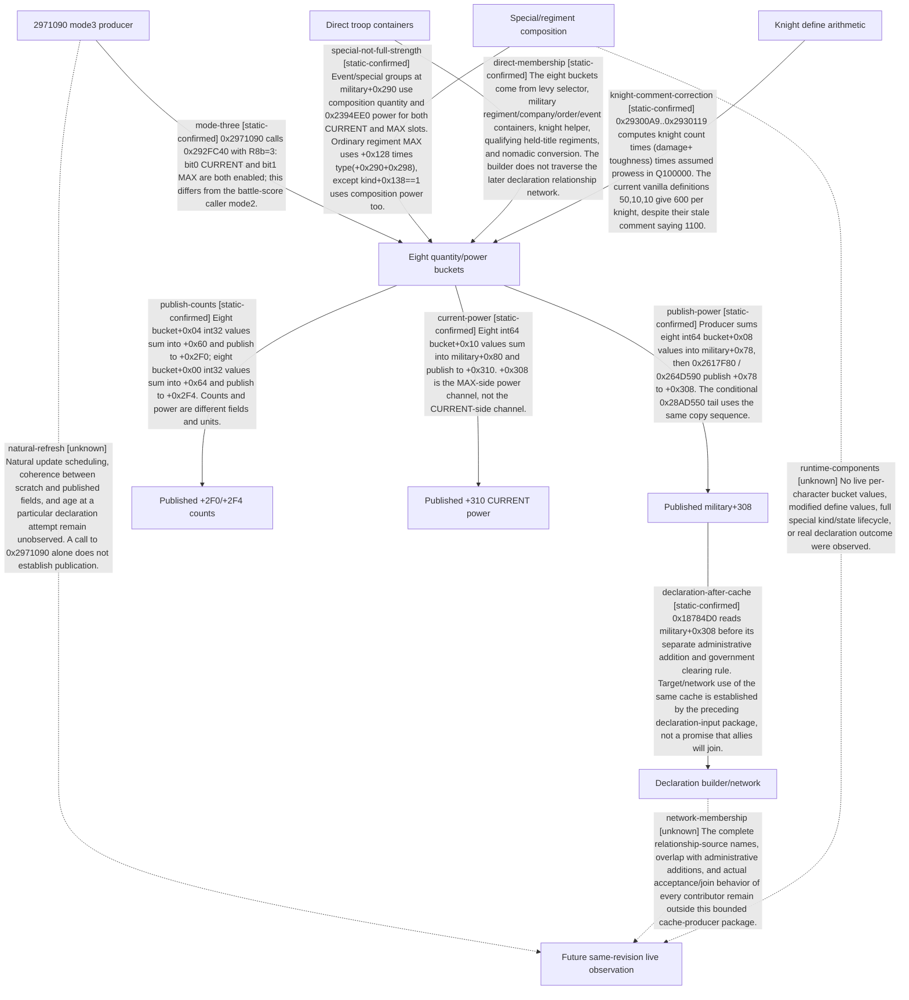

# Research plan: war-film-power-cache-20260923

GENERATED from the supplied research plan; no native semantics are inferred.

Question: Which native producer writes military extension+0x308, and how does its quantity/power and ally/special composition differ from +0x2F0/+0x2F4?



| Edge | Declared status | Evidence IDs | Open question |
|---|---|---|---|
| mode-three | static-confirmed | static-contract |  |
| publish-power | static-confirmed | static-contract |  |
| publish-counts | static-confirmed | static-contract |  |
| current-power | static-confirmed | static-contract |  |
| special-not-full-strength | static-confirmed | static-contract |  |
| direct-membership | static-confirmed | static-contract |  |
| declaration-after-cache | static-confirmed | static-contract, prior-declaration-contract |  |
| knight-comment-correction | static-confirmed | static-contract |  |
| natural-refresh | unknown |  | Natural update scheduling, coherence between scratch and published fields, and age at a particular declaration attempt remain unobserved. A call to 0x2971090 alone does not establish publication. |
| network-membership | unknown |  | The complete relationship-source names, overlap with administrative additions, and actual acceptance/join behavior of every contributor remain outside this bounded cache-producer package. |
| runtime-components | unknown |  | No live per-character bucket values, modified define values, full special kind/state lifecycle, or real declaration outcome were observed. |

| Observation design | Value |
|---|---|
| mode | offline-only |
| actor_kind | ai |
| owner_scope | one actor military extension and declaration assessment; no claim for all wars |
| identity_kind | generation-id |
| identity_lifetime | future same actor full ID and same producer revision; no raw pointer reuse |
| producer_trigger | unknown |
| producer | 0x2971090 scratch producer; 0x2617F80/0x264D590/conditional 0x28AD550 publish caches |
| caller | 0x264D590 selected character batch, 0x2617F80 direct character wrapper; natural cadence not established |
| consumer | State16 builder 0x18784D0 and network/target declaration assessment |
| cache_lifetime | Scratch refresh and published cache update are distinct; natural phase and age at declaration remain unknown |
| expected_signal | offline write chain and component source slots, then separately authorized future same-actor observations |
| zero_sample_meaning | not observed or not updated; does not prove a component is excluded |
| stop_condition | offline only; freeze one closed producer chain and preserve remaining unknowns; no CK3 execution |
| runtime_window_ref | None |

| Evidence ID | Declared layer | File | SHA-256 | Supports |
|---|---|---|---|---|
| static-contract | source-contract | war_film_power_cache_static_20260923.json | 55286e24d86b9afd9da9b049a9101b743f4e31ede421c8b64b0f9c8e56e3a5a7 | Exact native bytes and source define arithmetic; analyst-interpreted static edges only, no live success. |
| prior-declaration-contract | source-contract | ../war-film-declaration-inputs-20260923-r1/war_film_declaration_inputs_static_20260923.json | bffd617f742e63f99e9a37a414a78275279f09f6ac22f202e5f840277fb14adb | Previously frozen declaration builder/admin/network separation; not actual ally acceptance. |

Check result (file integrity and declarations only):

```json
{
  "schema": "xar.native-research-plan-check.v1",
  "result": "plan-consistent",
  "proof_layer": "record-structure-and-file-integrity",
  "semantic_correctness_verified": false,
  "live_execution_performed": false,
  "observation_plan_issues": [
    "offline-only plan does not define a live observation window",
    "the real producer trigger must be located before live sampling"
  ],
  "declared_edges_by_status": {
    "counter-policy": 0,
    "inference": 0,
    "live-confirmed": 0,
    "static-confirmed": 8,
    "unknown": 3
  },
  "enumerated_native_edges": 11,
  "declared_cases_by_status": {
    "pending": 1,
    "observed": 0,
    "not-applicable": 0
  },
  "checked_evidence_files": 2,
  "limitations": [
    "Evidence layers and conclusions are author declarations; hashes bind bytes, not their truth.",
    "Counts cover this enumerated graph only, not all CK3 branches.",
    "A consistent observation plan is not authorization to run or manipulate CK3."
  ],
  "plan_sha256": "6c00a4e7a842e46e45881d81d1917305a6dc26163034d6ef5d26be6af42986b8"
}
```
