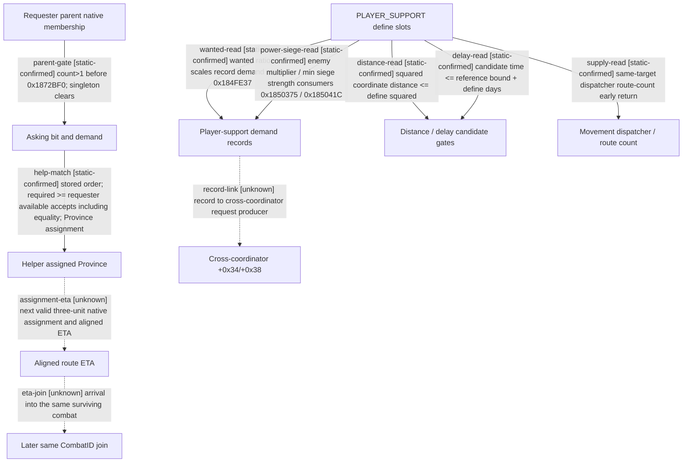

# Research plan: war-film-reinforcement-20260923

GENERATED from the supplied research plan; no native semantics are inferred.

Question: Which gates convert asking into native assignment, and which PLAYER_SUPPORT consumers are separate from that signal?



| Edge | Declared status | Evidence IDs | Open question |
|---|---|---|---|
| parent-gate | static-confirmed | static-contract |  |
| help-match | static-confirmed | static-contract |  |
| wanted-read | static-confirmed | static-contract |  |
| power-siege-read | static-confirmed | static-contract |  |
| distance-read | static-confirmed | static-contract |  |
| delay-read | static-confirmed | static-contract |  |
| supply-read | static-confirmed | static-contract |  |
| record-link | unknown |  | Locate actual writer of CAISubunitStack+0x34/+0x38; do not equate similarly named player records. |
| assignment-eta | unknown |  | Observe bit1 transition and matching route/ETA under production AI after a qualified &gt;=3-unit fixture. |
| eta-join | unknown |  | Observe helper CArmy +0x128 and same old CombatID side roster after arrival; predicted contact is not future binding. |

| Observation design | Value |
|---|---|
| mode | offline-only |
| actor_kind | ai |
| owner_scope | same-war same-side production AI CUnits; player seed control excluded from observation |
| identity_kind | generation-id |
| identity_lifetime | full CUnit/CArmy/Combat/coordinator IDs bound to one episode; stack ordinals only within the same paused snapshot |
| producer_trigger | daily-tick |
| producer | 0x1848310 -&gt; 0x1872BF0; matching 0x1848570 |
| caller | 0x18550D0 coordinator update / 0x1846730 stack update |
| consumer | assignment target and bit consumed by 0x18721B0 / 0x1873AC0 |
| cache_lifetime | asking/assignment are prior producer output until next update; paused queries do not run the AI producer |
| expected_signal | structurally qualified requester with asking, then helper bit1+Province, aligned ETA, later same CombatID roster |
| zero_sample_meaning | structural-precondition failure or unobserved candidate/eligibility/timing; never evidence of no reinforcement policy |
| stop_condition | no live execution in this package; future window stops on combat termination, identity drift, membership loss, or its separately authorized bound |
| runtime_window_ref | None |

| Evidence ID | Declared layer | File | SHA-256 | Supports |
|---|---|---|---|---|
| static-contract | source-contract | war_film_reinforcement_static_contract_20260923.json | b46f4570f360f7ad142e7563d7ebf12fd8677b61186a36a40ce56996e839a6bd | Bounded machine-code bytes plus explicit analyst interpretation of parent gates and PLAYER_SUPPORT consumers; not a live confirmation. |

Check result (file integrity and declarations only):

```json
{
  "schema": "xar.native-research-plan-check.v1",
  "result": "plan-consistent",
  "proof_layer": "record-structure-and-file-integrity",
  "semantic_correctness_verified": false,
  "live_execution_performed": false,
  "observation_plan_issues": [
    "offline-only plan does not define a live observation window"
  ],
  "declared_edges_by_status": {
    "counter-policy": 0,
    "inference": 0,
    "live-confirmed": 0,
    "static-confirmed": 7,
    "unknown": 3
  },
  "enumerated_native_edges": 10,
  "declared_cases_by_status": {
    "pending": 4,
    "observed": 0,
    "not-applicable": 0
  },
  "checked_evidence_files": 1,
  "limitations": [
    "Evidence layers and conclusions are author declarations; hashes bind bytes, not their truth.",
    "Counts cover this enumerated graph only, not all CK3 branches.",
    "A consistent observation plan is not authorization to run or manipulate CK3."
  ],
  "plan_sha256": "d43b1b8c0469188d80ba50088474d1dd867fc362e97162b3c2eb1d415dc42518"
}
```
