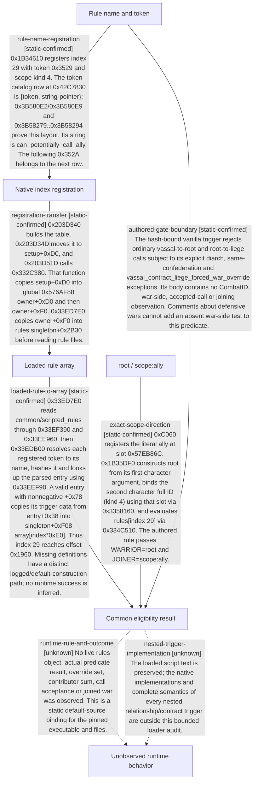

# Research plan: war-film-relationship-gate-20260923

GENERATED from the supplied research plan; no native semantics are inferred.

Question: Does the native loader bind can_potentially_call_ally to scripted-rules singleton+0xF08-&gt;+0x1960 used by 0x1B35DF0, and what is the exact scope direction?



| Edge | Declared status | Evidence IDs | Open question |
|---|---|---|---|
| rule-name-registration | static-confirmed | static-contract |  |
| registration-transfer | static-confirmed | static-contract |  |
| loaded-rule-to-array | static-confirmed | static-contract |  |
| exact-scope-direction | static-confirmed | static-contract |  |
| authored-gate-boundary | static-confirmed | static-contract |  |
| runtime-rule-and-outcome | unknown |  | No live rules object, actual predicate result, override set, contributor sum, call acceptance or joined war was observed. This is a static default-source binding for the pinned executable and files. |
| nested-trigger-implementation | unknown |  | The loaded script text is preserved; the native implementations and complete semantics of every nested relationship/contract trigger are outside this bounded loader audit. |

| Observation design | Value |
|---|---|
| mode | offline-only |
| actor_kind | ai |
| owner_scope | One declaration assessment actor and effective target; not all diplomacy or wars |
| identity_kind | generation-id |
| identity_lifetime | Synchronous collector locals and full CharacterID only; no pointer reuse |
| producer_trigger | not-applicable |
| producer | Unknown native rule registration/loader into the +0x1960 trigger subobject |
| caller | 0x1879850 and 0x18758C0 -&gt; 0x1B35DF0 |
| consumer | Boolean eligibility gate for one actor or target network contribution |
| cache_lifetime | Military+0x308 freshness remains separate; no runtime age observed |
| expected_signal | Exact symbol/string/registration or loader-index proof reaching the same consumed object and scope binding |
| zero_sample_meaning | No live samples are taken; an excluded branch is not proof that the relationship cannot join a war |
| stop_condition | No live access. One bounded pass over literal/registration and singleton-owner loading plus its trigger-array addressing. If no exact binding closes, freeze ruled-out matches and precise remaining edge; do not repeat broad scans. |
| runtime_window_ref | None |

| Evidence ID | Declared layer | File | SHA-256 | Supports |
|---|---|---|---|---|
| static-contract | source-contract | static.json | 63c2b31b6088c7289cc914e977b54fb40ed1d5b741ceeba50497cff6e7a99fcf | Exact registration operands, catalog layout and loading instructions, scope binding, and pinned authored text. Static interpretation only; no live success. |

Check result (file integrity and declarations only):

```json
{
  "schema": "xar.native-research-plan-check.v1",
  "result": "plan-consistent",
  "proof_layer": "record-structure-and-file-integrity",
  "semantic_correctness_verified": false,
  "live_execution_performed": false,
  "observation_plan_issues": [
    "offline-only plan does not define a live observation window",
    "the real producer trigger must be located before live sampling"
  ],
  "declared_edges_by_status": {
    "counter-policy": 0,
    "inference": 0,
    "live-confirmed": 0,
    "static-confirmed": 5,
    "unknown": 2
  },
  "enumerated_native_edges": 7,
  "declared_cases_by_status": {
    "pending": 1,
    "observed": 0,
    "not-applicable": 0
  },
  "checked_evidence_files": 1,
  "limitations": [
    "Evidence layers and conclusions are author declarations; hashes bind bytes, not their truth.",
    "Counts cover this enumerated graph only, not all CK3 branches.",
    "A consistent observation plan is not authorization to run or manipulate CK3."
  ],
  "plan_sha256": "aa1e4f018f591eccdfe0e5f50e4131a5f9fb997e022d11c5a5309acc55459120"
}
```
