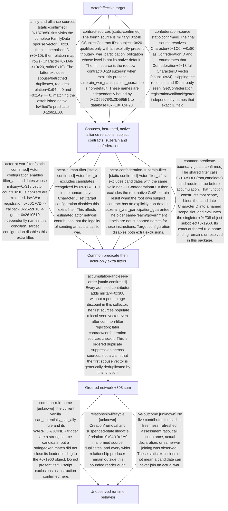

# Research plan: war-film-relationship-network-20260923

GENERATED from the supplied research plan; no native semantics are inferred.

Question: Which relationship sources and filters enter declaration network power at 0x1879850?



| Edge | Declared status | Evidence IDs | Open question |
|---|---|---|---|
| family-and-alliance-sources | static-confirmed | static-contract |  |
| contract-sources | static-confirmed | static-contract |  |
| confederation-source | static-confirmed | static-contract |  |
| actor-at-war-filter | static-confirmed | static-contract |  |
| actor-human-filter | static-confirmed | static-contract |  |
| actor-confederation-suzerain-filter | static-confirmed | static-contract |  |
| accumulation-and-seen-order | static-confirmed | static-contract |  |
| common-predicate-boundary | static-confirmed | static-contract |  |
| common-rule-name | unknown |  | The current vanilla can_potentially_call_ally rule and its WARRIOR/JOINER trigger are a strong source candidate, but a string/token match did not close its loader binding to the +0x1960 object. Do not present its full script exclusions as instruction-confirmed here. |
| relationship-lifecycle | unknown |  | Creation/removal and suspended-state lifecycle of relation+0x94/+0x1A9, malformed source duplicates, and every wider relationship producer remain outside this bounded reader audit. |
| live-outcome | unknown |  | No live contributor list, cache freshness, refreshed assessment ratio, call acceptance, actual declaration, or same-war joining was observed. These static exclusions do not mean a candidate can never join an actual war. |

| Observation design | Value |
|---|---|
| mode | offline-only |
| actor_kind | ai |
| owner_scope | One declaration assessment actor and effective target; not all diplomacy or wars |
| identity_kind | generation-id |
| identity_lifetime | Synchronous collector locals and full CharacterID only; no pointer reuse |
| producer_trigger | not-applicable |
| producer | Native collector 0x1879850 |
| caller | Declaration assessment 0x1878A00 |
| consumer | Actor/target strategic power before final ratio |
| cache_lifetime | Military+0x308 freshness remains separate; no runtime age observed |
| expected_signal | Instruction-backed source container naming and exact filtering differences |
| zero_sample_meaning | No live samples are taken; an excluded branch is not proof that the relationship cannot join a war |
| stop_condition | Freeze bounded native membership and filtering contract, preserve unsupported names unknown; no live execution |
| runtime_window_ref | None |

| Evidence ID | Declared layer | File | SHA-256 | Supports |
|---|---|---|---|---|
| static-contract | source-contract | static.json | 78b0cddf5dedd081972379470b9b992088761ec1f5d6a6949eea724380bc5de7 | Pinned instructions, independent named getter/term bindings and prior contract provenance; analyst-interpreted static semantics only. |

Check result (file integrity and declarations only):

```json
{
  "schema": "xar.native-research-plan-check.v1",
  "result": "plan-consistent",
  "proof_layer": "record-structure-and-file-integrity",
  "semantic_correctness_verified": false,
  "live_execution_performed": false,
  "observation_plan_issues": [
    "offline-only plan does not define a live observation window",
    "the real producer trigger must be located before live sampling"
  ],
  "declared_edges_by_status": {
    "counter-policy": 0,
    "inference": 0,
    "live-confirmed": 0,
    "static-confirmed": 8,
    "unknown": 3
  },
  "enumerated_native_edges": 11,
  "declared_cases_by_status": {
    "pending": 1,
    "observed": 0,
    "not-applicable": 0
  },
  "checked_evidence_files": 1,
  "limitations": [
    "Evidence layers and conclusions are author declarations; hashes bind bytes, not their truth.",
    "Counts cover this enumerated graph only, not all CK3 branches.",
    "A consistent observation plan is not authorization to run or manipulate CK3."
  ],
  "plan_sha256": "e8c864b011aee27b401ce4d2b620a94d4786017c5d8c456a0046d30ab69a5eee"
}
```
