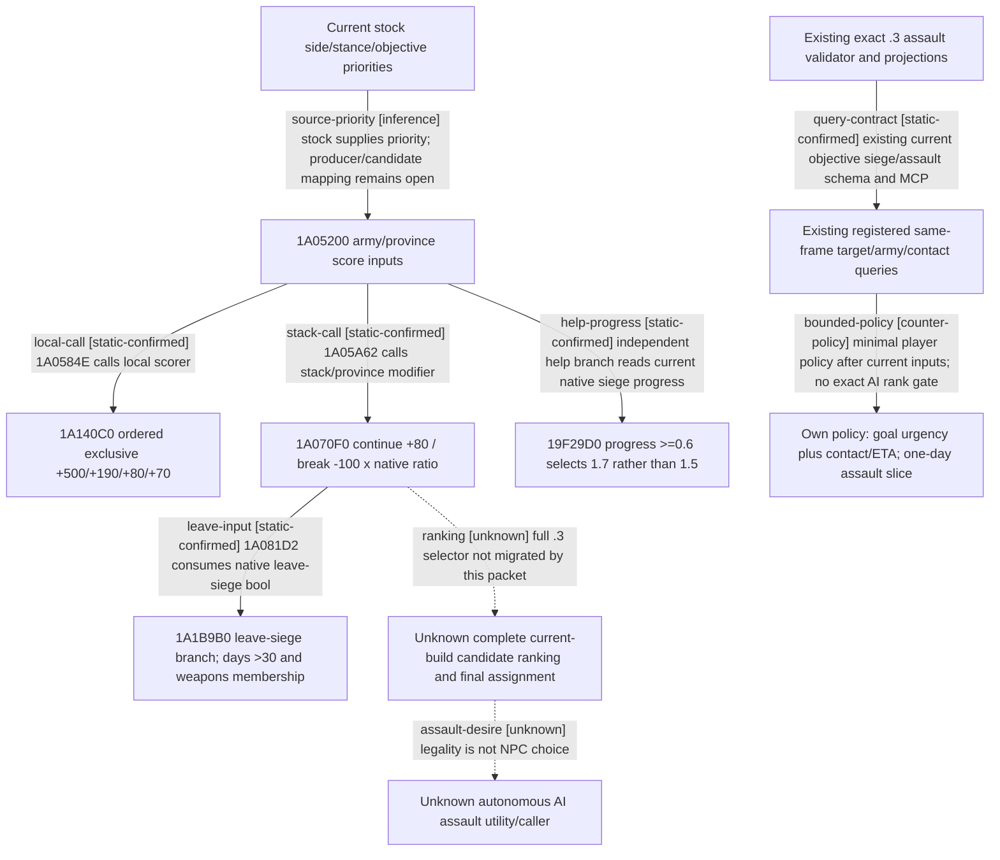

# Research plan: war-relief-siege-12003

GENERATED from the supplied research plan; no native semantics are inferred.

Question: Which current exact-build native siege/relief score branches are closed, and what existing observations support the minimum Robert relief-versus-own-siege or one-day assault choice?



| Edge | Declared status | Evidence IDs | Open question |
|---|---|---|---|
| source-priority | inference | stock-stances, stock-info | Close current .3 expansion, exact stance choice and candidate flags before exact AI emulation. |
| local-call | static-confirmed | exact-ai, semantic-ledger |  |
| stack-call | static-confirmed | exact-ai, semantic-ledger |  |
| leave-input | static-confirmed | exact-ai, semantic-ledger |  |
| help-progress | static-confirmed | exact-ai, stock-ai |  |
| ranking | unknown |  | Reuse prior 1.19 target-selection research as locator, then relocate current-build producer/sort/commit only if exact score emulation is requested. |
| assault-desire | unknown |  | Trace 1436930 ownership and assault kind0E constructors/dispatch; direct-call census does not exclude indirect AI calls. |
| query-contract | static-confirmed | assault-study, mcp-registration, adapter-registration |  |
| bounded-policy | counter-policy | siege-study, assault-study, episode-live-ledger, mcp-registration |  |

| Observation design | Value |
|---|---|
| mode | offline-only |
| actor_kind | ai |
| owner_scope | Native .3 AI scoring branches only; current Robert29829 episode/date are root-provided read-only targeting baseline, not a new observation. |
| identity_kind | definition-key |
| identity_lifetime | This exact EXE and current stock bytes only; future runtime rows must independently bind actor/full WarID/ProvinceID/SiegeID/native/public revisions/date/session. |
| producer_trigger | not-applicable |
| producer | Current stock defines and exact PE registration/consumer bytes; no game producer invocation. |
| caller | Offline extractor reads PE pdata instruction spans; existing root-owned MCP registrations are recipes only. |
| consumer | Native decision tree and input ledger; ROOT may use the bounded own-policy construction after actual paused queries. |
| cache_lifetime | Frozen file bytes only; not a runtime cache, new build/source requires separate evidence. |
| expected_signal | Ordered exclusive tactical bonus branch, signed day/progress/occupation comparisons, registered query field availability and explicit open AI assault desirability branch. |
| zero_sample_meaning | No new runtime samples were requested or collected. Source availability is not current Robert availability; null is not false or zero. |
| stop_condition | Stop at siege/relief/assault inputs; do not duplicate route or battle damage work, submit gameplay, alter source, run prose tests or repeat episode03 GREEN. |
| runtime_window_ref | None: FILE-ONLY delegated research; ROOT owns all process/MCP/game/Windows actions. |

| Evidence ID | Declared layer | File | SHA-256 | Supports |
|---|---|---|---|---|
| stock-ai | source-contract | Z:\SteamLibrary\steamapps\common\Crusader Kings III\game\common\defines\ai\00_ai.txt | 3af5d4100789bad56570e05c5852f35783605813957de7a5129d23142a116120 | Current relief/continuation/break/near-victory and help numeric definitions; native comparisons override stale comments. |
| stock-stances | source-contract | Z:\SteamLibrary\steamapps\common\Crusader Kings III\game\common\ai_war_stances\00_ai_war_stances.txt | 4f5aa322c4d7272338f4c7b111b7462d4a1fec886e93e7178084d318ceb8e294 | Current defender objective priorities and ordered blocks; not actual Robert stance. |
| stock-info | source-contract | Z:\SteamLibrary\steamapps\common\Crusader Kings III\game\common\ai_war_stances\_ai_war_stances.info | 0f01aaab6922fdca19b87a4421768f83b0c75534a128a73af8cecadd52f6205e | Definitions of war goal/enemy/defend fallback objectives. |
| exact-ai | exact-build | Z:\ck3_mod_rewrite_process_assets\g2-resume-20261003\war-relief-siege-ai\projection\docs\ck3-native-ai\research-plans\war-relief-siege-12003\exact-proof.json | 40c8d5e4cd02c733ac3c1defcc56553bf2d28a519e0be01a6d5dca405617c27b | Current .3 registration slots, positive consumer branch instructions and direct call anchors; no machine execution. |
| semantic-ledger | source-contract | Z:\ck3_mod_rewrite_process_assets\g2-resume-20261003\war-relief-siege-ai\projection\docs\ck3-native-ai\war-relief-siege-native-ai-12003.md | dd3073932146de2db61da9866354b5e47c8afe48e240f2c3b7e75a4487aac5f1 | Manual interpretation of exact consumer instructions, ordered branches and honest observation boundaries. |
| siege-study | source-contract | Z:\g35\docs\ck3-native-ai\episode03-siege-progress-1.20.0.3.md | f03e27d000202ad67489126c8a3a5946a5a49b9692a1149595dd8fb1a954b948 | Existing ordinary siege exact formulas/getter and observation boundaries reused. |
| assault-study | source-contract | Z:\g35\docs\ck3-native-ai\episode03-assault-1.20.0.3.md | fffa08845817596dc5b801a3c55ba4d30ecf510f9b14642bb70304554c2d7163 | Existing .3 start/stop legality and one-day projections reused. |
| episode-live-ledger | source-contract | Z:\g35\docs\ck3-native-ai\episode03-william-lewes-live-2026-10-03.md | 9743d0107f20d256380a8d6d7da6f9e67ca4bda0b0f6643a9fab376aaaa2ec4e | Reviewed existing live evidence ledger: William, not Robert; no new live evidence in this packet. |
| mcp-registration | source-contract | Z:\g35\ck3_autonomous_player\src\xar_autoplayer\bridge\mcp_server.py | eb01ef4704914ec5f207065712a6d3c8a01423c77c049681c9f02edb59d61158 | Existing snapshot/war/army/contact/battle-control/reinforcement/assault tools and arguments. |
| adapter-registration | source-contract | Z:\g35\ck3_autonomous_player\native_bridge\src\ck3_12002_adapter.cpp | 73d66ca49908aeabc9a172fe61214da797465bfa5b8a790c2573c73d4a37b38e | Inherited objective siege and route-contact capabilities; lacks province-local-siege advertisement. |
| route-contract | source-contract | Z:\g35\ck3_autonomous_player\src\xar_autoplayer\bridge\war_contract.py | b8f157fc5d0f14e50cc28d805c78795337b6b24061a978a0ad44a69289ccd87d | Exact sorted-hostile route-contact query grammar. |

Check result (file integrity and declarations only):

```json
{
  "schema": "xar.native-research-plan-check.v1",
  "result": "plan-consistent",
  "proof_layer": "record-structure-and-file-integrity",
  "semantic_correctness_verified": false,
  "live_execution_performed": false,
  "observation_plan_issues": [
    "offline-only plan does not define a live observation window",
    "the real producer trigger must be located before live sampling"
  ],
  "declared_edges_by_status": {
    "counter-policy": 1,
    "inference": 1,
    "live-confirmed": 0,
    "static-confirmed": 5,
    "unknown": 2
  },
  "enumerated_native_edges": 8,
  "declared_cases_by_status": {
    "pending": 1,
    "observed": 0,
    "not-applicable": 3
  },
  "checked_evidence_files": 11,
  "limitations": [
    "Evidence layers and conclusions are author declarations; hashes bind bytes, not their truth.",
    "Counts cover this enumerated graph only, not all CK3 branches.",
    "A consistent observation plan is not authorization to run or manipulate CK3."
  ],
  "plan_sha256": "d3295934f90598aef933249573f2ff62de8a84988808453b4078a7d9ece3fff5"
}
```
