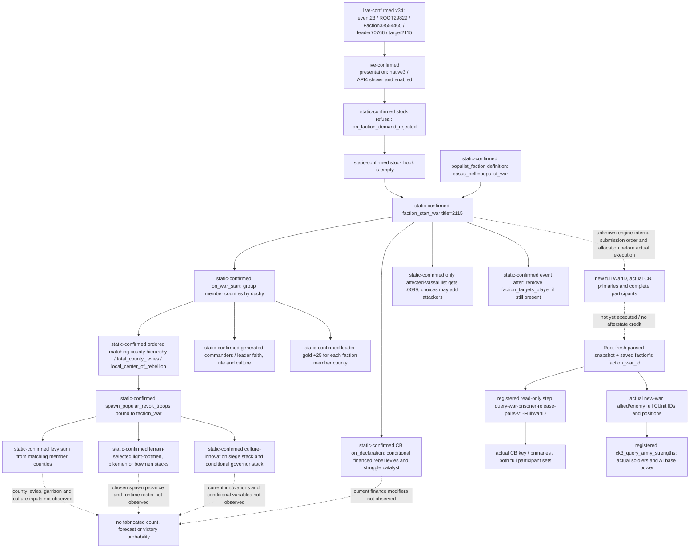

The current refusal is **native option 3 / public API option 4**, rendered row 1, for Robert **29829**, original episode `native-29829-2bc2d599f7f9`, event instance **23**, `faction_demand.1001`, date **53236608**. The frozen v34 event query directly binds saved faction **33554465**, leader **70766**, target title **2115**, peasant county **2102**, and saved `new_title` **16795606**. Both displayed options are shown and enabled. This lane has made no game calls or selected any option.

Version binding is **CK3 1.20.0.3 / Steam 25652598**, EXE SHA-256 `94B55397ABB687A3DCD436805A5D885E6BE90FA6C693FEB44A9E3BBEEADE02A6`. Final stock inputs come from `Z:/SteamLibrary/steamapps/common/Crusader Kings III/game`. Initial reads of the repository's reference game directory used an older tree; they are superseded by the installed-source slices in `source-manifest.json`. The exact installed event SHA is `eb17720ca9d48acfb8cc24e5f61edc62fd2d4d2d599561c92854fc762104eccd`. Existing acceptance and surrender-extent evidence is reused; this packet does not repeat it.

The stock refusal effects are at `events/factions/faction_demands.txt:1336–1358`. They call the rejected hook first, then `scope:faction.faction_start_war={ title=scope:target_title }`. The faction's own definition selects `populist_war` at `common/factions/00_populist_faction.txt:2`. This establishes the authored chain and expected CB. **The actual new war's CB remains an after-state observation**, obtained by full WarID; it is not supplied by event indicator rows. The stock hook at `common/on_action/faction_on_actions.txt:105` is empty. Refusal does not call the ordinary independence helper or its prestige-level/dread acceptance effects.

The saved `new_title` is already present in the **before** event. `setup_populist_leader_effect` at `00_faction_effects.txt:1788–1941` creates a landless duchy only if the selected leader has no primary title, sets its capital to the peasant county, and gives it to the leader. That setup belongs to issuing the demand; it must not be reported as a new title granted by refusal. The current saved war target is **2115**, distinct from this landless revolt title **16795606**.

`on_war_start` at `00_populist_faction.txt:1033–1103` builds rebellion area entries from faction counties' duchies, selects a matching county by `total_county_levies`, spawns leader-owned war-bound armies there, creates a commander using the leader's faith/rite/culture, and adds **25 gold per faction member county to the leader**. For the frozen three-member faction the authored purse contribution is **75 to leader70766**; it is not a Robert treasury debit and does not prove the leader's net post-war-start balance. The three actual members **2102 / 2111 / 2115** are all in duchy **2101**. Neither the winning spawn county nor the number of resulting CUnits is currently observed. Multiple `spawn_army` calls and engine grouping must not be turned into an asserted stack count.

`spawn_popular_revolt_troops` at `00_faction_effects.txt:1182–1374` sums `county_levies_to_raise` and `county_maa_to_raise` only for faction members whose duchy matches the local center. Levy count uses `max(total_county_levies × (0.5 − 0.01 × county_opinion) × applicable_culture_factor, 1.2 × building_max_garrison)`; the culture factor is 1.5 only under the authored mismatch/parameter condition. The three observed opinions **−56 / −75 / −65** supply the ordinary opinion multipliers **1.06 / 1.25 / 1.15**. Total county levies, garrison minima and that culture predicate are not in the frozen packets, so no numeric troop total follows. MAA stacks use `max(round(total_county_levies × county_opinion × −0.00003), 1)` per county; actual rounding/runtime stack composition is read after creation. Terrain selects light footmen, pikemen or bowmen. Siege innovation selects one bombard, trebuchet, mangonel or onager stack through the authored first-valid chain. A separate governor variable may add two light-footmen stacks. All these troops bind to `root.faction_war`.

The CB's `on_declaration` at `00_civil_war.txt:664–953` also calls `generate_troops_from_revolt_county_modifiers_effect`. That helper at `03_dlc_fp2_scripted_effects.txt:1205–1275` conditionally adds financed levies (authored **250 / 750 / 2000** contributions) at a chosen county province and removes the funding modifiers. These are symbolic conditional contributions, not current observed troops. `.0099` can later add affected vassals as attackers; the refusal caller does not choose for them. The current faction member list or one army's owner cannot substitute for the full post-start participant sets.

For eventual outcomes, the CB's **attacker victory** is Robert's loss and calls the already-researched popular revolt outcome helper after a defender prestige-level loss and faction-war legitimacy effects. White peace runs the stock white-peace faction cleanup and removes the populist faction. Attacker defeat is Robert's victory: stock county opinion modifier lasts **25 years**, rebel cleanup/imprisonment runs, and defender dread/legitimacy effects apply. The CB invalidates on primary-attacker death and inherits on primary-defender death. Authored war scoring uses only de-jure war goals, attacker wargoal threshold **0.8**, battle caps **100 attacker / 50 defender**, and occupation caps **150 / 150**. These source facts do not establish a current warscore breakdown or justify a peace action without fresh runtime terms.

The minimal actual transition check is: event23 ceases to be current, saved faction33554465 becomes at-war and supplies a full `faction_war_id`, that full WarID is new relative to **16777231 / 129**, and the same paused snapshot has Robert as primary defender, leader70766 as primary opponent, and target2115 among the actual targeted titles. **War129 already targets2115**, so target-title matching alone is ambiguous. The registered generic read-only participant scan supplies `active_casus_belli_key=populist_war`, primaries **70766 / 29829**, and complete attacker/defender participant IDs. Its mailbox uses the migrated Crozier reader under `XAR_CK3_ENABLE_G2_PRISONER_COLLECTION_PRIVATE_QUERY_V1`; the public `ck3_execute_step` route and current v34 capability already exist. The scan issues no prisoner release and does not need a new WAR compile flag.

Legal mobilization is checked by the native command validator, not by faction power. Current snapshot003 already exposes controllable regular **CUnit83886367 at Province2614**. The public driver advertises `raise-troops-default` only when the backend supports it, active wars exist and **no controllable army exists**; therefore that public step is unavailable in this current frame even though `ck3_raise_troops_default` is registered. The service requires the advertised step before dispatch. Do not disband the existing army merely to make that predicate true. If a later actual frame has an advertised raise step, the native chain checks a living player, resolves CK3's default rally province through the capital/default selector, validates its identity, constructs the original 0x50-byte raise command and executes the final native validator, then queues a copy. The driver's completion condition is a **new actual controllable full CUnitID** after submission. No hypothetical muster roster, gathering time or unraised count is supplied by this chain. The existing standalone `prewar_default_muster` reader is not registered in current v34 tools and must not be presented as an immediately callable recipe.

Files: `baseline.json` binds the three original Root packets and hashes; `source-manifest.json` binds 11 installed-source slices; `registered-tools.json` reproduces current discovered schemas; `ROOT-RECIPES.json` provides concrete registered read/step templates. `verify_afterstate.py` consumes later actual snapshot, faction and optional identity/strength packets without touching the game. The source freeze passed once after a Windows `tzdata` harness error was corrected with the explicit +08:00 record offset; `harness-attempt01-red.json` retains that failure. Current readiness is **research/source-ready plus reused production-live before-state identities**, with **no refusal, revolt afterstate, new war, mobilization, troop-count or G2 milestone credit** from this lane. Root owns the live worker, SDK, process cleanup, reports and Git.
