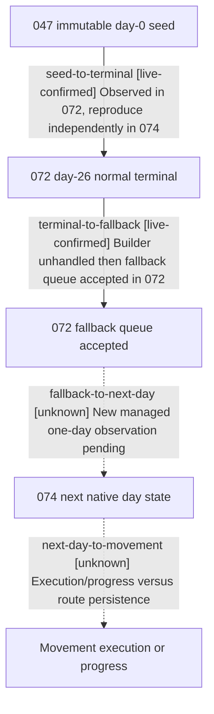

# Research plan: winner-ai-postsubmit-074

GENERATED from the supplied research plan; no native semantics are inferred.

Question: After native AI fallback movement queue acceptance at terminal, what position, route, target and movement state are visible after the next natural game day?



| Edge | Declared status | Evidence IDs | Open question |
|---|---|---|---|
| seed-to-terminal | live-confirmed | live-072-fallback |  |
| terminal-to-fallback | live-confirmed | live-072-fallback |  |
| fallback-to-next-day | unknown |  | Does 074 preserve the same terminal queue state and reach a stable next-day frame? |
| next-day-to-movement | unknown |  | What native position/progress signal proves the accepted command executed? |

| Observation design | Value |
|---|---|
| mode | passive-runtime |
| actor_kind | ai |
| owner_scope | Vanilla war 4, winning nonplayer CUnit 16777231 owned by Character 32725, original CombatID 16777218; revalidate IDs in each replay |
| identity_kind | generation-id |
| identity_lifetime | CUnit and CombatID bind to one loaded session and seeded scene, not arbitrary later loads |
| producer_trigger | daily-tick |
| producer | 072 observed 0x1872611 fallback submission to 0x973E00; native queue consumption and subsequent movement progression remain unobserved |
| caller | Managed life-advance from stable day-26 terminal frame to the next native day, with no player move command |
| consumer | Paused native army snapshot, battle-terminal-transition and private AI reentry readbacks; movement apply for this queued command is still a candidate |
| cache_lifetime | Route/target/position are current paused-frame state; private observer counters are process-local and not saved |
| expected_signal | First reproduce same-frame WarID/CombatID/CUnit/date and builder +8=0/+9=0 with fallback queue_accepted; on date_raw 53147016 read position, route, target, in_combat, army_state, private movement raw and queue records. Position change or separately proven movement progress can prove progress; route persistence alone cannot |
| zero_sample_meaning | No matching fallback in 074 is replay divergence, not a refutation of 072. Unchanged position after one day does not prove non-execution because travel may take multiple days |
| stop_condition | Stop after first stable paused day-27 and duplicate query if day-26 path matched; otherwise stop as divergent by day 35, not a 072 continuation |
| runtime_window_ref | Independent managed attempt 074 only after higher-priority war-width 073 releases CK3 and a fresh Steam-offline receipt is visually reviewed |

| Evidence ID | Declared layer | File | SHA-256 | Supports |
|---|---|---|---|---|
| live-072-fallback | live-observation | D:/workspace/ck3_native_war_ai_promo_work/episode01-winner-ai-reentry-v2-attempt-072/ck3-output/interactive-requests-responses/26-ai-reentry.json | D738BBF6B366EAF8E4743A0FD274CF55657C37A59427BB2F744CFBC3F4C6F96F | 072 day26 builder unhandled and fallback command to 2639 queue_accepted, not day27 movement |
| offline-072-save-timeline | offline-fixture | D:/workspace/ck3_native_war_ai_promo_work/episode01-winner-ai-reentry-v2-attempt-072/existing-save-timeline.json | ED61913EAFAE35D26E4B110D232879D915F4063C44E7D96AFADA4FDAFF2A3BBD | 072 last_save/autosave identical and save mtime precedes day26 advance request; internal raw-binary game date unknown |

Check result (file integrity and declarations only):

```json
{
  "schema": "xar.native-research-plan-check.v1",
  "result": "plan-consistent",
  "proof_layer": "record-structure-and-file-integrity",
  "semantic_correctness_verified": false,
  "live_execution_performed": false,
  "observation_plan_issues": [],
  "declared_edges_by_status": {
    "counter-policy": 0,
    "inference": 0,
    "live-confirmed": 2,
    "static-confirmed": 0,
    "unknown": 2
  },
  "enumerated_native_edges": 4,
  "declared_cases_by_status": {
    "pending": 1,
    "observed": 1,
    "not-applicable": 0
  },
  "checked_evidence_files": 2,
  "limitations": [
    "Evidence layers and conclusions are author declarations; hashes bind bytes, not their truth.",
    "Counts cover this enumerated graph only, not all CK3 branches.",
    "A consistent observation plan is not authorization to run or manipulate CK3."
  ],
  "plan_sha256": "caaf8bbdb7fd612320b5444ef34dbafe496d436ea667c2a9c290d621fcf8a726"
}
```
