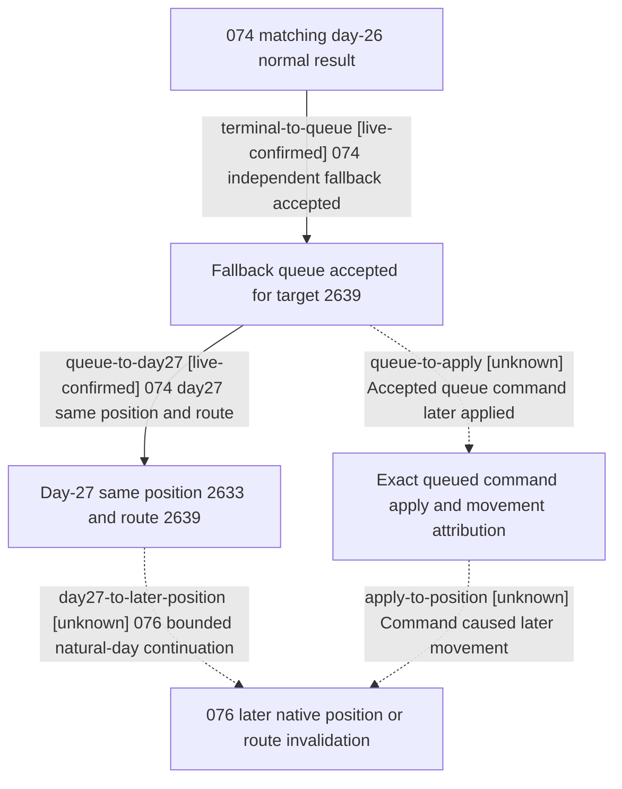

# Research plan: winner-ai-postsubmit-076

GENERATED from the supplied research plan; no native semantics are inferred.

Question: After the same native winner-AI fallback command is accepted, does the CUnit later make observable movement toward target 2639, and can its committed-path ETA or exact command apply be observed?



| Edge | Declared status | Evidence IDs | Open question |
|---|---|---|---|
| terminal-to-queue | live-confirmed | live-074-day26-private |  |
| queue-to-day27 | live-confirmed | live-074-day27-snapshot, live-074-audit |  |
| day27-to-later-position | unknown |  | When does this same AI CUnit move, cancel its route, or leave the war snapshot? |
| queue-to-apply | unknown |  | Can exact native apply or committed-path ETA be passively observed, rather than inferred from route? |
| apply-to-position | unknown |  | A later position change alone does not uniquely identify this accepted command as its cause |

| Observation design | Value |
|---|---|
| mode | passive-runtime |
| actor_kind | ai |
| owner_scope | Independent replay of vanilla WarID 4, winning CUnit 16777231 owned by Character 32725, CombatID 16777218; all identities revalidated at day 26 before extending |
| identity_kind | generation-id |
| identity_lifetime | IDs bind only to this loaded seeded scene, and observer counters live only in this process |
| producer_trigger | daily-tick |
| producer | Day-26 0x1872611 fallback to 0x973E00 was accepted in both 072 and 074; command apply and later movement remain unobserved |
| caller | Managed life-advance from immutable 047 day-0 seed; after an exact matching day-26 terminal, advance at most 30 more native days without issuing a player move |
| consumer | Paused public winner-army position/target/route/state, private CUnit route/target/state, append-only reentry records, and an exact native committed MovePath/ETA read only if a bounded safe observer is separately proven |
| cache_lifetime | Each day is a new paused native revision; route and ETA, if available, must be read fresh. Process-local observer records are not save-persistent |
| expected_signal | Stop as movement_observed only on a new native position for the same CUnit; record whether it reaches 2639. A changed route/target or vanished CUnit is a separate invalidated-path stop. If exact committed-path first-hop ETA can be safely exposed, compare fresh ETA against current date and stop on reached ETA plus position readback; absent ETA remains null, never inferred from route |
| zero_sample_meaning | A replay diverging from 072/074 at day 26 is a new sample, not a negative of prior accepted queues. Thirty unchanged days leave apply unknown unless exact apply trace exists; siege or path policy can delay or cancel movement |
| stop_condition | Exact day-26 identity gate first. Then first same-CUnit native position change, exact committed-path ETA reached with stable readback, route/target invalidation, CUnit absence, or day 56 (30 days after terminal), whichever is first; always finish and retain RED attempts |
| runtime_window_ref | Attempt 076 only after higher-priority war-width 077 has clean-exited, task bus CK3 resource is released, and a new Steam-offline frame is visually verified |

| Evidence ID | Declared layer | File | SHA-256 | Supports |
|---|---|---|---|---|
| live-074-day26-private | live-observation | D:/workspace/ck3_native_war_ai_promo_work/episode01-winner-ai-postsubmit-movement-attempt-074/ck3-output/interactive-requests-responses/26-ai-reentry.json | CB38B7990237493F818A61A823BC62F71AE1DAC7ADCC0CE6A8B2BBA689C26884 | Independent 074 day26 builder unhandled, fallback queue accepted for CUnit 16777231 and target 2639 |
| live-074-day27-snapshot | live-observation | D:/workspace/ck3_native_war_ai_promo_work/episode01-winner-ai-postsubmit-movement-attempt-074/ck3-output/interactive-requests-responses/27-snapshot.json | EA7C23E4E4CD601F31D7E3DC31E5C931F148A58262767E92683BAA5CAB502C4A | 074 day27 CUnit current=2633, target=2639, route=[2639], state=sieging; no ETA, progress or apply field in native army row |
| live-074-audit | live-observation | D:/workspace/ck3_native_war_ai_promo_work/episode01-winner-ai-postsubmit-movement-attempt-074/audit-result.json | 234F9B863D4A813C2688BBC637E1EA13BD7ED9D261901A130A8185D751271DFA | 31/31 GREEN confirms exact terminal match, next paused day, raw hashes and cleanup; post_queue_movement_executed remains unknown |

Check result (file integrity and declarations only):

```json
{
  "schema": "xar.native-research-plan-check.v1",
  "result": "plan-consistent",
  "proof_layer": "record-structure-and-file-integrity",
  "semantic_correctness_verified": false,
  "live_execution_performed": false,
  "observation_plan_issues": [],
  "declared_edges_by_status": {
    "counter-policy": 0,
    "inference": 0,
    "live-confirmed": 2,
    "static-confirmed": 0,
    "unknown": 3
  },
  "enumerated_native_edges": 5,
  "declared_cases_by_status": {
    "pending": 2,
    "observed": 1,
    "not-applicable": 0
  },
  "checked_evidence_files": 3,
  "limitations": [
    "Evidence layers and conclusions are author declarations; hashes bind bytes, not their truth.",
    "Counts cover this enumerated graph only, not all CK3 branches.",
    "A consistent observation plan is not authorization to run or manipulate CK3."
  ],
  "plan_sha256": "dc9cc6a9020f5c35a8f898c3e7ec7e8f8e7993196d87cefccabb7b1f0bd92701"
}
```
