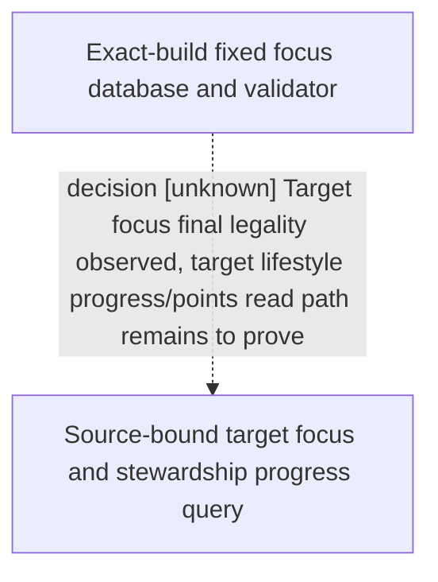

# Research plan: m4-focus-target-progress

GENERATED from the supplied research plan; no native semantics are inferred.

Question: For the paused ordinary feudal player with no current focus, can exact-build native reads bind the finally legal stewardship_wealth_focus and the target stewardship lifestyle XP and perk-point state in one source-bound frame?



| Edge | Declared status | Evidence IDs | Open question |
|---|---|---|---|
| decision | unknown | stock-focus-source, r0112-focus, r0112-current-state | Which exact getter or living-data XP map read supplies the target stewardship experience and perk-point values when there is no current focus, and can it be bound to the same paused query without treating absent as zero? |

| Observation design | Value |
|---|---|
| mode | paused-snapshot |
| actor_kind | human |
| owner_scope | current played adult landed feudal character 36403 in the ordinary xar_off campaign; not an NPC choice ranking |
| identity_kind | definition-key |
| identity_lifetime | stewardship_wealth_focus and stewardship_lifestyle keys in frozen 1.19.0.6; native definition pointer only within one application-main paused transaction and never across a frame, process or reload |
| producer_trigger | paused-query |
| producer | exact-build CK3 focus definition database and Character living-data lifestyle XP/owned-perk state; current stock focus reader captures target definition and calls the engine final validator on the paused application-main thread |
| caller | private-query-player-lifestyle-stock-focus-v1 through application-main formal wire; proposed extension reads target lifestyle progress before the same-frame typed result is serialized |
| consumer | M4 private readback and later official lifestyle recommendation; no typed focus submission until source-bound candidate and target progress are independently live-proved |
| cache_lifetime | query-local sample only; the existing stock focus result is valid for its bound native revision and cannot supply a pointer or legality verdict to a later submit transaction |
| expected_signal | fixed focus key/lifestyle identity, final native legal status, explicit target lifestyle XP and available/used perk points with typed presence/readiness on the same paused frame |
| zero_sample_meaning | No target XP map entry or zero observed candidate rows does not establish zero XP/points or legal false; distinguish a known zero getter value from an unavailable source and do not promote null to zero |
| stop_condition | one private read-only query on one paused frame, native wait at most 60 seconds inside an authorized sole-owner bounded run at most 600 seconds; no date advance or gameplay action |
| runtime_window_ref | None |

| Evidence ID | Declared layer | File | SHA-256 | Supports |
|---|---|---|---|---|
| stock-focus-source | source-contract | ../../../ck3_autonomous_player/native_bridge/src/player_lifestyle_stock_focus_legality_v1.cpp | a5bfa4d6217a708d1ad700a94bfc2d3ab6d2b724bd2ea17f13e3923a868d66fc | The fixed target is resolved from the exact focus database and validator in one paused transaction; its target lifestyle progress callback reuses exact getters before a second whole-sample comparison. The target definition pointer is transaction-local. |
| r0112-focus | live-observation | Z:/ck3_mod_rewrite/.task-tmp/M4-LIFE-NEXT-CANDIDATE/R0112-live/private-query-player-lifestyle-stock-focus-v1.json | f64ac543d432d5e0bf65e700667427aec3c599766bcced5c68fd79bcd834e711 | R0112 observed native_legal true for the fixed focus after scanning 23 rows, with an independent same paused native:3 frame; no action was submitted. |
| r0112-current-state | live-observation | Z:/ck3_mod_rewrite/.task-tmp/M4-LIFE-NEXT-CANDIDATE/R0112-live/paused-life2-current-state.json | 29fcea1e5d1dc5af6583c89b0604492e7282295b339e56736e646a142841b9c7 | The current focus and current lifestyle progress are both typed absent; this does not observe target stewardship progress or points. |

Check result (file integrity and declarations only):

```json
{
  "schema": "xar.native-research-plan-check.v1",
  "result": "plan-consistent",
  "proof_layer": "record-structure-and-file-integrity",
  "semantic_correctness_verified": false,
  "live_execution_performed": false,
  "observation_plan_issues": [],
  "declared_edges_by_status": {
    "counter-policy": 0,
    "inference": 0,
    "live-confirmed": 0,
    "static-confirmed": 0,
    "unknown": 1
  },
  "enumerated_native_edges": 1,
  "declared_cases_by_status": {
    "pending": 1,
    "observed": 1,
    "not-applicable": 0
  },
  "checked_evidence_files": 3,
  "limitations": [
    "Evidence layers and conclusions are author declarations; hashes bind bytes, not their truth.",
    "Counts cover this enumerated graph only, not all CK3 branches.",
    "A consistent observation plan is not authorization to run or manipulate CK3."
  ],
  "plan_sha256": "65cd8e9164f43734b66fbeaeec01f076bebf330a51895eee545fd7f3b408725d"
}
```
