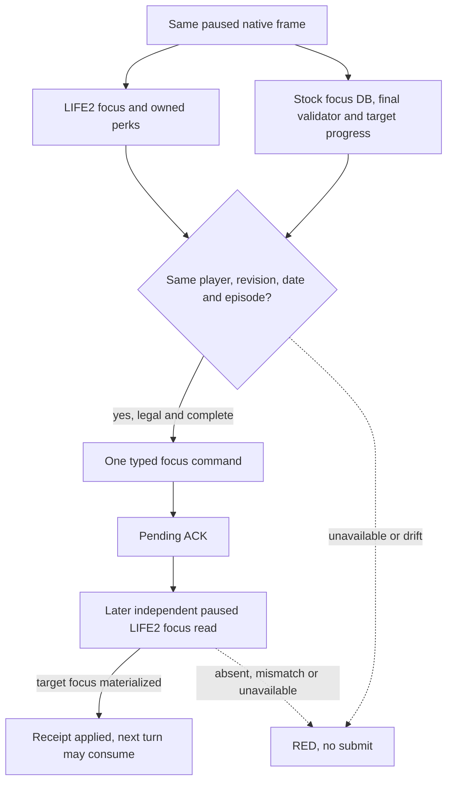

# M4 stock-focus typed submit, exact CK3 1.19.0.6

The frozen executable is SHA-256 `2D00FF3101EF70B566F2FCBAE292F09263199C80E9DC8F139B82D7D96F83DB86`. The source and command offsets are recorded in `player_lifestyle_stock_focus_legality_v1_abi.json` and `player_lifestyle_selection_native_adapter_v1_abi.json`. The latter confirms a `0x38` focus command, the final validator at RVA `0x25DF570`, and the common clone-and-queue submit at RVA `0x973E00`. Queue acceptance is only a pending ACK.

R0128 observed a paused player with no current focus or current lifestyle progress, while the stock `stewardship_wealth_focus` query independently read final native legality and target `stewardship_lifestyle` XP and perk points. The ordinary LIFE4 window source was unavailable. This is a read-only production primitive, not an action result. Its evidence and exact hashes are indexed in `lifestyle-r0128-readback.md`.

An absent current focus is a typed native state supported by the game's no-focus important action. R0128 does not establish why that character reached this state. Seven already owned military perks do not prove a current focus. The target stewardship progress comes from the stock query's exact getters; it is not the absent current-lifestyle row.

The private focus path must capture LIFE2 and the stock focus result twice in the same application-main transaction, require identical typed preconditions, and invoke the exact final validator again immediately before one submit. It may use the stock result's transaction-local definition pointer only inside that transaction. It must never use the absent current-lifestyle row as target progress or require a GUI lifestyle window. The receipt is a later native frame; it must establish the target focus itself, not infer success from ACK. Python admission additionally requires the same-frame feudal government and peace scope. R0128 was a wartime readback source and is ineligible for that policy action.

The step remains private and default OFF. No public capability or M4 completion follows from static tests. A bounded live typed submit, independent receipt and following formal turn are separate gates.

Static check on the M2-integrated `590792b` baseline: `run_m4_stock_focus_typed_static_tests.py` passed the C++ precondition fixture 11/11 and native adapter fixture 9/9 under both MSVC `/Od` and `/O2`; the four affected private bridge objects compiled in Debug and Release. Python lifestyle policy, private transport and formal consumer tests passed normal and `-O` at 28/28 each. All build output was under `Z:/workspace/_m4_typed_focus_build_20260922`; no CK3 process was launched. The first runner attempt passed the Debug fixtures and build, then stopped on a GBK output-print encoding error before Release. The runner output conversion was fixed and the complete two-mode rerun passed. That first error was a runner reporting failure, not a native or gameplay result.

## Next bounded production candidate

Use the latest valid ordinary `xar_off` checkpoint whose independent campaign-root query proves the played actor is feudal and at peace. Rebuild a new save/driver pair with the official prepare/rebind path and bind it to the new DLL's complete SHA. Keep h1094/R0128 immutable: that actor was at war and its driver now carries a live restore tail. No-launch must verify the pair, lifecycle, exact EXE/DLL, private option and fresh output directory before a sole-instance launch. The candidate should allow one typed `stewardship_wealth_focus` action at most, stop RED on any unavailable source or uncertain submit, and preserve the pending intent. A later distinct paused native frame must show the target focus; a following formal turn must consume the applied receipt. The first live action and receipt must be recorded separately from R0128's input readback.
