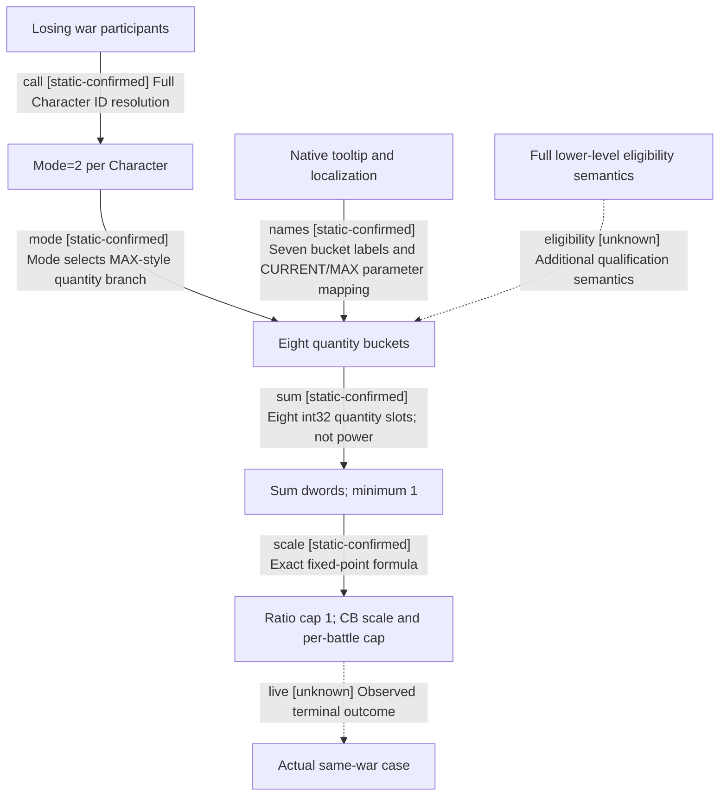

# Research plan: war-film-battle-denominator-results-20260923

GENERATED from the supplied research plan; no native semantics are inferred.

Question: What populations and current/maximum quantities do the eight mode=2 strength buckets contribute to battle warscore denominator?



| Edge | Declared status | Evidence IDs | Open question |
|---|---|---|---|
| call | static-confirmed | bytes, interpretation |  |
| mode | static-confirmed | bytes, interpretation |  |
| names | static-confirmed | bytes, interpretation |  |
| sum | static-confirmed | bytes, interpretation |  |
| scale | static-confirmed | bytes, interpretation |  |
| eligibility | unknown |  | Government config keys, levy construction qualification and regiment/state enum lifecycles remain partially unnamed. |
| live | unknown |  | No new actual battle or per-bucket paused values in this package. |

| Observation design | Value |
|---|---|
| mode | offline-only |
| actor_kind | engine |
| owner_scope | Losing war participant Character -&gt; native military strength output |
| identity_kind | none |
| identity_lifetime | Offline exact-build RVA and output offsets; no live IDs sampled |
| producer_trigger | unknown |
| producer | 0x292FC40 output struct producer, flags=2 |
| caller | Battle warscore constructor 0x25BBE70 |
| consumer | Sum eight dwords at +00,+20,+40,+60,+80,+A0,+C0,+E0 |
| cache_lifetime | Local output buffer constructed per evaluation; no long-lived cache assumed |
| expected_signal | Per-bucket producer fields, mode bits, population filters and UI/source names |
| zero_sample_meaning | An unpopulated bucket does not prove its category is absent from the algorithm |
| stop_condition | Stop raw bucket expansion where population identity requires an independent paused observation; keep unknown labels |
| runtime_window_ref | None |

| Evidence ID | Declared layer | File | SHA-256 | Supports |
|---|---|---|---|---|
| bytes | exact-build | war-film-denominator-evidence-20260923.json | e1d902bc06a86c400b2c0d6ba399d74050a60add1d703a3c376df1c723e1060d | Exact instruction spans, 15 anchor checks, nine native labels and localization binding. |
| interpretation | source-contract | ../war-film-battle-score-denominator-2026-09-23.md | 845a9297c3a4d5034afdb769e39dad1afead56317c8cbe8dc2b37b41c5e78b2e | Manual interpretation of participant selection, quantity versus power, CURRENT/MAX and component sources; live and residual boundaries remain unknown. |

Check result (file integrity and declarations only):

```json
{
  "schema": "xar.native-research-plan-check.v1",
  "result": "plan-consistent",
  "proof_layer": "record-structure-and-file-integrity",
  "semantic_correctness_verified": false,
  "live_execution_performed": false,
  "observation_plan_issues": [
    "offline-only plan does not define a live observation window",
    "the real producer trigger must be located before live sampling"
  ],
  "declared_edges_by_status": {
    "counter-policy": 0,
    "inference": 0,
    "live-confirmed": 0,
    "static-confirmed": 5,
    "unknown": 2
  },
  "enumerated_native_edges": 7,
  "declared_cases_by_status": {
    "pending": 0,
    "observed": 0,
    "not-applicable": 0
  },
  "checked_evidence_files": 2,
  "limitations": [
    "Evidence layers and conclusions are author declarations; hashes bind bytes, not their truth.",
    "Counts cover this enumerated graph only, not all CK3 branches.",
    "A consistent observation plan is not authorization to run or manipulate CK3."
  ],
  "plan_sha256": "c3c551f1b1789c5507b36435a7449475ed455ae60948fb3da09bb2bf7fee3fc7"
}
```
