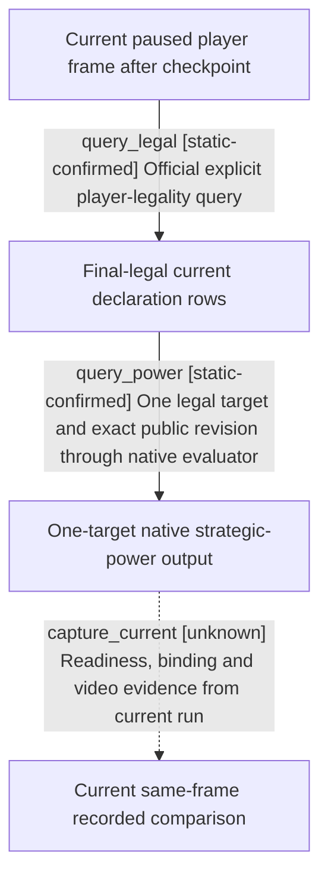

# Research plan: war-film-robert-paused-legality-and-power

GENERATED from the supplied research plan; no native semantics are inferred.

Question: For the current human-controlled Robert vanilla campaign, what final-legal declarations and one-target native strategic-power evaluations are observed in one paused frame?



| Edge | Declared status | Evidence IDs | Open question |
|---|---|---|---|
| query_legal | static-confirmed | source_contract |  |
| query_power | static-confirmed | source_contract |  |
| capture_current | unknown |  | Does the current session complete these bounded queries in one paused frame and produce usable post-HUD footage? |

| Observation design | Value |
|---|---|
| mode | paused-snapshot |
| actor_kind | human |
| owner_scope | Current Robert player returned by the owning R0004 official MCP session; no NPC autonomous declaration, no actor switch, no war manipulation. |
| identity_kind | generation-id |
| identity_lifetime | Current full CharacterID plus episode, snapshot_id, public/native revision, date, bridge PID and connection generation; no historical ID reused. |
| producer_trigger | paused-query |
| producer | Current official query-declarable-wars and exact one-target State16 builder 0x18784D0 / evaluator 0x1878A00 / network collector 0x1879850. |
| caller | Same owning MCP Client calls ck3_query_declarable_wars then ck3_query_war_entry_assessments with exactly one currently allowed target and expected_revision from public snapshot.revision. |
| consumer | Versioned structured query response and current post-query snapshot; film values come from returned native fields, not snapshot soldier recomputation. |
| cache_lifetime | Each query must retain the same paused snapshot_id, public/native revision, actor/episode and target scope. Checkpoint is saved before S0; a drift is a separate failed segment. |
| expected_signal | Successful final-legal rows and up to four one-target evaluations including native effective defender, base/network/total powers and actual_power_ratio_raw with complete readiness/provenance. |
| zero_sample_meaning | No query success means unavailable, not no legal war. A successful empty candidate query only describes this current player/frame. No AI choice inference follows from zero candidates or no contrast. |
| stop_condition | Stop at two useful distinct available comparisons or after four assessment requests, or on lost owner/binding/capability. Preserve every response. No time advance or gameplay action inside the observation window. |
| runtime_window_ref | D:\workspace\ck3_war_film_research_20260923\capture-live-live-r4c\live-run-identity.json |

| Evidence ID | Declared layer | File | SHA-256 | Supports |
|---|---|---|---|---|
| source_contract | source-contract | war-film-robert-readback-source-contract-20260923.json | 4398c720697b0dd7ef49877b1dfe29145fe8c399f11e16b5222329a0f63e631e | Frozen public tool signatures, same-frame service checks and exact-build native evaluator provenance. |
| runbook | source-contract | D:\workspace\ck3_native_tree_docs_audit_20260922\docs\ck3-native-ai\war-film-robert-mcp-shot-runbook-2026-09-23.md | 7a35c3365ce75668f143d85efdbbaab56615323e9ae1e3054739374938cb8dc6 | Bounded current-player readback procedure, fresh public revision, checkpoint before observation, distinct post-HUD recording. |
| run_identity | exact-build | D:\workspace\ck3_war_film_research_20260923\capture-live-live-r4c\live-run-identity.json | d066785a2c1ab779e683ea346b3ca1831df39d0fd7c63a578b460f8ca416437c | Allocated vanilla R0004 identity only; not a successful gameplay observation. |
| preflight | exact-build | D:\workspace\ck3_war_film_research_20260923\capture-live-live-r4c\preflight.json | dae60b511d41d493617bc1eafeadea8e99725dcef03376688fb05548fea83de2 | Recorded exact EXE, DLL, injector and static preflight; runtime capabilities still require current readback. |
| open_kaishek | offline-fixture | D:\workspace\ck3_war_film_research_20260923\capture-preparation-r1\open-kaishek.json | 9066aecc0fcbec570eed428cc3c8da703cefc1b385fea08891b27f5bfc09e8e3 | Already completed syntax-only settings/rules/tutorial subset; not native evaluator semantics; no rerun. |

Check result (file integrity and declarations only):

```json
{
  "schema": "xar.native-research-plan-check.v1",
  "result": "plan-consistent",
  "proof_layer": "record-structure-and-file-integrity",
  "semantic_correctness_verified": false,
  "live_execution_performed": false,
  "observation_plan_issues": [],
  "declared_edges_by_status": {
    "counter-policy": 0,
    "inference": 0,
    "live-confirmed": 0,
    "static-confirmed": 2,
    "unknown": 1
  },
  "enumerated_native_edges": 3,
  "declared_cases_by_status": {
    "pending": 1,
    "observed": 0,
    "not-applicable": 0
  },
  "checked_evidence_files": 5,
  "limitations": [
    "Evidence layers and conclusions are author declarations; hashes bind bytes, not their truth.",
    "Counts cover this enumerated graph only, not all CK3 branches.",
    "A consistent observation plan is not authorization to run or manipulate CK3."
  ],
  "plan_sha256": "55839bcf3591f829666860360551244f4d95286f709ffadff238f58823b3246b"
}
```
